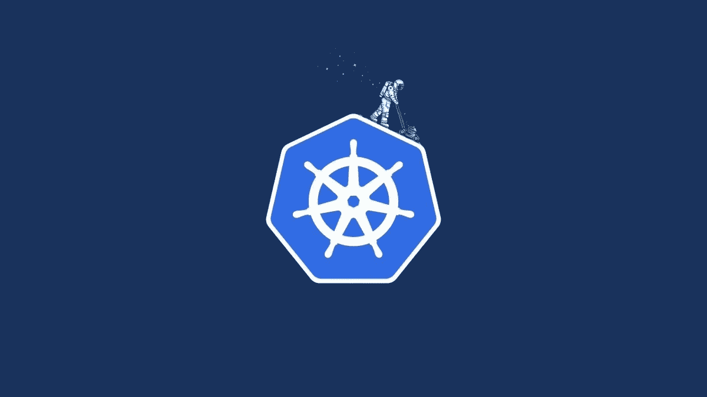

# 使用 LKE 一步一步学习 Kubernetes

> 原文：<https://medium.com/nerd-for-tech/learn-kubernetes-step-by-step-using-lke-67ceb2f6aad2?source=collection_archive---------1----------------------->

想学 Kubernetes？那你来对地方了！

# 介绍

Kubernetes 或 K8S 是一个容器编排解决方案。更准确地说，它是一个编排软件，允许 YAML 脚本部署应用程序，自动扩展应用程序，并在不同的环境中有多种部署可能性。