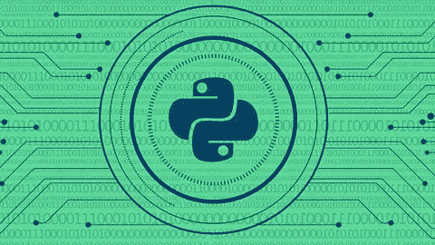

# 从头开始学习 Python 和道德黑客

> 原文：<https://medium.com/nerd-for-tech/learn-python-ethical-hacking-from-scratch-e8e238593722?source=collection_archive---------1----------------------->

从零开始&通过编写 20 多个黑客程序，从零开始同时学习这两个主题

从头开始学习 Python 和道德黑客

从零开始&通过编写 20 多个黑客程序，从零开始同时学习这两个主题。

[*https://www . udemy . com/course/learn-python-and-ethical-hacking-从头开始/*](https://is.gd/6dzUKk)

注意:您可以订阅这个媒体频道来获取通知。

由 z 安全公司的扎伊德·萨比创建

## 您将学到的内容:

*   170 多个关于 Python 编程和道德黑客的视频
*   安装黑客实验室和所需的软件(在 Windows、OS X 和 Linux 上)
*   同时学习两个主题——Python 编程和道德黑客
*   从 0 开始到高中级水平
*   编写超过 20 个道德黑客和安全程序
*   通过例子学习，通过编写令人兴奋的程序
*   建模问题、设计解决方案并使用 Python 实现它们
*   用 Python 2 和 3 编写程序
*   编写可以在 Windows、OS X 和 Linux 上运行的跨平台程序
*   对计算机系统如何工作有深刻的理解
*   有一个坚实的基础&使用学到的技能编写任何程序，即使它与黑客无关
*   理解什么是黑客，什么是编程，以及它们为什么相关
*   设计一个测试实验室来安全地练习黑客和编程
*   互动&使用 Linux 终端
*   了解什么是 MAC 地址以及如何更改它
*   写一个 python 程序来改变 MAC 地址
*   使用 Python 模块和库
*   理解面向对象编程
*   编写面向对象的程序
*   建模和设计可扩展的程序
*   编写一个程序来发现连接到同一网络的设备
*   读取、分析和操作网络数据包
*   理解并与不同的网络层互动，如 ARP，DNS，HTTP …等等
*   编写一个程序来重定向网络中的数据包流(arp 欺骗)
*   编写一个数据包嗅探器来过滤有趣的数据，如用户名和密码
*   编写一个程序来重定向 DNS 请求(DNS 欺骗器)
*   即时拦截和修改网络数据包
*   编写一个程序来替换网络上任何计算机请求的下载
*   分析和修改 HTTP 请求和响应
*   在同一网络上的任何计算机加载的 HTML 页面中插入代码
*   将 HTTPS 降级为 HTTP
*   写一个程序来检测 ARP 欺骗攻击
*   编写有效载荷来下载文件，执行命令，下载和执行，下载执行和报告…..等等
*   使用套接字通过 TCP 发送数据
*   通过 TCP 可靠地发送数据
*   编写客户机-服务器程序
*   写一个能在 Windows、OS X 和 Linux 上运行的后门
*   在后门中实现很酷的特性，如文件系统访问、上传和下载文件以及持久性
*   编写一个远程键盘记录器，可以注册所有的按键，并通过电子邮件发送
*   使用 python 与文件交互(读、写和修改)
*   将 python 程序转换成可在 Windows、OS X 和 Linux 上运行的二进制可执行文件
*   将恶意软件转换为 torjans，其工作和功能类似于图像或 PDF 等其他文件类型
*   绕过防病毒程序
*   了解网站如何工作，使用的技术以及如何测试它们的弱点
*   向网站发送请求并分析响应
*   编写一个程序，可以发现网站中隐藏的路径
*   写一个程序，可以映射一个网站，发现所有的链接，子域，文件和目录
*   从 python 中提取并提交表单
*   运行字典攻击并猜测登录页面上的登录信息
*   使用 Python 分析 HTML
*   使用 Python 与网站互动
*   编写一个可以发现网站漏洞的程序

## 课程内容:

1.  介绍

2.编写 MAC 地址转换器— Python 基础知识

3.MAC 转换器—算法设计

4.网络扫描仪编程

5.编写一个 ARP 欺骗器

6.编写数据包嗅探器

7.编写 DNS 欺骗器

8.编写文件拦截器

9.编写代码注入器

10.绕过 HTTPS

11.写一个 ARP 欺骗检测器

12 编写恶意软件

13.编写恶意软件—键盘记录器

14.编写恶意软件—后门

15.编写恶意软件—打包

16.网站/网络应用黑客

17.网站黑客——编写爬虫

18.编写程序猜测登录信息

19.编写漏洞扫描程序

## 要求:

*   基本的 IT 知识
*   不需要 Linux，编程或黑客知识。
*   最低内存为 4GB 的计算机
*   操作系统:Windows / OS X / Linux

## 描述:

欢迎学习这门伟大的课程，在这里你将同时学习 python 编程和道德黑客，这门课程假设你没有任何这些主题的先验知识，在课程结束时，你将达到一个很高的中级水平，能够结合这两种技能，编写 python 程序，以黑帽黑客的方式侵入计算机系统，并使用你所学的编程技能编写任何程序，即使它与黑客无关。

这门课程非常**实用**，但它不会忽视理论，我们将从道德黑客和 python 编程的基础开始，安装所需的软件，然后我们将潜水并立即开始编程。从这里开始，你将**通过编写有用的黑客程序**来学习一切，因此我们将永远不会有任何无聊枯燥的编程讲座。

本课程分为多个部分，每个部分都旨在实现一个特定的目标，目标通常是侵入某个系统，因此我们将从学习该系统的工作原理及其弱点开始，然后您将学习如何编写 python 程序来利用这些弱点并侵入系统，在编写程序的过程中，我将从头开始教您 python 编程，每次涵盖一个主题。 因此，在课程结束时，你将拥有许多由你自己编写的(见下文)来自**后门、键盘记录器、凭证采集器、网络黑客工具、网站黑客工具的道德黑客程序，这个列表还会继续下去**。 您还将深入了解计算机系统如何工作，如何对问题建模，如何设计解决问题的算法，以及如何使用 python 实现解决方案。

正如在本课程中提到的，您将同时学习道德黑客和编程，因此这里是本课程将涉及的**一些**主题:

## 编程主题:

*   为 python 2 和 3 编写程序。
*   使用模块和库。
*   变量、类型等。
*   处理用户输入。
*   读写文件。
*   功能。
*   循环。
*   数据结构。
*   正则表达式。
*   脱水制作。
*   递归。
*   穿线。
*   面向对象编程
*   使用 scapy 进行数据包处理。
*   Netfilterqueue。
*   套接字编程。
*   字符串操作。
*   例外情况。
*   序列化。
*   将程序编译成二进制可执行文件。
*   发送和接收 HTTP 请求。
*   解析 HTML。
*   还有更多！

## 黑客话题:

*   网络黑客/渗透测试基础。
*   更改 MAC 地址和绕过过滤。
*   网络映射。
*   ARP 欺骗—重定向网络中的数据包流。
*   DNS 欺骗—将请求从一个网站重定向到另一个网站。
*   监视任何连接到网络的客户端——查看用户名、密码、访问过的网址等。
*   在连接到同一网络的任何计算机加载的页面中插入代码。
*   当文件被同一网络上的任何计算机下载时，即时替换它们。
*   检测 ARP 欺骗攻击。
*   绕过 HTTPS。
*   为 Windows、OS X 和 Linux 创建恶意软件。
*   为 Windows、OS X 和 Linux 创建特洛伊木马。
*   黑客视窗，OS X 和 Linux 使用自定义后门。
*   绕过反病毒程序。
*   使用虚假的登录提示窃取凭据。
*   显示虚假更新。
*   使用自己的键盘记录器来监视在 Windows 和 Linux 上输入的所有内容。
*   学习网站黑客/渗透测试的基础知识。
*   发现子域。
*   发现网站中隐藏的文件和目录。
*   运行单词列表攻击来猜测登录信息。
*   发现并利用 XSS 漏洞。
*   使用自己的漏洞扫描器发现网站的弱点。

## 您将在本课程中构建的程序:

通过执行以下黑客程序，您将了解上述所有内容

*   mac_changer —将 mac 地址更改为我们想要的任何值。
*   network_scanner —扫描网络并发现所有连接的客户端的 IP 和 MAC 地址。
*   arp_spoofer —运行 arp 欺骗攻击来重定向网络中的数据包流，从而允许我们拦截数据。
*   数据包嗅探器-过滤拦截的数据，并显示用户名，密码，访问链接…等等
*   dns_spoofer —重定向 dns 请求，例如:将请求从一个域重定向到另一个域。
*   file_interceptor —用我们想要的任何文件替换被拦截的文件。
*   code_injector —在截获的 HTML 页面中注入代码。
*   ARP 欺骗检测器—检测 ARP 欺骗攻击。
*   execute_command 有效负载—在执行系统命令的计算机上执行该命令。
*   execute_and_report 有效负载—执行系统命令并通过电子邮件报告结果。
*   下载并执行有效负载—下载文件并在目标系统上执行。
*   download_execute_and_report 有效负载—下载文件、执行文件并通过电子邮件报告结果。
*   reverse_backdoor —远程控制执行它的系统，允许我们
*   访问文件系统。
*   执行系统命令。
*   下载和上传文件
*   键盘记录器——记录击键并通过电子邮件发送给我们。
*   crawler —发现目标网站上的隐藏路径。
*   发现子域—发现目标网站上的子域。
*   蜘蛛-映射整个目标网站，发现所有文件、目录和链接。
*   guess_login —运行单词列表攻击来猜测登录信息。
*   vulnerability_scanner —扫描目标网站的弱点，并生成包含所有发现的报告。

## 在构建上述内容的过程中，您将了解到:

*   建立渗透测试实验室，安全地练习黑客技术。
*   在任何操作系统中安装 Kali Linux 和 Windows 作为虚拟机。
*   Linux 基础。
*   Linux 终端基础。
*   网络如何工作。
*   客户端如何在网络中通信。
*   地址解析协议。
*   网络层。
*   域名系统——DNS。
*   超文本传输协议。
*   HTTPS。
*   反病毒程序如何工作。
*   插座。
*   通过 TCP 连接设备。
*   通过 TCP 传输数据。
*   网站如何运作。
*   获取和发布请求。
*   还有更多！

课程结束时，你将拥有编写任何程序的编程技能，即使它与黑客无关，但你将通过编程黑客工具来学习编程！

通过本课程，您将获得 24/7 的支持，因此如果您有任何问题，可以在问答部分发布，我们将在 15 小时内回复您。

## 注意事项:

*   本课程仅用于教学目的，所有攻击都是在我自己的实验室或针对我有权测试的设备发起的。
*   *这个课程完全是扎伊德·萨比赫& zSecurity 的产品，没有其他组织与它或认证考试有关联。虽然，你将获得 Udemy 颁发的课程完成证书，除此之外没有其他机构参与。*

## 本课程面向谁:

*   有人对学习 Python 编程感兴趣吗
*   有人对学习道德黑客/渗透测试感兴趣吗

## 专题评论:

侯赛因·巴克里博士

课程太棒了！您将学习使用 Python 构建大量的黑客工具。他的解释很容易理解，而且他很博学。我从这门课中学到了很多。我完全推荐给任何热衷于学习道德黑客程序员的方式的人！

[***https://www . udemy . com/course/learn-python-and-ethical-hacking-从头开始/***](https://is.gd/6dzUKk)

## 讲师:

# 扎伊德·萨比赫

## 道德黑客、计算机科学家和 zSecurity 首席执行官

我的名字是扎伊德·阿尔·库莱希，我是一名职业黑客，一名计算机科学家，zSecurity 的创始人兼首席执行官。我只是喜欢黑客和破坏规则，但不要误解我，因为我说我是一个有道德的黑客。

我在道德黑客方面有丰富的经验，早在 2009 年我就开始在道德黑客社区(iSecuri1ty)制作视频教程，我还在同一家公司做过 pentester。2013 年，我开始在线直播我的第一门课程，这门课程收到了惊人的反馈，促使我将它发布在 Udemy 上。

这个课程成为 Udemy 中最受欢迎和收入最高的课程几乎有一年了，这激励我制作更多的课程，现在我有许多道德黑客课程，每个课程都专注于一个特定的领域，主导 Udemy 上的道德黑客主题。

现在我在 Udemy 和其他教学平台如 StackSocial、StackSkills 和 zSecurity 上有超过 35 万名学生。

# z 安全性

## 道德黑客和网络安全培训的领先提供商，

zSecurity 是道德黑客和网络安全培训的领先提供商，我们教授黑客和安全知识，帮助人们成为道德黑客，以便他们可以测试和保护系统免受黑帽黑客的攻击。

成为一名道德黑客简单但不容易，网上有很多资源，但其中很多都是错误和过时的，不仅如此，即使你已经有了网络安全的背景，也很难跟上时代。

我们的目标是通过揭露真正的黑帽黑客使用的方法来教育人们并提高意识，并展示如何保护系统免受这些黑客的攻击。

## [披露:这篇文章包含附属链接，意思是当你点击链接并购买，收到佣金。]