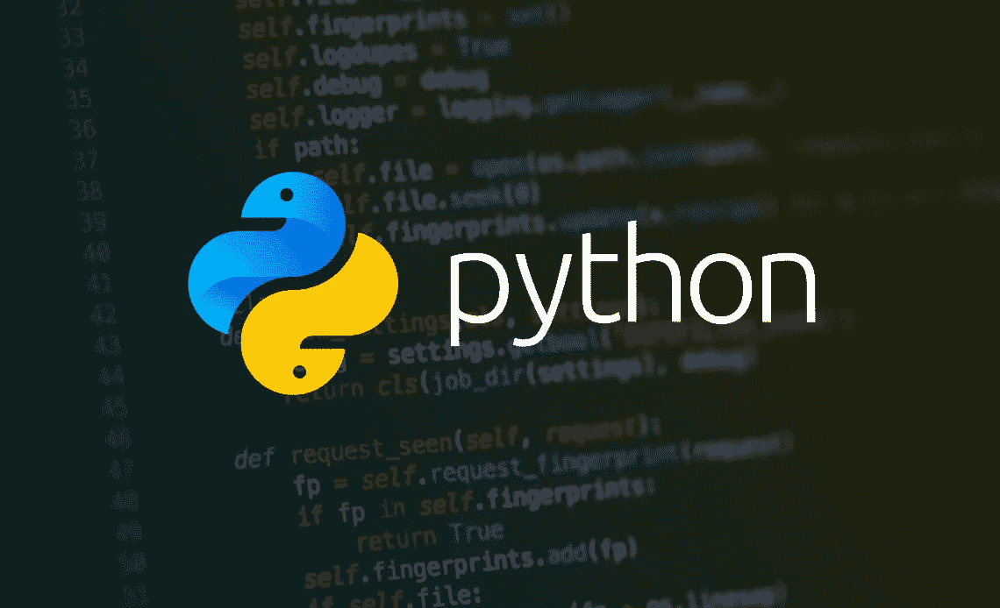

# 4 分钟学会 Python

> 原文：<https://medium.com/nerd-for-tech/learn-python-in-3-minutes-7d7ce5c51afb?source=collection_archive---------2----------------------->

这里有一个备忘单，可以帮助你开始使用 Python。只需 4 分钟阅读，你就可以动手了！

## 入门指南

Python 通常更受欢迎，因为它很容易学习。它用于开发网站和软件、任务自动化、数据分析和数据可视化。

它支持多种编程范例，如面向对象、结构化和函数式编程。

## 变量和字符串

您可以定义一个变量，而不需要给它一个类型，如下所示:

> var1 = "Hello world！"
> 
> var2 = 354

您可以将字符串打印为:

> print("Hello world！")

**注意:**变量名不能以数字开头，只能包含 A-z、0-9 和 _ 并且区分大小写。

## 列表

您可以将列表定义为:

> list = ["苹果"，"橘子"，"香蕉"]

其中列表中的第一项和最后一项可以称为:

> list[0] =“苹果”；
> 
> list[-1] = "香蕉"；

您可以在列表中循环，在一个数字范围内工作，并将项目添加到列表中，如下所示:

> numList = []
> 
> 对于范围(3，6)中的 n:
> 
> numList . append(item)//numList =[3，4，5 ]

**注意:**范围适用于下限，但在上限之前停止。

您可以对列表进行切片，并获取索引前/后的项目，如下所示:

> numList[:1] //返回索引 1 = [3]之前的项目
> 
> numList[1:] //返回索引 1 = [4，5]之后的项目

您可以按索引删除值，如下所示:

> del numList[1]

或者，您可以通过使用值本身来删除您不知道其索引的值，如下所示:

> numList.remove(4)

您可以弹出列表中的最后一个值，甚至可以将它赋给变量，如下所示:

> lastNum = numlist . pop()//lastNum = 5

一个**元组**是 Python 中的一个变量类型，就像一个列表，用于在一个变量中存储多个值，但不可改变。

> myTuple =(“苹果”、“橘子”、“香蕉”)

## 情况

经典条件也适用于 Python:

x == 4，x ≤ 4，x ≥4，x <4, x> 4，x！= 4 …

还有列表条件:

> list //中的“apple”返回 true，因为“apple”存在于 list 中
> 
> “orange”不在列表中//返回 false，因为“orange”存在于列表中

您可以将布尔值设置为:

> myVar = False //注意 False 的大写字母

Python 中的 If 语句看起来像:

> 如果年龄≤ 12 岁:
> 
> isChild = True
> 
> 否则如果 12
> 
> isTeen = True
> 
> 否则:
> 
> isAdult = True

## 字典

您可以将键值对作为变量保存在 Python 中。这种变量被称为字典。字典可以保存不同的数据类型作为键值。

> user = { 'name' : 'Jane Doe '，' age' : 30}
> 
> print(user['name']) //打印无名氏
> 
> 用户['phone'] = '5554433' //将值为' 5554433 '的键' phone '添加到用户词典中

您可以循环遍历字典，如下所示:

> fav_fruit = { 'Jane ':'苹果'，'约翰':'橘子' }
> 
> 对于名称，fav_fruit.items()中的水果:
> 
> 打印(姓名+“爱”+水果)
> 
> //打印“简喜欢苹果”和“约翰喜欢橘子”

或者，您可以只遍历字典中的键或值，如下所示:

> 对于 fav_fruit.keys()中的名称:
> 
> 打印(姓名+“爱水果！”)//打印“珍爱水果！”和“约翰喜欢水果！”

您可以获得如下输入:

> name = input("你叫什么名字？")

**注意:**输入默认是 Python 中的一个字符串。所以如果你想得到一个输入，比如说，一个 int，你应该这样做:

> 年龄=输入(“你多大了？”)
> 
> age = int(年龄)

## While 循环

您可以运行 while 循环，如下所示:

> 年龄= 15 岁
> 
> 而年龄< 18 岁
> 
> print("用户尚未成年！")

## 功能

您可以按如下方式定义和调用函数:

> def add_numbers(x，y):
> 
> 返回 x + y
> 
> sum = add_numbers(3，5)
> 
> print(sum) //打印 8 张

## 班级

您可以定义一个类并创建它的实例，如下所示:

> 班级人员:
> 
> def __init__(自己，姓名，年龄):
> 
> self.name = name
> 
> 年龄=年龄
> 
> person1 = Person("Jane "，30)
> 
> 打印(人员 1 .姓名)

## 文件

您可以使用 Python 读取或写入文件，如下所示:

> fileName = 'employees.txt '
> 
> 用 open(fileName)作为 file_object:
> 
> file_object.write('John Doe') //将“John Doe”写入文件
> 
> lines = file_object.readLines()
> 
> 对于线中的线:
> 
> print(line) //打印“John Doe”

## 例外

您可以按以下方式处理异常:

> 提示(“输入一个数字”)
> 
> 尝试:
> 
> num =输入(提示)
> 
> 期望值错误:
> 
> print("值无效。再试一次。”)
> 
> 否则:
> 
> 打印(“谢谢。”)

## 结论

虽然这篇文章是快速入门和动手工作的好方法，但是 Python 可以提供比这些基本函数更多的功能，并且附带了很好的文档，所以请确保不时地查看一下。请记住，Python 附带了令人惊叹的第三方模块，这些模块基于您要使用它的任何东西，并通过它们表现出色。