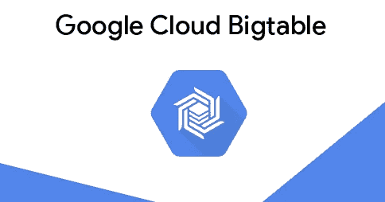
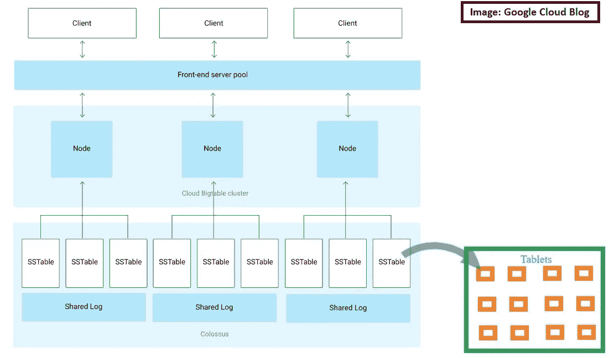
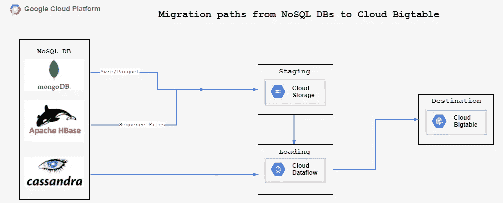
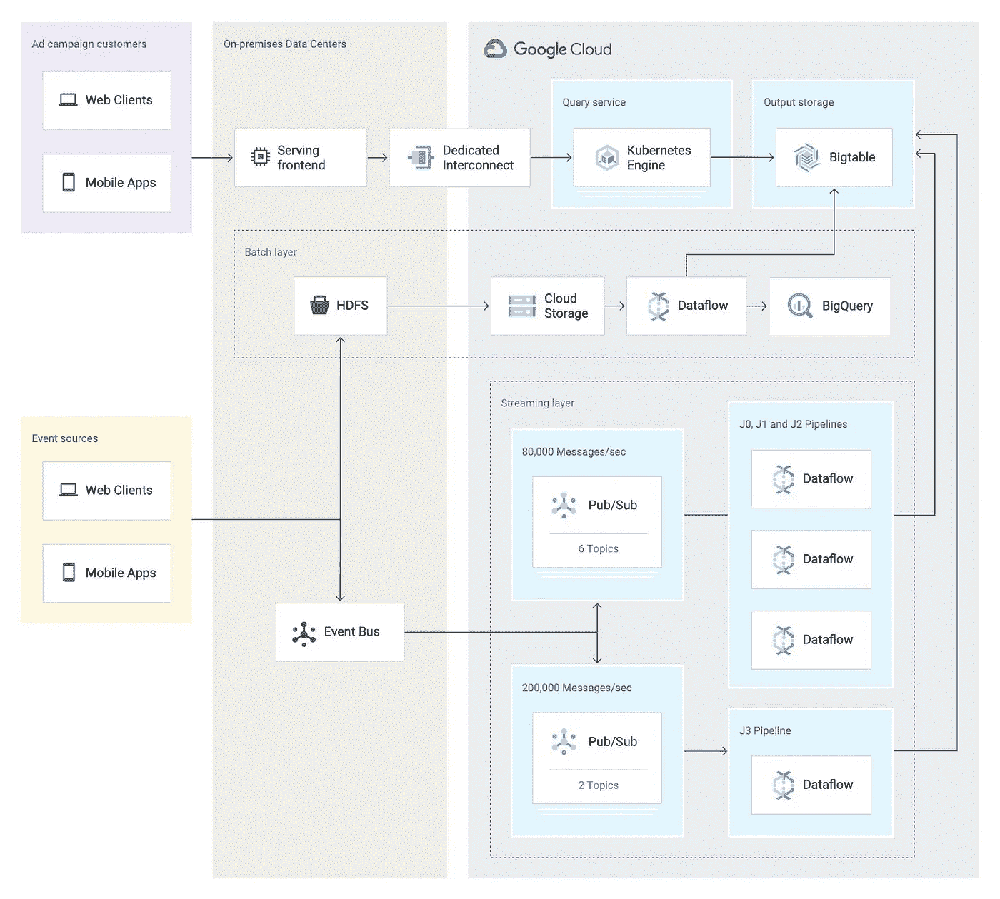
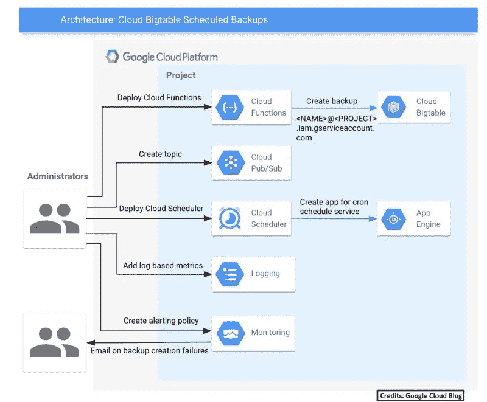

# 在 10 分钟内了解 Bigtable 的大部分内容

> 原文：<https://medium.com/nerd-for-tech/learn-the-most-of-bigtable-in-within-10-minutes-57f319104590?source=collection_archive---------2----------------------->

图片来自谷歌

## 想知道 YouTube 的推荐系统有多快吗？

或者

## 谷歌地图定位或帮助搜索位置的准确度如何？

以至

## 谷歌搜索引擎如何更快地为你的搜索返回几乎准确的结果？

为了达到今天的水平，这些系统需要大量的数据，以便运行模式识别、预测系统、键值搜索等模型。

存储如此庞大的数据需要高可用、持久、能够处理大量数据写入/读取(吞吐量)且速度更快的弹性数据库。

> **Bigtable** 是谷歌云的 NoSQL 产品，是一种完全托管的服务，可以以高吞吐量和最小延迟处理大量数据。

**云扳手**不是一回事吗？

部分是，但是当两者比较时，这里有一些“值得知道”的东西:

Cloud Spanner 和 Bigtable 都允许用户存储数 Pb 的数据。

◆ Bigtable 是一个宽列存储，它可以保存非常大量的动态列，并且与 Cloud Spanner 不同，它是无模式的。

◆ Cloud Bigtable 不像 Spanner 那样支持 SQL 查询(“NoSQL”，而且显而易见)。但是可以使用 Bigquery 作为查询引擎，在 Bigtable 上运行联邦查询。

◆像 Cloud Spanner 一样，Bigtable 中的分片是在内部完成的。数据路由太偏离路线。

◆与 Spanner 不同，Bigtable 没有“多区域”实例。

◆默认情况下，Spanner 根据实例类型在区域内进行复制，而您需要添加额外的集群来自动复制 Bigtable 中的数据。

## 使用 Bigtable 需要我们了解一些概念:

## ✔存储类型

**在 Bigtable 中创建实例时，我们应该选择我们想要的存储类型。**

*   **硬盘驱动器或硬盘驱动器**适合大数据量(谷歌建议当数据量为> 10 TB 时，硬盘驱动器是一个可行的选择)。但是请注意，硬盘会影响吞吐量和延迟。迁移大量数据或归档数据时，硬盘是合适的选择。
*   **另一方面，SDD 或固态硬盘**比硬盘相对更贵，但更适合更好的延迟和吞吐量。
    SDD 比 HDD 更受青睐，我们在创建集群时所做的选择以后无法更改。

## ✔行键

Bigtable 中的行键类似于 RDBMS 中的主键(或多或少)。它们有助于更快地在 Bigtable 中找到数据。与 RDBMS 中的主键不同，行键不应该是增量的，应该仔细选择以避免热点。

行键是多个标识符的组合，标识符之间有一个分隔符。

例如，[credit#celeb#2b3f81c9]是一个有效的行关键字，它是卡类型、卡类别和用户 id 的组合，以哈希作为分隔符。

**✔列科**

Bigtable 中的列族是组合在一起的相关列。

比如【姓名、地址、电话、性别、邮箱】一起可以是一个“栏目族”，可以命名为“Info”。这些列放在一起是为了更快地读取。必须注意，应该在将数据迁移/放置到 Bigtable 中之前创建列族，但是也可以在以后添加列。删除列族也会导致存储在该族中的数据被删除。

**✔药片**

Bigtable 中的平板电脑或多或少类似于 Cloud Spanner 中的 Splits。平板指的是 Bigtable 中特定节点上的数据块。Bigtable 集群中的节点将请求发送到一个表，该表被进一步划分为片以平衡流量。

**✔排序字符串表又名 SSTable**

一旦 Bigtable 中的表被分片到平板电脑中，它们将以“排序字符串表”的格式存储在 Google 文件系统(Colossus)中，这种格式可以有效地处理大量的键值对，同时保持低延迟和高吞吐量。

Bigtable 架构—图片来自 GCP 站点，添加了平板电脑

## 如何从现有的 NoSQL 数据库迁移到 Bigtable？

从 NoSQL 数据库迁移到 Bigtable 的架构流程示例

上图只是一个例子，展示了将数据从其他 NoSQL 数据库迁移到云 Bigtable 的各种方法。

**Dataflow** 为将您现有的 NoSQL 数据库迁移到云 Bigtable 提供了大量支持。

如果您将数据从现有的 NoSQL 数据库批量迁移到 Bigtable，您可以在数据流中选择支持数据库迁移的 4 个“Google 提供的模板”之一。

◆云存储 Avro 到 Bigtable
◆云存储拼版到 Bigtable
◆云存储序列文件到 Bigtable

使用云存储作为 staging area，在数据流中建立管道，将数据迁移到 Bigtable。

◆ Apache Cassandra 到 Bigtable

在 Cassandra 和 Bigtable 之间建立连接，直接迁移数据，不需要 staging area(还是有 staging area 比较明智)。

下面简单介绍一下我们如何从流行的 NoSQL 数据库迁移到 Bigtable:

**✔ HBASE 到 Bigtable**

◆将 HBASE 表导出为 Hadoop 序列文件
◆将这些序列文件导入云存储
◆使用数据流模板“云存储序列文件到 Bigtable”设置管道
◆不断将数据从云存储移动到 Bigtable

**✔Cassandra 到 Bigtable**

◆在 Apache Cassandra 和 Cloud Bigtable 之间建立网络连接。
◆使用数据流模板“Cassandra to Cloud Bigtable”建立管道
◆不断将 Cassandra 表复制到 Cloud Bigtable 中。

提及:Astra 提供 CAAS (Cassandra 作为一项服务),在 GCP 市场有售。

更多信息请点击此处:

 [## 开源 Cassandra 现在在云上管理|谷歌云博客

### 在 Google Cloud，我们致力于将开源技术带给我们的客户。在过去的十年里，阿帕奇…

cloud.google.com](https://cloud.google.com/blog/products/databases/open-source-cassandra-now-managed-on-google-cloud) 

**✔MongoDB 到 Bigtable**

◆使用 MongoDB Compass 将 MongoDB 集合导出为 CSV 文件。
◆使用 Spark/Scala 或 Python 将 CSV 转换为 Avro/Parquet 格式。
◆将文件加载到云存储。
◆设置一个数据流模板“云存储 Avro 到 Bigtable”或“云存储 Parquet 到 Bigtable”
◆不断地将数据从云存储移动到 Bigtable。

以上仅适用于批量移动数据。

如果您正在迁移流数据，您可以将发布/订阅与数据流一起使用。

**移动流数据的示例架构如下:**

Twitter 的大表迁移混合架构(鸣谢:GCP 架构)

这里的架构是 Twitter 的混合云方法，通过混合本地服务器和 Google Bigtable 来处理其巨大的数据流(特定于广告管理和活动)。

**✔虽然批迁移的历史资料挺直的，**

◆本地 Hadoop 集群中的数据从 Hadoop 序列文件转换为 Avro(根据我的说法，这种转换是不必要的，因为数据流也可以处理序列文件)。

◆这些数据随后从 HDFS 加载到云存储中。

◆在数据流上部署一个管道，将数据从 GCS 加载到 Bigtable。

**✔处理流数据很有趣。**

◆ Event Bus，Twitter 基于分布式日志的内部工具，将 Avro 消息推送到两个不同的 Pub/Sub 流。

◆具有 6 个主题的流 1 每秒接收 80，000 条消息，具有 3 个数据流管道(J0、J1 和 J2 ),每秒处理超过 200 万个聚合。

◆具有 2 个主题的流 2 每秒接收 200，000 条消息，具有 1 个数据流管道(JBOY3 乐队),每秒处理超过 400，000 个聚合。

在这两种情况下，Apache Beam 都被用作 orchestrator。

流媒体管道的有趣之处在于，分区的方式是为了处理 Twitter 从其数据源接收到的流量和流量峰值。

拥有两个流，一个处理关键数据，另一个处理其他数据，这难道不是一个好主意吗？

## 使用 GCP 服务自动化大表备份

Bigtable 支持备份和复制。

备份是数据的拷贝，可以在生产数据库出现问题时提供帮助，其中复制通过在适用的不同区域复制数据库来帮助您的应用程序实现高可用性。

选择复制时，向现有集群添加一个新集群，并选择您选择的区域。请注意，实例复制应该存在于同一分区但不同的区域。您最多可以为每个实例创建 4 个复制。

另一方面，备份的成本低于复制，因为它们只是同一个集群上的数据库副本。Bigtable 允许用户为每个集群的每个表创建多达 50 个备份。

复制是一次性的过程。通过选择实例、在首选区域添加集群、配置应用程序配置文件并选择要复制的数据库来创建复制副本。其中，创建备份是一个连续的过程，通常需要通过单击要为其创建备份的表来手动完成。

这里的体系结构解释了如何使用 GCP 内的各种服务来自动化这些备份。

✔你创建一个云函数来创建一个云 Bigtable 备份。
✔使用云调度程序输入您的首选备份时间表。
✔使用发布/订阅向在步骤 1 中创建的云功能发送消息，具体取决于在步骤 2 中创建的计划
✔使用云监控来监控任务，并使用云日志来访问适当的日志。

Bigtable 中自动化表备份的示例架构

## **成本优化**

Bigtable 可以支持每秒数百万个请求，在最佳可伸缩性下具有低延迟。但是这种支持是有代价的。在追求将现有的 NoSQL 数据库迁移到 Bigtable 或者在 Bigtable 上建立一个新的数据库的过程中，我们经常忽略(或者我应该说错过了)我们所产生的成本，这些成本可以通过更多的研究来避免。

Bigtable 的开销成本取决于各种因素，如节点数量、存储选择(HDD 硬盘)、副本选择、备份选择等。

这些通常可以通过格外小心和利用 GCP 提供的其他服务来避免。通过使用云日志/发布/订阅/云功能等服务自动扩展节点数量，使用内存存储à GCP 服务进行缓存，并节省频繁运行的查询的成本等。

我认为这是最好的博客文章之一，也是我发现的唯一一篇对削减(或优化)巨额成本如此有用的文章。

 [## 查看如何优化数据库服务云 Bigtable | Google Cloud 博客

### 请注意，在上图所示的示例中，可用于云 Bigtable 操作的预算是…

cloud.google.com](https://cloud.google.com/blog/products/databases/check-out-how-to-optimize-database-service-cloud-bigtable) 

您可以从 GCP 文档中了解关于 Bigtable 的更多信息。

以下是链接:

 [## Bigtable 概述|云 Bigtable 文档| Google 云

### 云 Bigtable 是一个稀疏填充的表，可以扩展到数十亿行和数千列，使您能够…

cloud.google.com](https://cloud.google.com/bigtable/docs/overview)