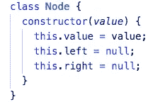
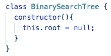
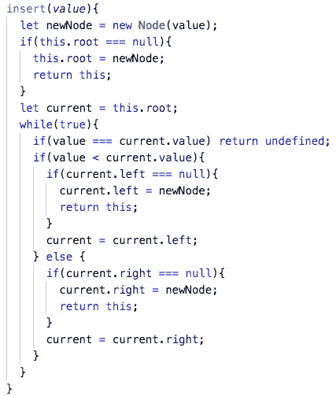
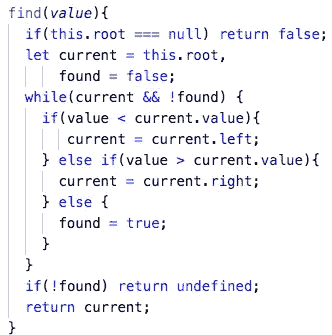

# 学习二分搜索法树

> 原文：<https://medium.com/nerd-for-tech/learning-binary-search-trees-138c68b447a2?source=collection_archive---------14----------------------->

野外的一棵二叉树

学习 JavaScript 内置数据结构之外的数据结构(如数组和对象文字)已经成为一种热潮。除了作为开发人员必备的知识之外，我真的很喜欢为每个数据结构创建定制类，以及让它们工作的方法。树木，特别是二分搜索法树(BST)是我迄今为止学到的最有趣的，我很高兴分享我收集的知识。在本文中，我将深入研究什么是树，树的一些实际应用，以及 BST 中的一些重要操作。本文中的许多信息和图片将来自我的 [repl](https://replit.com/@liamH47/Trees#index.js) ，在那里我为 BST 和它所包含的节点构建了一个类。

树作为一种数据结构之所以这样命名，是因为当被可视化时，它们看起来像一棵树(通常是倒过来的)。树由各种具有父子关系的节点组成。通常有一个根节点，该根节点具有指向树中更“向下”的其他节点的指针。树与链表相似，它们由相互指向的节点组成，但它们的线性度较低。字面上。在链表中，只有一种方式遍历数据，从前到后(如果是双向链表，也可以从后到前)。有许多不同种类的树，就像在现实生活中一样。本文将特别关注 BST。

几个简单的规则就是二叉查找树区别于任何老树的地方。它们如下:

1.  每个节点最多只能有两个子节点。
2.  位于其父节点左侧的每个子节点的值必须小于其父节点的值。
3.  位于其父节点右侧的每个子节点的值必须大于其父节点的值。

虽然这些规则确实限制了可以放入树中的内容和位置，但它们使 BST 成为处理排序数据的一种非常有用和高效的数据结构。如果您想要找到一个特定的节点，那么您沿着树往下走的每一层都会消除一半的可能剩余节点。这也意味着添加另一个级别只会将查找节点的最大步骤数增加一个。

事不宜迟，让我们看看如何用 JavaScript 构建 BST！

有了这个简单的设置，您就有了一个功能完整的节点，以及可以添加方法的 BST 框架。由于 BST 的性质，要添加的两个最重要的方法是 insert 和 find。我们需要能够向 BST 添加一个新节点，并确保它在正确的位置，并且我们需要能够在节点在那里时找到它们。这两种方法都将接受一个值，并遍历树。

就是这样！这是一个完全有效的 BST。虽然没有太多的类方法，但是 BST 确实可以很好地完成一些事情。这就把我们带到了最后一部分，BSTs 的大 O。

插入:O(log n)

搜索:O(登录号)

查看[bigocheatsheet.com](https://www.bigocheatsheet.com/)了解更多精彩信息

感谢阅读！