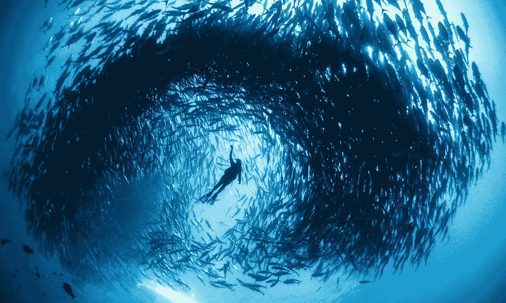
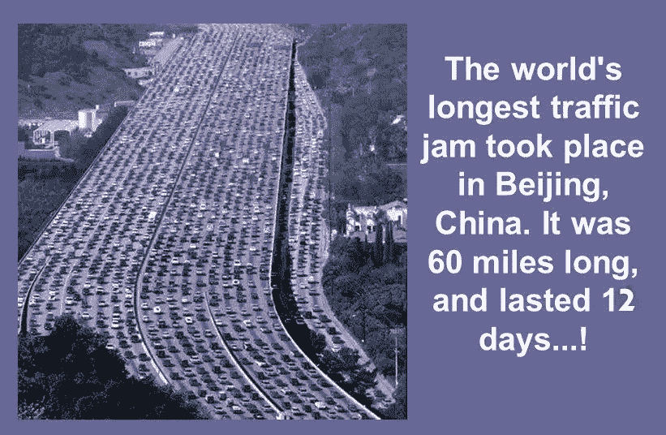
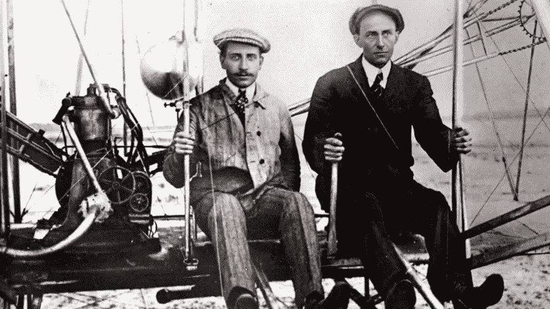
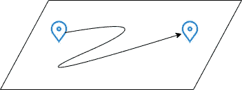
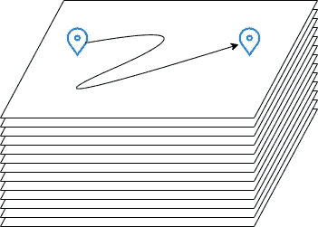
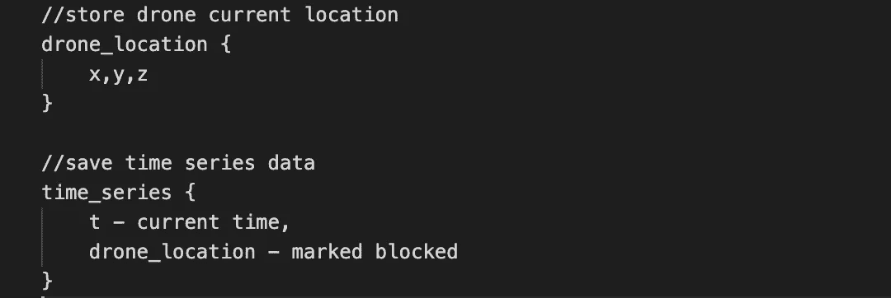
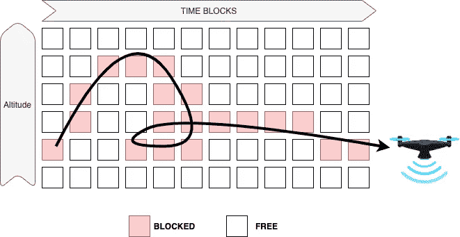

# 鱼群——未来无人机网络的灵感

> 原文：<https://medium.com/nerd-for-tech/learning-from-school-of-fishes-organizing-chaos-c737997d79ce?source=collection_archive---------17----------------------->

鱼群——下一代无人机网络的灵感

把自己当成学校里的一条鱼。你觉得不舒服吗？难道鱼不够聪明，不能观察并迅速决定它们下一步应该游向哪里吗？他们为什么不经常打对方？

不仅仅是鱼，看看这群鱼——它们是如何如此同步的？

就连蝗虫群也知道在混乱中让自己同步的诀窍。**蝗虫**通常以大约 16-19 公里/小时的**速度**随风飞行，这难道不神奇吗？

现在，看看我们——超级人类！！

我们已经征服了空间，但我们不知道如何组织这种日常混乱。

感谢莱特兄弟，他们在 1903 年发明了飞机，在过去的 117 年里，我们已经把他们的发明从制造飞机带到了卫星 [(3372 颗)](https://www.ucsusa.org/resources/satellite-database)，这些卫星只由超级机密的政府机构管理。

> ⚡:我一生中去太空旅行的愿望将会落空，我也永远不会知道地球是平的还是圆的。

在无人机时代，是什么阻止我们将处理空中交通的超级秘密方式商品化？

几十年前开发的系统速度很慢，无法有效处理无人机流量。

但是在我们开始解决这个问题之前，为什么我们需要基础设施来管理如此密集的空中交通？

# 了解原因？

*   一辆普通的**车**产生 55 g 的**二氧化碳** /乘客/公里。小型无人机送货可以**节约排放**。[点击此处阅读更多内容。](https://www.smithsonianmag.com/innovation/drone-delivery-good-for-environment-180968157/#:~:text=On%20average%20in%20the%20U.S.,kg%20of%20greenhouse%20gas%20emissions.)
*   发电越来越便宜，越来越清洁——无人机致力于绿色能源。当你想到噪音污染时，也要考虑它。
*   **更快&及时操作**(医疗帮助、在线监视、监控、产品交付、大型农场监控等)因为我们可以想到一层一层地建设，使其更加密集，但像鱼群一样有组织。
*   **产品破损率低**由于[道路质量指数](https://www.theglobaleconomy.com/rankings/roads_quality/)不是到处都好，包装被人搬运导致破损。
*   道路上的交通流量减少了——网上购物被认为可以让人们远离交通堵塞。这只会让事情变得更糟。
*   让交通警察的生活变得更轻松，减少路怒症、送货主管的鲁莽驾驶、鸣笛等。
*   想想空中监视，医疗救助

让我们来了解一下它的**对应**

*   自然居民的生长空间减少。从现在开始，我喜欢每天在鸟鸣声中醒来。
*   无人机缺乏安全性可能是灾难性的。它可能会造成小到使用开放的 WiFi，大到策划有针对性的攻击的问题。
*   [隐私问题](https://www.forbes.com/sites/stephenrice1/2019/02/04/eyes-in-the-sky-the-public-has-privacy-concerns-about-drones/?sh=286c0dd66984):我讨厌无人机在我家上空飞行。
*   硬件或软件故障可能导致严重的灾难性问题。
*   无人机盗窃——用石头砸它，它会撤退，现在你来控制。

> 考虑到所有这些反对意见，没有人会同意我们应该为无人机建造空中交通控制器。无人机是邪恶的。

但我们是人类，每天都期待新的挑战，我们足够聪明，可以通过沟通、建立协议、政府、法律等来解决问题。

如果我们没有适当的法律，最强壮的人会拥有一切。这些钱不会有任何价值。

我们将出台越来越多的强有力的法律来促进经济增长，让我们的生活更加便利。这些反驳的话可以小心了！

# 从 2D 到三维交通控制器

问任何一个程序员，他们都会知道如何建立一个交通系统——但是空中交通管制员是一个稍微难一点的问题，很少有人知道。

让我们从视觉化开始——你能视觉化吗？

让我们首先从 2D 可视化开始，考虑有一辆车，它必须从 A 点到 b 点。在一页上画出来(物理)。

二维交通可视化

现在画 1000 页同样的图，把所有的图叠起来。这是 3D 交通的样子。

> 它就像“n”层堆叠起来的路线图。

三维交通可视化

让我们设计一个数据结构来解决这个问题。

**这是否意味着我们只需要一种 3D 方式来表示坐标和基于时间的系列数据就可以解决这个问题？**

是的，如果你认为你的空间是一个菱形。

> 但是等等，你怎么知道你的无人机的坐标？

这是一个**难题**因为地球不是平的([到这里看点有趣的](https://physicsworld.com/a/fighting-flat-earth-theory/))。可以用 GPS 坐标吗？它提供 1m 精度的数据。

哦不，全球定位系统的高度坐标是非常不准确的。它可能有 1 米的水平位置精度，但高程精度差。它的精度误差是水平位置精度的 2 到 3 倍。

因此，在我们解决这个位置问题之前，我们不可能建立一个像鱼群一样的运输系统。

> 我们需要重新发明 GPS 系统来创建鱼群运输系统。

**我们可以尝试的一个快速解决方案**是，我们可以创建**高程带**，无人机应该连续传输高程带及其 GPS 坐标。

高程带

> 但是我们如何创建**海拔带**？
> 我们可以开发本地地面基础设施，以持续跟踪无人机和每架无人机的高度带。

构建、维护和监控这样的基础设施是昂贵的。这在通信方面非常沉重，因为一切都驻留在云中，这需要网络(在某些领域总是不稳定)。

那么，解决办法是什么呢？

# **引入边缘 AI**

**Edge AI —** 机器学习算法，在本地层面处理硬件设备生成的数据**。**

> *制造像鱼一样自助的雄蜂。我们需要建造智能无人机，它们能够理解交通状况，并自己实时做出决策。*

无人机需要实时执行的任务包括:

1.  **了解周围环境并迅速做出决定。**

就这样，没有工作了。

# 快速、本地和自治

云与边缘人工智能延迟

数据不需要在云上共享，所以它可能会限制我们只为特定的领域存储。你不需要建立一个基础设施来实现它，因为它将是“自主的”。

欢迎来到未来——搭载 Edge AI 的自主无人机。

如果你喜欢这个帖子，请分享。我们报道未来——敬请关注。

如果你喜欢这篇文章，请分享它，我正在准备一个新家。Medium 还不支持印度人的会员计划。