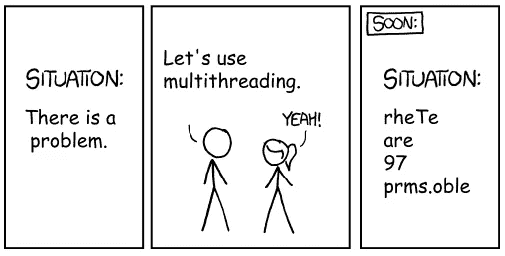
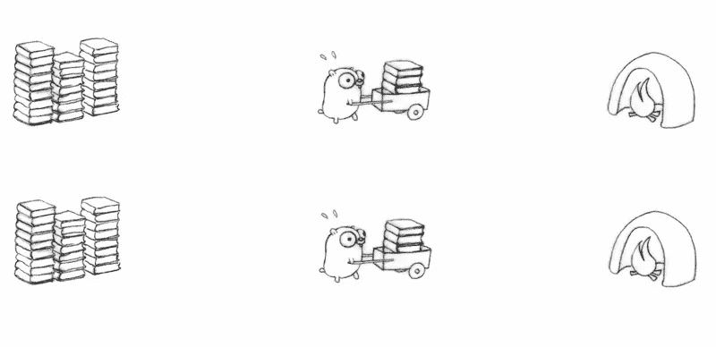
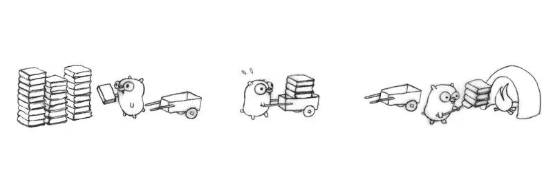
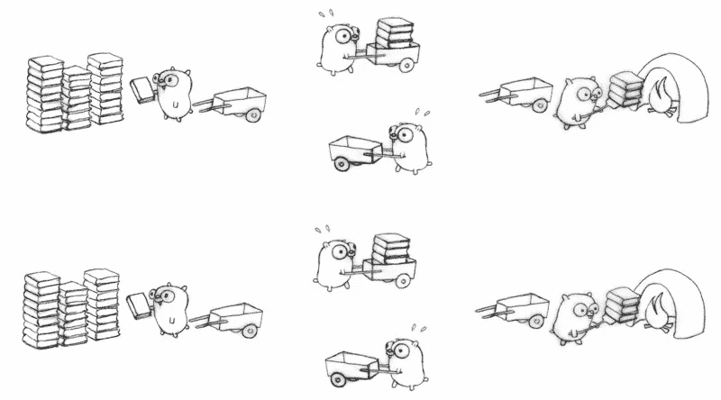
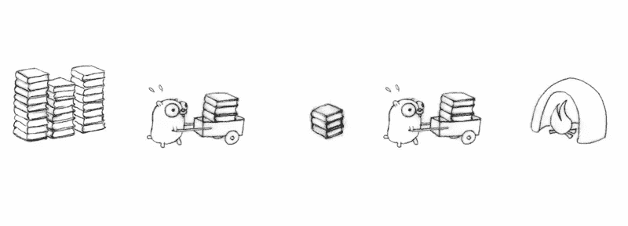

# 使用 Goroutines & Channels 学习 Go - Concurrency

> 原文：<https://medium.com/nerd-for-tech/learning-go-concurrency-goroutines-channels-8836b3c34152?source=collection_archive---------0----------------------->

就像任何提供构造来构建并发运行任务(如 java 中的线程)的语言一样，Go 也提供称为 Goroutines 和 channels 的构造。本文将讨论这些结构，并讨论一些示例代码。

# **Goroutines**

**Goroutines** 是与主程序流程同时执行**和**的函数。简而言之，主程序是主 goroutine，任何其他派生的 goroutine 都将在主 goroutine 的保护下运行，直到主 goroutine 的生命周期结束。它相当于 java 中的轻量级线程。
Goroutine 使用一种在 Go 中被称为通道的**通信机制与其他 Goroutine 交互。**

# **频道**

一个**通道**是一个通信对象，使用它 goroutines 可以相互通信。通道是一个数据传输块，其中数据可以被**写入**或**从**读取。一个 goroutine 将数据写入通道，另一个 goroutine 可以从中读取数据。
查看操作员以前的帖子(- >)

**使用频道**

**单向通道**Golang 还提供了单向通道，你可以从读取数据，也可以从**写入数据。** 在教科书定义中，它旨在为程序提供类型安全，使程序不容易出错。在一般类型中，我找不到更多的使用它来代替每个链接的单元测试

 [## 在 Go 中创建单向通道有什么意义

### 感谢贡献一个堆栈溢出的答案！请务必回答问题。提供详细信息并分享…

stackoverflow.com](https://stackoverflow.com/questions/36798580/whats-the-point-of-creating-one-way-channels-in-go) 

## 描述 goroutine 和 channel 的简单函数

> **通道被阻塞**。如果一个 goroutine 试图从一个空通道中读取，那么它将被阻塞，程序执行将一直等待，直到它收到一个值。

# **等待组**

还有另一个名为 waitgroup 的构造。这类似于其他编程语言中的 waitgroup。当调用者 goroutine 需要等待已经在其流中创建的一组 go routine，并且打算阻塞直到被调用的 go routine 的执行完成时，使用这种方法。

> Goroutines 和 threads 之间的差异
> 1。Goroutines 的启动时间比线程快。
> 2。Goroutines 在少量操作系统线程上多路复用。
> 3。Goroutine 有一个增长的分段堆栈，而这些线程有一个常量堆栈和一个增长的堆。

> Go 中没有锁的要求

到目前为止一切顺利。听起来非常类似于传统的线程间通信。但是现在，我们需要理解的主要区别，来自传统的基于线程的编程语言，是如何分配工作以实现并发性的范例的变化。

在进一步阅读之前，我鼓励大家观看下面的 Rob Pike 的视频，他在视频中完美地解释了这个概念。

**传统并发模型**
1。基于共享内存位置的概念
2。多个线程试图访问共享内存并试图修改它。
3。因为多个线程可以同时修改内存中的同一个变量，所以出现了共享变量锁的概念，这样只有一个线程修改变量，而其他线程则在等待。
4。为了保持一致性，在等待线程中引入了同步的概念。
5。上帝禁止多线程场景中的可调试性。

**Golang 并发模型**
1。goroutines 不应该有共享的堆栈内存。
2。并发是一种通过将程序分成可以独立执行的片段来构建程序的方法。
3。沟通是协调独立执行的手段。

**明白了…肯定没有！！！**
我试着整理了一些来自上述[会议](https://talks.golang.org/2012/waza.slide#12)幻灯片的图片，这些图片可能更有意义

以下方法有 3 个实体
1。书籍设置-输入
2。gopher+cart-go routine+channel
3。木材燃烧器-输出

## 方法 1 -将处理分成单个 go routine+通道

有一个单一的 goroutine 做这项工作。

添加一个新的 goroutine 来完成这项工作，但是没有 cart(通道)，它是没有用的。不并发

添加一个 go routine+通道和实现的并发性，但只使用一个输入源。

添加一个 go routine+通道和实现的并发性，但只使用一个输入源。

## 方法 2 -将处理分成多个连续的 go routine+通道

地鼠 1 -推车上堆书
地鼠 2 -运输推车
地鼠 3 -书着火

添加一个 gopher+cart 来增加并发性。

拆分书堆并复制相同的设置。并发性增加。

## **方法 3 -** 将处理分成多个连续的 gorroutine+通道

Gopher+cart 将书籍堆放在推车上并运送到检查站。另一个地鼠+车选择从检查站开火。

复制设置和并发性增加。

> 现在我想有些事情已经开始被理解了。为了理解相同的内容，我使用了多种资源，并亲自动手编写代码。修订并发是一种通过将程序分成可以独立执行的片段来构建程序的方法。

希望这篇文章有助于理解 Go 中的并发性。还有一些东西可以阅读，如下所示。作为工作池的通道
2。mutex——用于处理共享内存情况下 goroutines 之间的竞争情况。
可能更多，但如果需要可以阅读。基本概念是一些需要深入理解的东西，以在 go 中编写并发性来达到很好的效果。欢迎对帖子发表评论，指出不符之处。