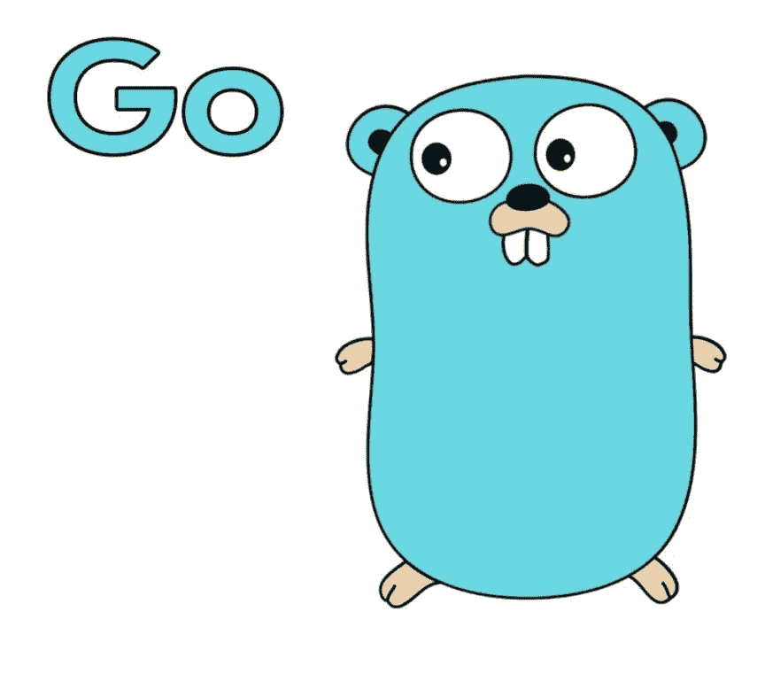

# 学习围棋——指针

> 原文：<https://medium.com/nerd-for-tech/learning-go-pointers-195b5c1f9b85?source=collection_archive---------2----------------------->



# **指针**

指针是一个变量，它存储另一个变量引用的内存地址。指针有能力改变它们所指向的数据。

如果您来自 C/C++背景，那么您肯定使用过指针(*)。指针是编程语言中最复杂和最强大的范例之一。

## **初始化一个指针**

```
arrA := [...] int{1, 3, 5}
var b *int = &arrA[0]
```

观察 **&(地址)**操作符。当我们讨论数组和切片时，我们已经在以前的一篇帖子中讨论过这一点。

## **修改指针参考值**

```
arrA := [...] int{1, 3, 5}
var b *int = &arrA[0]
fmt.Println("value : ", arrA[0])
*b = 10   // update value of a pointer references address
fmt.Println("New value : ", arrA[0])Result
value :  1
New value :  10
```

注意，当我们使用 **(*b)** 更新 **b** 引用地址的值并分配一个新值时，原始数组中的值得到更新。

***(解引用操作符)** *操作符必须与指针变量名称一起使用，对指针变量引用的内存位置中的值进行操作。

# **指针和结构**

结构可以通过指针访问。
记住我们上一篇文章中的员工结构！

```
type Employee struct {
   id int
   name string
   dept []string
}
```

让我们尝试使用指针来保存对 struct 实例的引用。

```
pntrStr := &Employee{}
fmt.Println(*pntrStr, pntrStr)    // print value of the pointer reference and pointer
pntrStr.name = "value"    // modify the value of name
fmt.Println(pntrStr)     // print value of the pointerResult
{0 []} {0  []}
&{0 value []}
```

观察我们使用指针变量访问结构的字段**名称**的方式。这和我们使用正态变量的方法是一样的。但是我们不是讨论过需要在指针变量名后面附加一个*来访问它的值吗？嗯，这是 T21 合成糖。实际的方法应该是

```
(*pntrStr).name = "look at this"
```

但是具有 struct 的指针可以使用

```
pntrStr.name = "value"
```

## **未初始化的指针**

Go 中未初始化的指针有一个唯一的值 **nil。**所以在使用一个指针值之前，你可以保持对它的值不为零的验证。

## **指针操作**

**==，！=**
如果两个指针都指向内存中的同一个变量，那么它们可以相等。否则他们是不平等的。

## **作为函数参数的指针**

指针是围棋中的特殊变量。但是它们仍然是变量，因此可以作为函数签名中的参数传入。

```
func f(a *int) {     fmt.Println(*a) }
```

不要担心函数定义。我们将在后面的文章中讨论这个问题。观察 Println 函数中传递的指针值。

## **新关键字**

Go 中的**新**函数返回一个指向类型的指针

```
var pntrStr2 *Employee
pntrStr2 = new(Employee)
fmt.Println(pntrStr2, *pntrStr2)
```

观察使用情况。 **new** 返回指向 Employee struct 新实例的指针。

## **结尾注释**

Go 和 c 语言中的指针有一些重要的区别需要注意。

*   类似于 C/C++中指针的空值，Go 对指针有 nil。
*   Go 不像 C/C++那样提供指针算法。这使得它比 C/C++更安全，同时提供了令人惊叹的功能。
*   使用不安全的包有办法改变指针。但是除非有特殊原因，否则不要玩这个游戏。

我想这是它的指针。这篇文章给你关于指针和如何使用它的基本理解。当我们到达 Go 主题中的**接口时，我们将观察更多的使用风格。**

就这样，我们的帖子到此结束。我试图尽可能地涵盖更多内容，并为您提供见解及其用例与实现。**你可以在帖子上评论任何细节或不一致的问题**。或者你可能想根据你的兴趣谷歌一下复杂的细节。

下一篇文章将会介绍围棋中的 ***函数和方法*** 。