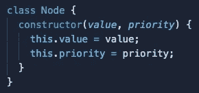
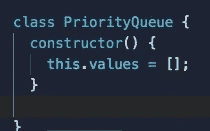
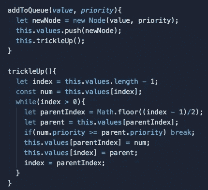
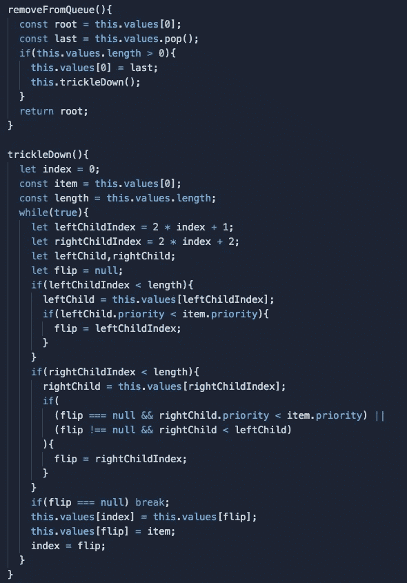

# 学习优先级队列

> 原文：<https://medium.com/nerd-for-tech/learning-priority-queues-9d77e6938ac6?source=collection_archive---------22----------------------->

上周，我写了我第一次涉足二进制堆的经历，可以在这里找到。了解堆对于学习优先级队列非常有帮助，因为实现优先级队列的最佳(但不是唯一)方式是使用堆。在上周的帖子中，我还做了一个 repl 的链接，展示了如何用 JavaScript( [这里是](https://replit.com/@liamH47/Binary-Heaps#index.js))构建 max heap，以及一些需要实现的基本方法。我在同一个 repl 中添加了一个优先级队列类。

# 什么是优先级队列？

优先级队列是一种抽象的数据结构。它很像一个普通的队列，只是每个节点或元素除了它的值之外还有一个优先级。首先从队列中删除优先级最高的节点。如果两个元素具有相同的优先级，那么首先添加到队列中的元素将首先被删除。

我们可以通过多种不同的方式来实现优先级队列。我们可以使用数组、链表或堆。二进制堆非常适合用作优先级队列，因为最大堆和最小堆是分别基于小于或大于其父节点值的节点值来组织的。这意味着创建优先级队列的许多逻辑已经存在于堆中。因为堆很容易用于优先级队列，所以有一种常见的误解，认为优先级队列就是堆。虽然您可能应该总是为您的优先级队列使用堆，但是知道您不一定必须这样做是很重要的。

# 为什么不是数组或者链表？

如果我们使用数组，时间复杂度会大得多。就大 O 而言，数组最大的弱点是重新索引。例如，如果我们将一个项目添加到数组的开头，那么后面的每个元素都需要重新索引。添加到末尾会更有效，但不幸的是，这并不能解决我们的问题，因为数组很快就会不按优先级排序。在这一点上，我们将不得不遍历数组来找出哪一项具有最高的优先级，这可能需要很长时间，具体取决于数组的大小。虽然它可以完成工作，但是堆是一个更有效的工具。对于这样的任务，链表和数组有相似的时间复杂度问题。

# 现实世界的应用

我们的计算机一直使用优先级队列来确保最重要的操作被首先处理。它们也用于数据压缩和 Djikstra 的最短路径算法。然而，优先级队列的概念并不专属于计算机科学。新冠肺炎疫苗的推出是优先排队的一个很好的例子。你可以认为老年人是最优先考虑的，其次是免疫系统受抑制的人，必要的工人，等等。当优先级相等时，例如两个 90 多岁的人，谁先打电话或申请预约(或“排队”)，谁将首先接种疫苗。

# 有趣的部分

现在您对什么是优先级队列有了一个很好的想法(或者，至少我有一个很好的想法)，下面是我用来实现优先级队列的代码！我决定做一个最小堆，因为上周我做了一个最大堆。优先级队列可以由两者之一构成。使用最小堆时，优先级最低的节点将首先被删除。虽然这可能看起来违反直觉，但在编程之外,“优先级 1”实际上是“最高优先级”的意思这当然也可以用最大堆来完成，只是要记住最高优先级的值将首先被删除。

首先，这是我创建的节点类。这些节点将构成我们的优先级队列，并且相对简单。没有指针之类的东西，只有一个值和这个值的优先级。

接下来，我们有基本的优先级队列，没有任何方法。

下面是我们向队列添加新节点的方法。

最后，这是从队列中删除最高优先级项目的方法。

感谢您的阅读，我希望您发现这是有益的和信息丰富的！