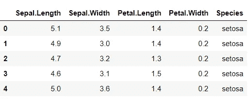
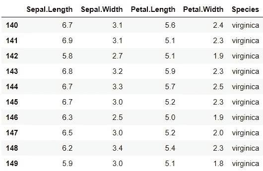
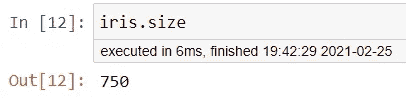
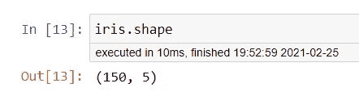
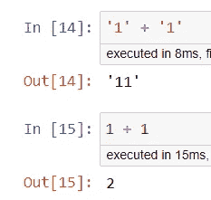
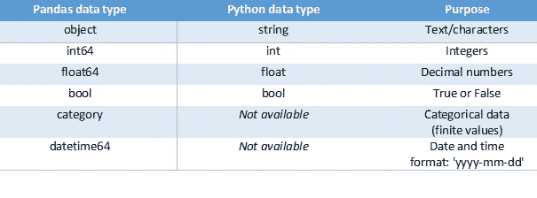
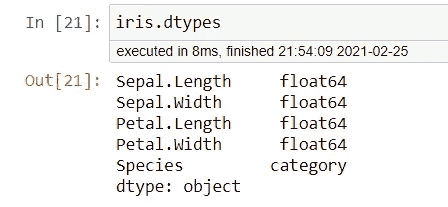
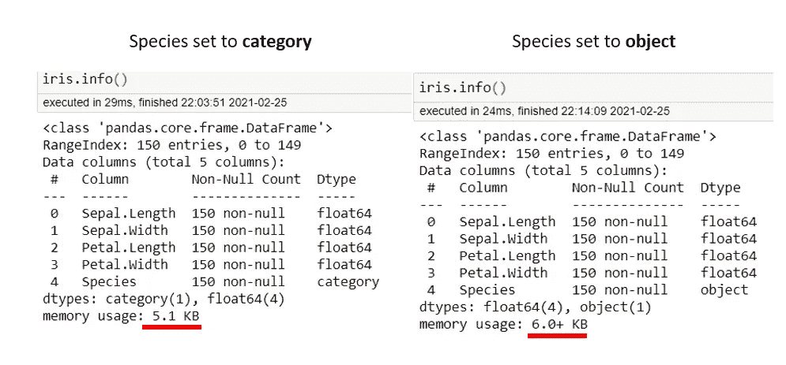
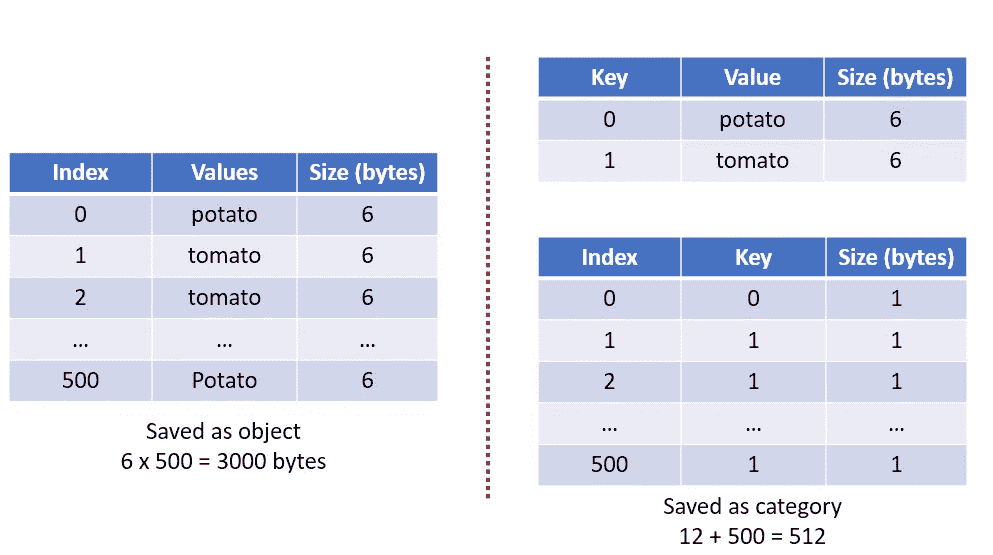

# 为数据科学学习 Python:数据检查和数据类型

> 原文：<https://medium.com/nerd-for-tech/learning-python-for-data-science-data-inspection-and-data-types-5b5e80954a6b?source=collection_archive---------4----------------------->

## 数据=理解


图片来自 [Unsplash](https://unsplash.com/photos/KgLtFCgfC28)

在我们进一步讨论之前，先声明一下，我绝不是 Python 和熊猫库的专家。其实恰恰相反。我是一个狂热的 R 和它的库用户，但我最近才开始学习 Python 编程，因为我对用 Python 学习数据科学感兴趣，抱歉我不忠实 R [😢](https://emojipedia.org/crying-face/)

我写这篇文章的目的是首先帮助我自己和其他刚开始用 python 编程的人。

不要再拖延了，让我们开始吧！

根据多年的 R 编程经验，数据分析的第一步，也可能是最关键的一步**是获取数据本身。因此，让我们使用一个数据科学领域的人可能至少使用过一次的数据集，即 **iris** 数据集。我们将利用包***stats models****来获取 Python 中的虹膜数据。对于数据检查，我们将使用 ***熊猫*** ，所以我们也安装它。如果您还没有安装软件包，请使用 pip 来安装。***

```
*#install statsmodel with pip
pip install statsmodels
pip install pandas*
```

*要在 jupyter notebook 或 Python IDE 中将 iris 数据集保存到变量中并可视化数据框，请使用以下代码:*

```
*import statsmodels.api as sm
import pandas as pdiris = sm.datasets.get_rdataset('iris').data
iris.head() #to check the first 5 rows of the dataframe*
```

**

*虹膜数据集的前 5 行*

# *数据检查*

# *。头()和。尾部()*

*眼见为实。为了检查我们是否成功导入了虹膜数据集，我们可以使用 **iris.head()** 来检查虹膜数据的前 5 个条目。在上面显示的数据框中，我们可以看到第**行和第**列被加粗。这由熊猫突出显示，以指示**行索引**和**列名**。还需要注意的是，python 的索引是从 0 开始的，而不是从 1 开始的，这与其他编程语言不同，比如 R 和 MATLAB。*

*如果你有兴趣知道最后 5 个条目，我们可以使用 **iris.tail()** 。我们还可以在 **head()** 或 **tail()** 内部指定一个**参数**，通过插入一个数字来显示 **n 个观察值**而不是 5。例如， **iris.tail(10)** 显示虹膜数据的最后 10 个条目。*

**

# *。大小()和。形状()*

*现在我们已经看到了我们的数据，我们应该有兴趣知道数据框的大小。数据帧的大小就是行数乘以列数。为了获得这些信息，我们可以使用 **iris.size** 来查看我们有多少个条目(不包括行和列标签)。*

**

*iris 数据帧中有 750 个条目*

*现在，由于我们不知道行数和列数，仅知道数据框的大小可能不会提供太多信息。为了获得这些信息，我们可以使用 **iris.shape** 返回行数和列数。*

**

*iris 数据帧中有 150 行和 5 列。注意:显示的数字始终是(行，列)*

# *熊猫数据类型*

*数据框中的每一列都有适当的数据类型是不可或缺的。这是因为每种数据类型都有其独特的相应操作。下面我们来看一个简单的例子:*

**

*第一个加法是字符串**和**之间的加法，第二个加法是整数**和**之间的加法。在数字数据类型上，我们可以执行加、减、乘等数学运算。另一方面，字符串操作会导致两者相加。因此，确认数据的数据类型非常重要。*

*在我们开始之前，让我们熟悉一下 Pandas 中可用的数据类型(你知道 Pandas 和 Python 可以有不同的数据类型吗？).*

**

*关于熊猫和 Python 数据类型的简要说明(图片由作者创建)*

*这篇文章将涵盖除**日期时间 64** 之外的所有熊猫数据类型，更多关于**日期时间 64** 的内容将在后面的文章中介绍。*

*在熊猫中，Int64 和 **float64** 用来表示数字。 **Int64** (整数)是没有分数的数字，例如-3、0 和 3。 **Float64** 是用小数表示的数字，如-3.00、0.534、9.99。*

***Bool** 或 boolean 只能包含两个值，不是 ***真*** 就是 ***假*** 。布尔数据类型对于回答为“是”或“否”的列特别有用。例如，感染状态为、已感染(**真**)或未感染(**假**)。*

*Pandas 中的**对象**数据类型类似于**字符串**数据类型 python。**一个对象**的数据类型通常用字符表示，数字和非数字。**类别**数据类型类似于**对象**数据类型，但是它只有有限的可能性。*

*要检查一个 **Pandas** 数据帧的数据类型，我们可以使用**。数据类型**。让我们将此应用于虹膜数据帧。*

**

*检查 iris 数据框中列的数据类型*

*从数据类型来看，似乎每一列都已经有了合适的数据类型。但是，如果我们想要更精确，我们可以将**物种**列改为**类别**。我们可以用**。astype('category')** 将列从**对象**更改为**类别**。*

```
*iris["Species"] =  iris["Species"].astype('category')
#iris["Species"] <- the square bracket is used to select the column
#To change a column to other data type, fill in the parameter#Example:
#.astype('int64') would change the column to integer
#.astype('float64') would change the column to floating points*
```

*我们可以用 **dtypes** 来检查变化。*

**

*现在物种数据类型是类别*

*虽然将对象数据类型更改为**类别**似乎很繁琐，但转换后还是有优势的。*

***内存效率***

*我们可以使用 **iris.info()** 来获取数据类型、列名、列值计数(非空)以及**用于存储的内存等信息。我们可以看到，与存储为**对象**相比，**类别**数据类型使用了更少的内存。***

**

*这是因为**类别**中的值被保存为关键字。然后，对于该值的每次出现，存储的是键而不是值。下面简单解释一下这是如何工作的。*

**

*图像由作者重新生成。最初的描绘是由[https://github.com/tomytjandra](https://github.com/tomytjandra)创作的*

# *结论*

*恭喜你！你已经读到这里，而我们目前只是在探索数据。但这没关系，因为要进行分析，我们必须首先熟悉我们的数据以及它能提供什么。我们将在以后的文章中讨论更多关于数据争论和子集化的内容😊*

*目前就这些了，我希望你喜欢这篇文章。*