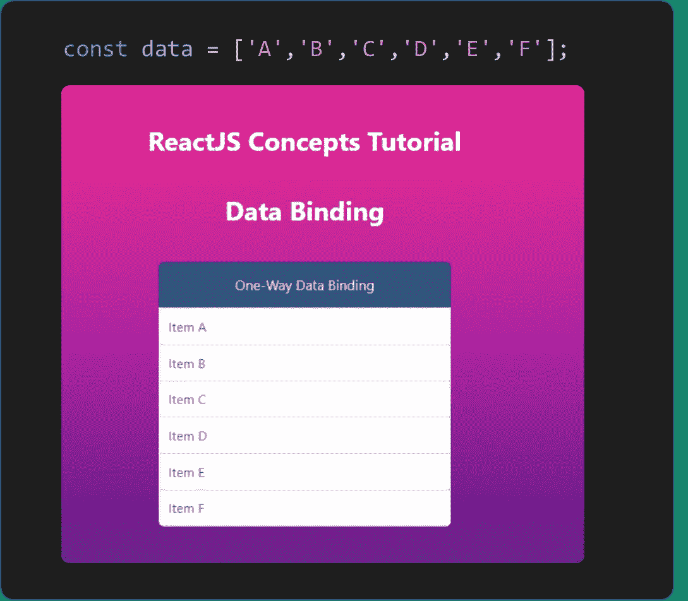
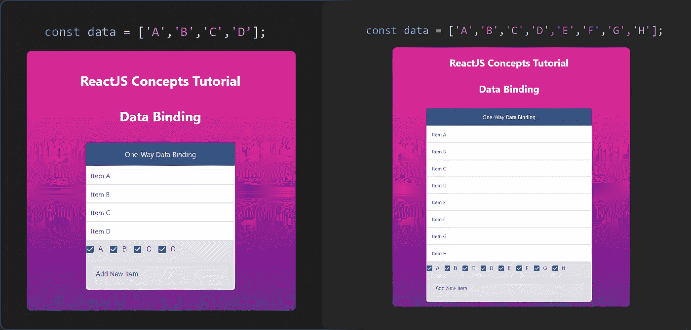
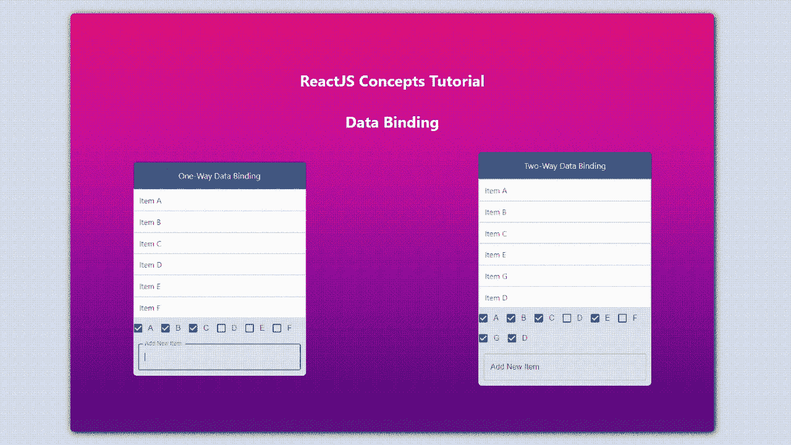

# 学习反应:双向数据绑定

> 原文：<https://medium.com/nerd-for-tech/learning-reactjs-two-way-data-binding-5c5ce1ab9b3d?source=collection_archive---------1----------------------->


实际图片来源:[链接](https://www.brighttalk.com/wp-content/uploads/2018/10/AdobeStock_195865436.jpeg)

简而言之，数据绑定是将 UI 元素(表格、列表、选项卡)与用于填充 UI 元素的数据绑定或连接的过程。

与 **AngularJS** 提供**双向数据绑定**不同， **ReactJS** 提供**单向数据绑定**。在本教程中，我们将学习 ReactJS 中的单向数据绑定。

# 1.单向数据绑定

顾名思义，数据以一种方式绑定数据和 UI 元素之间的连接。

**a .要查看的组件**

**b .组件视图**

在**组件查看**模型中，组件数据的任何变化都会自动反映在 UI 中，例如，如果一个列表 **l1= [A，B，C，D，E，F]** 作为一个表格呈现在 UI 中，那么在列表 l1 中添加/删除项目会自动在表格中添加/删除行。

在组件模型的**视图中，UI 中的任何变化将自动反映在组件数据中，例如，如果列表 l1 在 UI 中呈现为表格，每一行都有添加/删除该行的选项。然后，在添加或删除行时，组件数据也会改变。**

> ReactJS 提供组件来查看单向数据绑定类型。

```
import React, { useState } from 'react';
import Grid from '@mui/material/Grid';export function OneWayDataBinding (props)
{ **const data = ['A','B','C','D','E','F'];**
  return(
    <Grid container>
      <Grid container item xs={12} direction="row"
         justifyContent="center" alignItems="center"
         style={{
           background: "#314b80", borderRadius: '7px 7px 0px 0px',
           color: '#e8effb'
         }}
      >
        <p style={{fontSize: '17px'}}>One-Way Data Binding</p>  
      </Grid>
      <Grid container item xs={12}>
        <div style={{ width: '100%'}}>
          <table style={{ width: '100%'}}>
            <tbody>
              **{data ? data.map((item,index) => {
                return(
                  <tr id={index} key={index}>
                    <td style={{ 
                            width: '100%', padding: '3%', 
                            background: 'white'}}
                    >
                      Item {item}
                    </td>
                  </tr>
                )
              }) : null}**
            </tbody>
          </table>
        </div> </Grid>
    </Grid>
  )
};
```



将视图中的组件数据[A，B，C，D，E，F]呈现为表格

在上面的代码示例中，我们在**视图中将列表呈现为表格。**

```
const data = [‘A’,’B’,’C’,’D’,’E’,’F’];
```

因为 ReactJS 提供了单向组件来查看数据绑定，所以 UI 中的任何更改都不会修改组件数据，但是组件数据中的更改会反映在视图中。因此，在表中删除或添加新项目不会改变列表，但在列表中删除或添加新项目会自动反映在视图中。



ReactJS 是查看数据绑定的单向组件

# 2.在 ReactJS 中实现双向数据绑定



在 ReactJS 中实现双向数据绑定

今天我们将学习如何使用 InputBox、Checkbox 等视图元素来修改组件数据，这反过来会自动更新视图，因为 ReactJS 提供了**组件来绑定视图数据。使用这种技术，我们可以实现类似双向数据绑定的功能。**

## 步骤 1:用 Setter 将数据组件转换成状态变量

```
**const [data, setData] = useState(['A','B','C','D','E','F']);**
```

> 现在，我们已经将数据转换为 StateVariable，无论何时通过任何函数/操作更新数据，视图都会自动重新呈现。为了更新数据，我们还提供了一个名为 setData 的**绑定函数，使用它我们可以添加/删除值。**

## 步骤 2:使用 eventListeners 将 setData 函数绑定到事件

我们使用文本输入元素来添加新值，这样我们就可以将键盘事件 onKeyPress/onChange 绑定到更新组件数据的函数。

```
<**TextField** label="Add New Item" variant="outlined" value= {newItem}
  **onKeyPress={(event) => AddNewItem(event)}** 
  helperText={newItem.length > 0 ? "Press Enter to Add" : ""}
  **onChange={(event) => {setNewItem(event.target.value)}}**
/>
```

这里，我们将用户输入读取到一个名为 **newItem** 的新变量中，当按下 Enter 键时，我们将使用 newItem 的值并添加到列表中。

> 使用 **OnChange** 事件监听器，我们捕获用户对变量 **newItem** 的输入。
> 
> 使用 **onKeyPress** 我们正在监听输入键盘事件和**向列表(数据)**添加新项目

```
function **AddNewItem**(event){
  **if (event.charCode === 13){     // Looking for Enter**
    **var temp= data                // Copying the List (data) to temp
    temp.push([newItem,true])     // Adding newItem in temp
    setData(temp)                 // Copying temp to List (data)**
    setNewItem("");
  }
}
```

> 同样，我们使用复选框来更新 UI。我们在本教程中没有涉及到，但是你可以在下面的 [github 链接](https://github.com/ReactJS-Concepts/ReactJS-Concepts/tree/DataBinding)中找到代码

[**数据绑定分支链接:**react js-Concepts/react js-数据绑定时的概念(github.com)](https://github.com/ReactJS-Concepts/ReactJS-Concepts/tree/DataBinding)

[**完整的回购链接:**react js-Concepts/react js-Concepts:创建此存储库是为了帮助了解 react js(github.com)的基础、核心和高级概念](https://github.com/ReactJS-Concepts/ReactJS-Concepts/tree/main)


# 阅读更多我关于 ReactJS 和其他令人敬畏的 React 包的文章

> *第一部分:* [*如何创建一个新的 React App | by ki HSA Rai | Medium | Medium*](/@ashikthulungrai7/how-to-create-a-new-react-app-3286a37e2189)
> 
> [*第 2 部分:创建 ReactJS 组件的简单方法|作者 ki HSA Rai | 2021 年 7 月| Medium*](/@ashikthulungrai7/part-2-easy-way-to-create-reactjs-components-7d458b577c67)
> 
> [*1。拖&降:REACT BEAUTIFUL DND | by KIHSA Rai | 2021 年 7 月|中*](/@ashikthulungrai7/drag-drop-react-beautiful-dnd-328e00797f27)