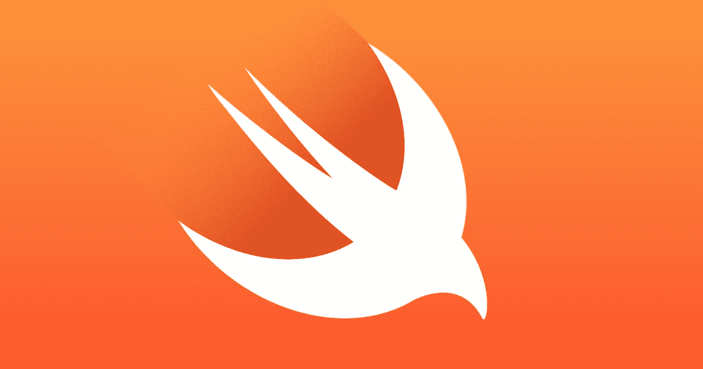

# 学得快

> 原文：<https://medium.com/nerd-for-tech/learning-swift-ly-2246e14c3fe1?source=collection_archive---------15----------------------->



这张照片归功于《连线》

*“你有雨燕的经验吗？”*

我犹豫了一拍，才勾选“是”。

剧透:我没有 Swift 的经验。

其实我申请之后也是这么提的。然而，这并没有阻止我下载 XCode 并编写 Swift iOS 教程，学习如何构建 Notes 应用程序。

我这周的经历让我想到了苹果操作系统的开发，以及它与标准网络开发的不同之处。的确，一旦你理解了编码和语法，你或多或少就能理解其他语言的代码在做什么。此外，在编写本教程的过程中，我被 Swift 与 JavaScript 的相似性和不同性震惊了。

## 什么是 Swift？

Swift 是一种用于苹果 OS 开发的编程语言，另一种是 Objective-C，据[Java point](http://www.javatpoint.com)报道，“Swift 是在 2014 年苹果全球开发者大会上推出的”。事实证明，苹果的另一种编程语言 Objective-C“自 20 世纪 80 年代初以来基本保持不变，缺乏现代语言功能”。([维基百科](https://en.wikipedia.org/wiki/Swift_(programming_language)) ) Swift 极其灵活:你可以用它来构建兼容 macOS、iOS、tvOS、watchOS 的应用。简而言之，一旦你知道如何在 Swift 中编程，你构建的任何应用都可以在整个苹果环境中工作。

在研究和撰写本文的过程中，我惊讶地发现，Swift 不仅设计得如此安全和高效，而且可能是 Objective-C 语言不那么受欢迎的原因。首先，它更难学，但也是一种不太安全的语言。事实上，[Java point](http://www.javatpoint.com)说使用 Objective-C 的一个缺点是“用 Objective-C 开发的 app 比 Swift 更容易被黑”。

我不完全确定最后这种说法有多准确，我也没有资格做出这样的声明，但 Swift 似乎确实是在考虑安全性和效率的基础上构建的。

## Swift 和 JavaScript 之间的一些关键区别是什么？

## 数据类型

在 Swift 中，您可以初始化一个变量并为其分配一个类型。

我的快速要点

这在 JavaScript 中非常不同。你不能给一个变量赋值。事实上，这是 TypeScript 的好处之一，它是 JavaScript 的超集，也是它受欢迎的原因。

我的 JavaScript 相当于我的 Swift gist

## 可变关键字

这是我注意到的第一个不同。在 Swift 中，可以使用`var`声明一个变量，要声明一个常量，可以使用关键字`let`。

在 JavaScript 中，从 ES6 开始，可以使用`let`和不常用的`var`初始化变量。使用关键字`const`实例化一个常量。

## 守卫声明

这是我注意到的另一个关键区别。Swift 有 guard 语句，这是 Chris 编写的[代码中的弗朗西斯·福尔特和 Chris Ching“作为反向`if…else`工作”，因为只要条件为真，代码就会继续运行。除了 switch/case/break 语句之外，JavaScript 实际上没有与之等效的语句。](https://codewithchris.com/swift-guard/)

注意:对于 guard 语句，这些语句必须“包含一个控制语句`return`、`break`、`continue`或`throw`”([编程](https://www.programiz.com/swift-programming/guard-statement)

```
guard true else {
  print("Hello")
}
print("Goodbye")
```

## 功能

在 Swift 中，您使用关键字`func`来定义一个函数。真正引起我兴趣并激发这篇文章灵感的是苹果如何提供库函数；也就是说，Swift 自带预定义功能。

```
func functionName(parameter) {
  /* code block here */
}
```

与 Swift 相比，JavaScript 不提供相同的库函数。最多，当您点击、悬停、更改、与 DOM 进行交互以及必须呈现数据时，可能会发生事件侦听器。同样，这也可能取决于您正在使用的框架或库。

要在 JavaScript 中定义函数，您可以使用传统方法:

```
function functionName(parameter){
  /* code block goes here */
}
```

您也可以使用 ES6+语法，该语法使用`const`来定义它:

```
const functionName = parameter => {
  /* code block goes here */
}
```

请注意，如果有多个参数，则必须在参数周围使用括号，如下所示:

```
const functionName = (params1, params2) => {
  /* code block goes here */
}
```

本周我在 Swift 的短暂工作经历让我意识到学习这门语言是多么的有益。理解 Swift 与 JavaScript 的不同之处让我对两者都有了更深的理解，我真的很期待与 Swift 一起学习和构建。

如果您也对 Swift 感兴趣或想重温您的基础知识，请随时查看以下资源。

## 资源

[](https://developer.apple.com/swift/) [## Swift -苹果开发者

### Swift 是一种强大而直观的编程语言，适用于 iOS、macOS、tvOS 和 watchOS。编写 Swift 代码是…

developer.apple.com](https://developer.apple.com/swift/)  [## Swift-Java point 的历史

### Swift 于 2014 年在苹果全球开发者大会上推出。Swift 的开发始于 2010 年…

www.javatpoint.com](https://www.javatpoint.com/history-of-swift) [](https://en.wikipedia.org/wiki/Swift_%28programming_language%29) [## Swift(编程语言)

### 范例多范例:面向协议、面向对象、函数式、命令式、块结构、声明式…

en.wikipedia.org](https://en.wikipedia.org/wiki/Swift_%28programming_language%29) [](https://codewithchris.com/swift-guard/) [## Swift Guard 声明解释

### 由弗朗西斯福尔特和克里斯清斯威夫特有很多很酷的功能，帮助初露头角的开发人员作出巨大的好…

codewithchris.com](https://codewithchris.com/swift-guard/)  [## 声明-Swift 编程语言(Swift 5.4)

### 在 Swift 中，有三种语句:简单语句、编译器控制语句和控制流…

docs.swift.org](https://docs.swift.org/swift-book/ReferenceManual/Statements.html) [](https://www.programiz.com/swift-programming/functions) [## Swift 功能

### 函数是一组定义要执行的动作的语句。函数的主要用途是使…

www.programiz.com](https://www.programiz.com/swift-programming/functions) [](https://www.programiz.com/swift-programming/guard-statement) [## Swift guard 声明

### Swift If 语句描述了如何基于特定条件(布尔值)执行操作。在本文中…

www.programiz.com](https://www.programiz.com/swift-programming/guard-statement)