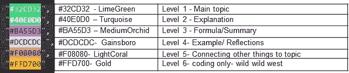
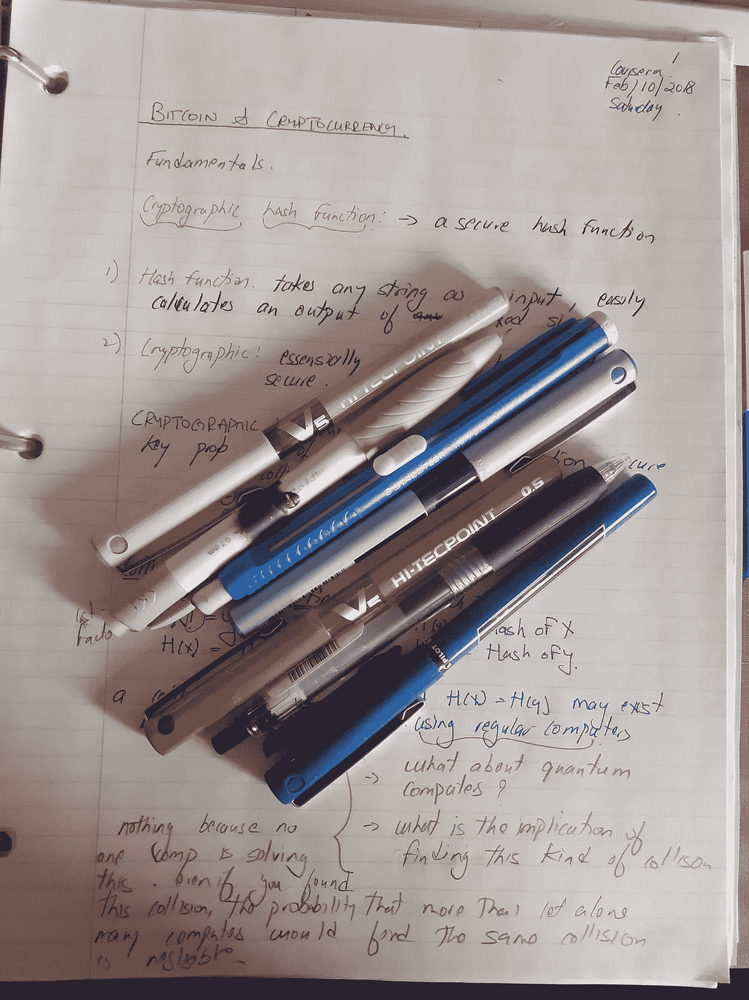

# 学习编码(第八部分):颜色编码-阅读障碍者写作和编码指南

> 原文：<https://medium.com/nerd-for-tech/learning-to-code-part-8-color-coding-the-dyslexics-guide-to-writing-and-coding-e1ff424e4180?source=collection_archive---------12----------------------->

在这些帖子的许多地方都会出现的一个问题是，我做事情的方式有点不同，因为我有阅读障碍，犯的错误比别人多得多。大多数人都会犯这些错误，但是我犯的频率会成为一个巨大的障碍。

这些通常与拼写有关，看不到标点符号、括号之类的东西，不能像其他人一样解释指令——尤其是当指令是书面的时候。我把这篇文章放在这里，是因为我希望你能在其他事情之前找到这个工具，这一直是我对编码的最大挑战之一，找到这个工具极大地提高了我的学习能力。我真希望一年前就知道这些。**另外，如果你和我一样有阅读障碍，这可能对你的学习有帮助。**

我能更好地看到颜色，因为我将颜色与特定类型的事物联系在一起。因此，如果我在读笔记，我会先搜索特定的颜色元素，我知道不能弄乱它们。**我发现在编码时，你可以对括号进行颜色编码，这似乎与我对笔记所做的事情在逻辑上是一样的。**

**这是我做笔记和现在编码的色码公式。**我在工程专业的第三年开发了这个，当时我发现自己有阅读障碍，但我从未改变过。我用它做任何事情，我用这种方式看书和记笔记，我用同样的方式完成我所有的非技术教育。

以下是我的代码中括号的逻辑，以及我如何编写技术和非技术学习笔记:

# 绿色-任何事物的第一层

**技术注释和非技术注释:**用于表示文件的标题。从视觉上来说，如果我在我的笔记中寻找什么，我会知道寻找绿色的标题。这个来自绿色=go。有时你有多个标题，比如副标题。新的章节标题总是在新的一页上，全部大写。笔记中可能会有副标题，但可能会有下划线。

**编码**:第一级括号。我会知道，如果我点击了一个新的绿色括号，我就进入了一个新的代码段。

# 蓝色-第二级-让我们开始学习吧！

**技术注释和非技术注释:**这是文档的主要文本，也可以是解释。在课堂上，这将是教授所说的，也是我抄下来的书上的内容。当我自己学习时，这是我根据网上或书本上的资源解释我是如何理解这个主题的。

**编码**:蓝色总是跟在绿色后面，因为所有标题都需要解释。因此，第二个括号的颜色是蓝色。

# 紫色-第三层:这归结为什么？

技术说明:所有配方都是紫色的。这实际上是主要解释的子集，但现在我们处于“如何做”阶段，因此必须将其分离出来。有时你记得解释，但忘记了公式或如何推导，所以我用紫色标出。没有解释变量的公式是不完整的，那些也是紫色的。**最终公式**(例如在它们被导出之后)将被重新复制到紫色部分的末尾，并在它们周围有一个方框。这是因为我需要一个快速参考，而不是整个推导过程。

**非技术性注释:**如果可以的话，我会把话题浓缩成一个非常简短的陈述或公式。因此，如果我在学习战略或政策，我会尝试用某种“等式”来概括这一部分。类似于:政府+企业+ NGO +(任何东西？)=人工作的地方。

**编码:**第三级括号为紫色。

# 灰色-第四级-特别的东西:

**技术提示:**如果你做手记，灰色是有效的铅笔。所有作品的例子都是用铅笔写的，因为它们在演示如何做某事时起作用。此外，我在这一部分犯了太多的错误，写错了东西，我需要删除很多东西。

**非技术性注释:**这通常是最后一层，所以这是我对这个主题的评论。

**编码:**第四层括号是灰色的，深嵌在代码正在做的一些特定的事情中。

# 粉红-找到了！

**技术注释和非技术注释:**这是我将事物与其他主题联系起来，我个人对这个特定主题如何应用于其他事物的见解。例如，如果我学习了神经如何交流，那么我就把我所知道的任何化学和物理知识联系起来。当你学习像会计这样的东西时，原理是一样的，但它实际上与商业战略有关。

我把这个放在哪里没有线性关系，我需要知道这些是我的一些想法，足够重要，可以在学习的时候写出来，但不是手边材料的一部分。

**编码:**第五级括号为粉色。到现在为止，你需要浏览所有的材料，才能读到这一部分。

# 黄色-神圣的狗屎阿曼注意，我们从来没有达到这个水平！！

**编码:**这只是代码，我不知道有多少代码被嵌入，所以我需要一个新的类别“omg Aman 我们不再是在正常的领域-这是该死的狂野西部”。

我还有另外两种颜色，就它们的作用而言，我不会弄乱它们:

**红色** -红色表示停止- ***在我所有的学习笔记中，所有被定义的单词都是红色的*** 。学术或个人研究。这相当于在网页上看到一个超链接。在这个词被定义之前，我不会再记笔记。在一个班级或其他地方。我在任何班级都是超级讨厌的学生。

**黑色**-**-T9【这是** *这个词的定义。*这总是一个正式定义和我对这个术语的理解的混合体，实际上，是我用自己的话来解释或说明。定义的目的是为了我的理解来理解概念。

**对我来说，红色和黑色的代码等同于注释部分。**

我用括号对着色来获得括号的颜色，因为…这是我在教程上看到的第一个这样做的东西，这个家伙的教学听起来很棒。你可以使用任何你想要的颜色，但是改变默认的颜色需要一些技巧。

这花了我 3 天时间，所以请观看 youtube 上的东西来找出它。我已经知道我需要一些能够看到我的错误，所以我不能在编码前进，直到这一点完成。如果你是编码的超级新手，并且这是你真正需要的东西，那么给我留言，我会写一篇关于如何实际做到这一点的帖子。也该死！！！你在看这个？？

我在 VS Studio 的黑色背景上编码，因为盯着白色屏幕找东西只会伤害我的眼睛。这些颜色深浅不同于我写的笔记(出现在下面的另一张图中)。

以下是我为支架选择的实际颜色:

颜色编码逻辑

这些是最容易区分的。

是的-我确实带了这么多文具去学校。现在也是。

个人笔记的笔颜色

我对语言类型和循环感到非常困惑。因此，我将尝试双重打击，并在我的下一篇文章中对此进行深入探讨。我不知道是否有人对此感兴趣，但是因为我怀疑我是唯一一个阅读这些的人，我想这就是为你自己写博客的好处。