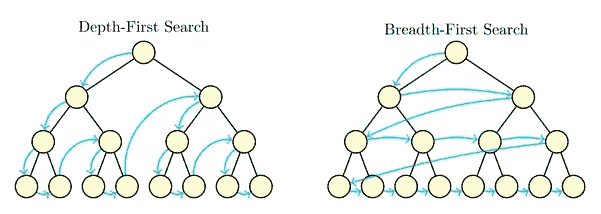
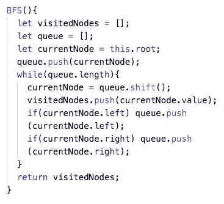
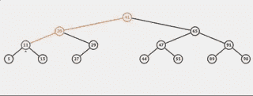
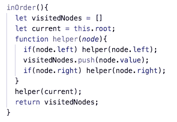
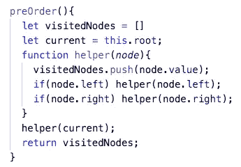
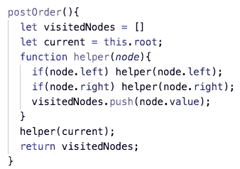

# 学习树遍历

> 原文：<https://medium.com/nerd-for-tech/learning-tree-traversal-29e11a6c421d?source=collection_archive---------13----------------------->

学习数据结构和算法的另一周，我正在学习树遍历。上周，我写了一篇关于我对二分搜索法树的介绍的博客，可以在这里找到。那篇文章概述了什么是树，以及如何用 JavaScript 类构造树。本文将扩展同一个类，可以在这里找到，以包括一些更常见的树遍历算法。

树遍历是一个经典的计算机科学问题。想法是访问树中的每个节点一次，不管树的形状或具体类型。做这件事有许多方法，每一种方法在不同的情况下都有好处。这与链表、堆栈或队列有很大的不同，在链表、堆栈或队列中，访问每个节点的方式实际上只有一种，那就是以线性方式从开始到结束。

有两种主要的方法来遍历一棵树。第一种叫做广度优先搜索(BFS)，第二种叫做深度优先搜索(DFS)。BFS“跨越”树工作，在移动到它们的孩子之前访问每个节点的兄弟节点，而 DFS 在它的兄弟节点之前访问一个节点的孩子节点。它们都有相同的时间复杂度，但有时一个会比另一个更好，这取决于具体的场景。

# 广度优先搜索

BFS 从访问根节点开始，然后从左到右进入下一层。一旦它访问了一个级别右边最远的兄弟节点，它就进入下一个级别，并重复这个过程，直到所有节点都被访问过。为了知道哪个节点需要在树中向下移动，BFS 算法必须将节点存储在队列或数组中。这意味着在特别宽的树上，BFS 不是一个很好的选择，因为太多的节点必须存储在内存中。在下面的例子中，为了简单起见，我写了一个使用数组而不是队列的 BFS 算法，尽管队列会更高效。

有些情况下，BFS 表现得很好。例如，如果我们正在遍历一个每个节点只有一个子节点的树，那么一次只需要在队列中存储一个节点，因此不需要太多的内存。

# 深度优先搜索

DFS 有几个变种，但有一点是相同的，它们都是先访问一个节点的子节点，再访问它的兄弟节点。主要的变体称为前序、前序和后序。

在 https://visualgo.net/en/bst找到更多像这样令人惊叹的可视化工具

## 中根次序

Inorder 按照值的升序访问节点，如果您需要以这种方式排序返回的数据，这将非常有用。

## 预购

Preorder 访问根，然后沿着树的左侧向下，然后移动到右侧。

## 后期订单

Postorder 访问树左下角的节点，它是兄弟节点，然后向上移动到父节点。一旦访问了树的左侧，它将访问底部的右侧，并重复与左侧相同的过程。最后，它返回并最后访问根节点。

