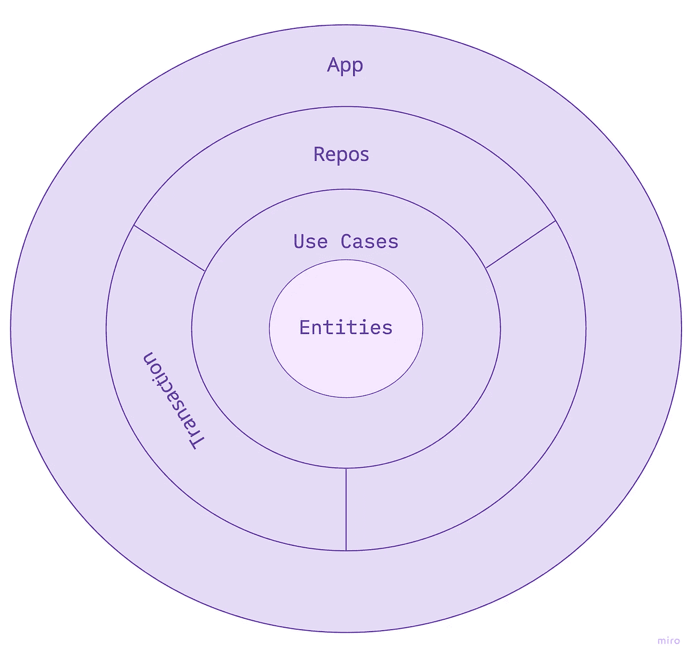
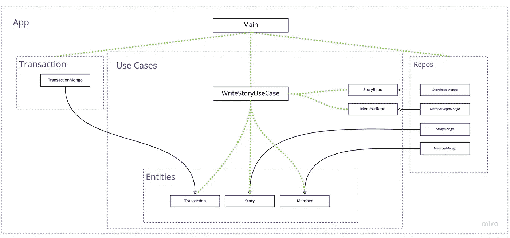

# 将事务控制留给客户端

> 原文：<https://medium.com/nerd-for-tech/leave-transaction-control-to-the-client-ea6009348f37?source=collection_archive---------6----------------------->

每个领域最终都会遇到这种情况。业务操作需要维护给定模型上两个或更多实体之间的不变量。如何在不弄乱模型的情况下完成它？哪个组件应该负责确保这一点？

例如，假设您的域有成员和他们写的故事，每个配置文件应该显示成员发布的故事数量。团队决定向成员实体添加一个“storiesWrittenCount ”,以避免对故事集合的额外查询。

满足这种情况的第一个天真尝试是:

```
WriteStoryUseCase(story, member) {
  storyRepo.create(story)
  member.storiesWrittenCount++
  memberRepo.update(member)
}
```

使用这种方法，在成功创建故事后，存在成员更新失败的风险，破坏了故事计数不变量。

在过去，我用三种不同的方式解决了在两个或更多实体之间提供事务支持的挑战

## 选项 1:忽略它

风险低，冲刺晚了。你不会想在复古版里再讨论一次关于故事指向的问题。

## 选项 2:将事务实现泄露给域

```
WriteStoryUseCase(story, member) {
  MongoClient client = ...
  ClientSession clientSession = client.startSession() *...create story and update member...* clientSession.withTransaction(...)
}
```

此时，您的域依赖于您的基础层(本例中为 *Mongo* )，不再是“干净的”

## 选项 3:创建一个“StoryMemberRepo”

```
WriteStoryUseCase(story, member) {
  storyMemberRepo.writeStoryAndUpdateMember(story, member)
}
```

这里我们避免了数据库依赖，但是，这些存储库混合了概念，您的代码库可能会以一个 *MemberRepo* 、一个 *StoryRepo* 、一个 *StoryMemberRepo* 、一个*StoryMemberNotificationRepo*等结束。现在已经不清楚在哪里可以找到功能，这导致了开发人员的困惑和可能的代码重复。

# 另一种选择

当我在阅读[领域驱动设计](https://www.oreilly.com/library/view/domain-driven-design-tackling/0321125215/)的时候，一个特别的句子引起了我的注意并让我思考: ***“把事务控制留给客户。”***

***把域中的事务概念抽象出来，让客户端发起并提交工作单元怎么样？***

## 敬代码！

Kotlin 和 Mongo 是首选技术，你可以在 [Github](https://github.com/SenhorCastor/leave-transaction-control-to-the-client) 查看完整的例子。

我定义了*事务:*

```
interface Transaction {
  fun start()
  fun commit()
}
```

而它的 *Mongo* 表示:

```
class TransactionMongo private constructor(...) : Transaction {
private lateinit var session: ClientSession

  override fun start() {
    session = client.startSession()
    session.startTransaction()
  }

  override fun commit() {
    try {
      session.commitTransaction()
    } catch (e: Exception) {
      session.abortTransaction()
      throw TransactionAbortedException(e);
    } finally {
      session.close()
    }
  }
}
```

在*回购*中保存*实体*的每个功能接收一个可选的*事务*作为输入，并返回一个*事务*:

```
interface MemberRepo {
  fun save(member: Member, tr: Transaction? = null): Transaction
}
```

随着其实施:

```
class UserRepoMongo(private val mongoClient: MongoClient) : UserRepo {
  override fun save(user: User, tr: Transaction?): Transaction { val transactionUsed = mongoClient.getTransaction(tr)
    collection.save(transactionUsed.session(), user) return transactionUsed
  }
}
```

为了简单起见，我给 *MongoClient* 添加了一个扩展函数:

```
fun MongoClient.getTransaction(tr: Transaction?): TransactionMongo {
  return if (transaction == null) {
    val newTransaction = TransactionMongo.create(this)
    newTransaction.start()
    return newTransaction
  } else {
    transaction as TransactionMongo
  }
}
```

最后，我的用例是这样的:

```
WriteStoryUseCase(story: Story, member: Member) {
  val tr = storyRepo.save(story);
  val memberUpdated = member.incrementStoriesWrittenCount()
  val trAfterSave =  memberRepo.save(memberUpdated, tr)
  trAfterSave.commit()
}
```

使用这种方法，域中的数据库没有依赖性。此外，这两个实体没有混淆概念。

增加的复杂性是，现在模型需要处理一个新的概念*事务。*这将提交工作单元的责任转移给了模型，这在设计上是一个合理的想法。

最后，如果领域需要从许多用例中创建故事，那么您可以使用一个服务来完成这项工作，并且可以在您的模型中共享。

# 模型

让我们来看看用来解决这个例子的模型( [Github](https://github.com/SenhorCastor/leave-transaction-control-to-the-client) )。



应用程序层拥有全局访问权来控制流程和执行依赖注入。

Repos 和事务层包含实现内层中定义的不同实体和存储库所需的细节。在这种特殊情况下，*蒙戈*。

用例是实际业务逻辑所在的地方，即*“领域层”*

下面是该示例的主要组件的 UML 图:

您可以看到用例如何只能访问实体和接口回购；细节注入 App 层。



目前就这些了。感谢您的阅读！这是我的第一个媒体故事——希望你喜欢。

您可以在 [Medium](/@fernandoamartin) 、 [Twitter](https://twitter.com/Fer_A_Martin) 和 [Linkedin](https://www.linkedin.com/in/fernandoamartin/) 上关注我，在那里我将分享我在软件开发、工程管理等方面的想法和经验。