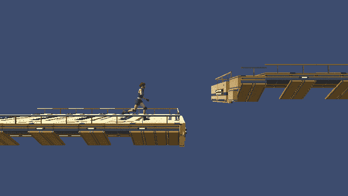
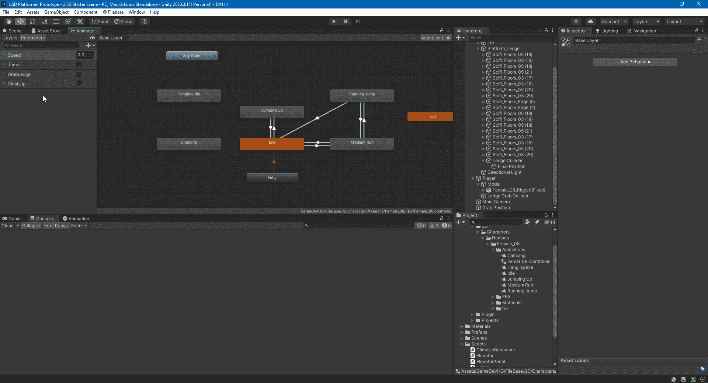
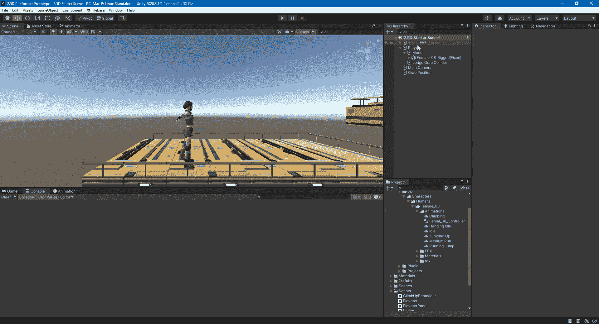
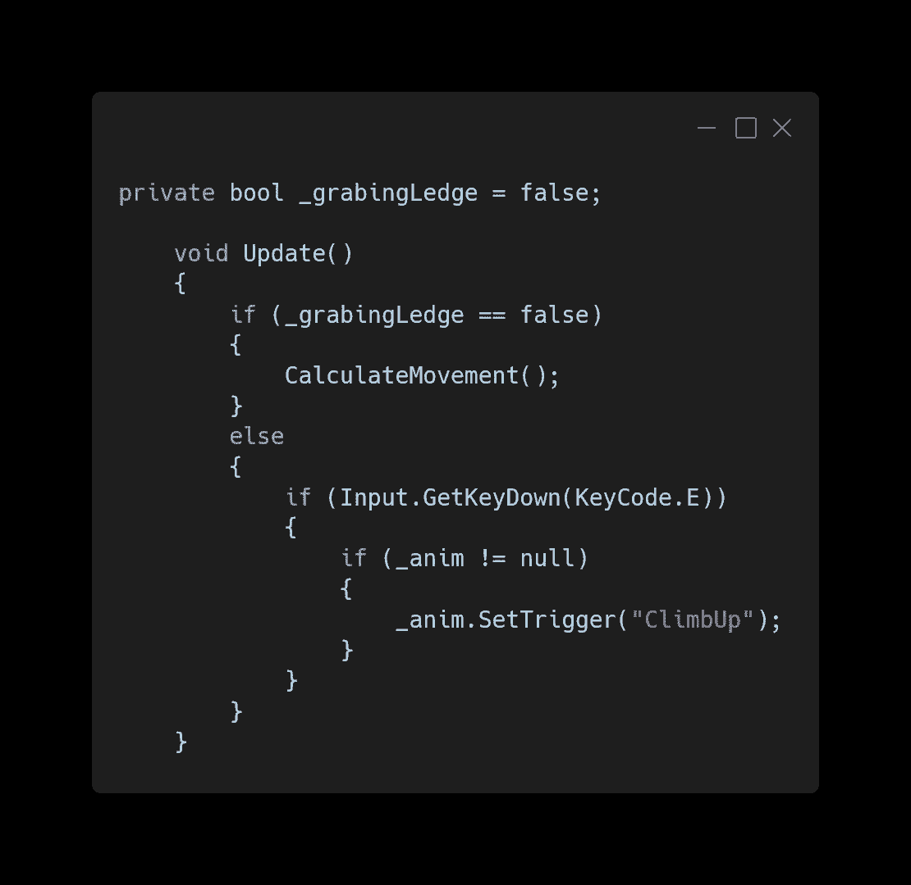
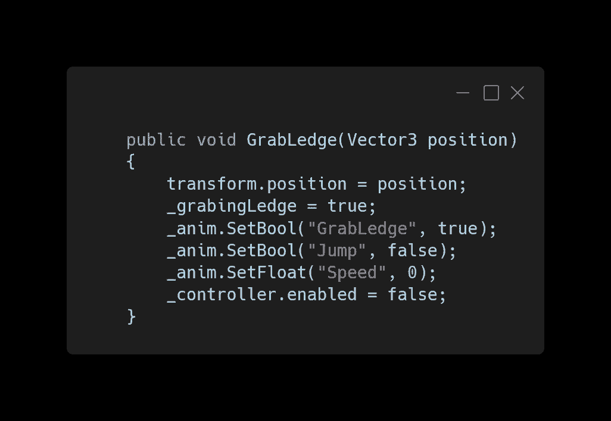
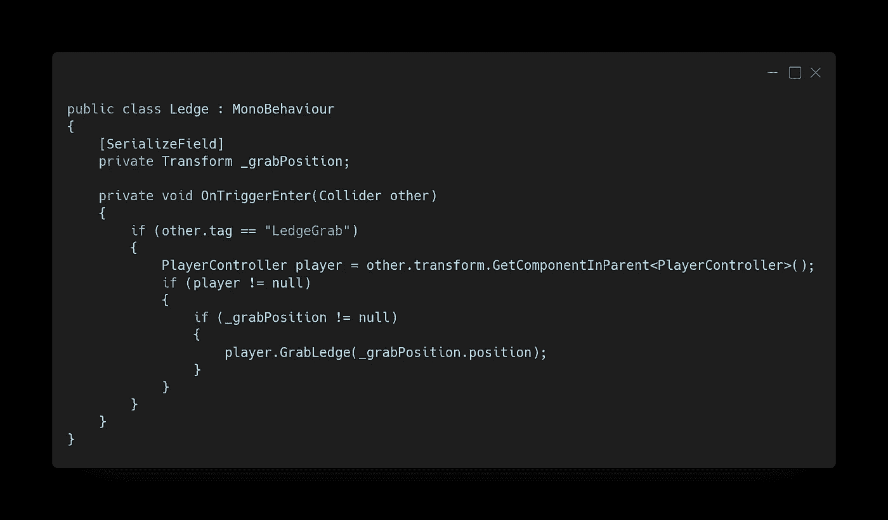
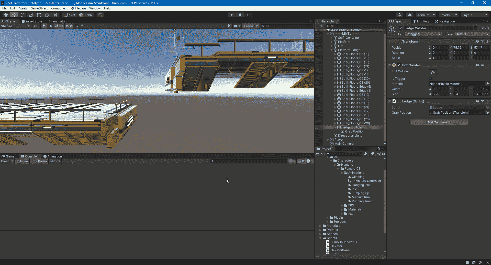
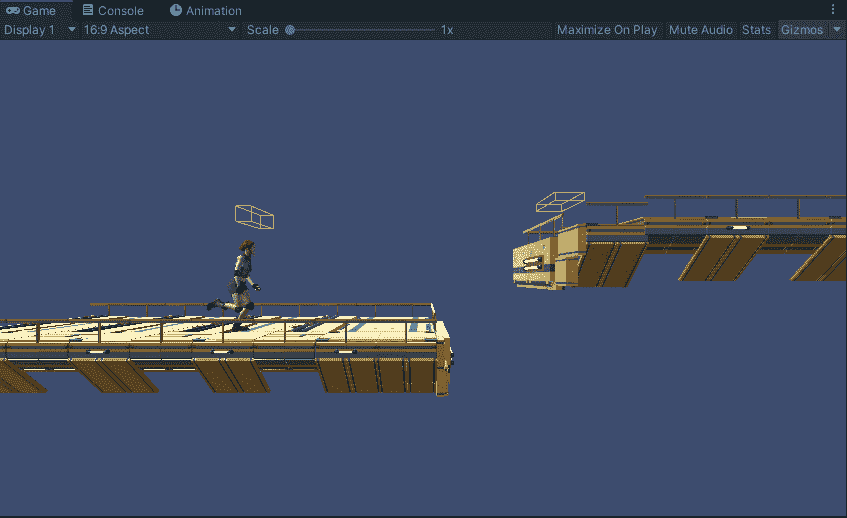
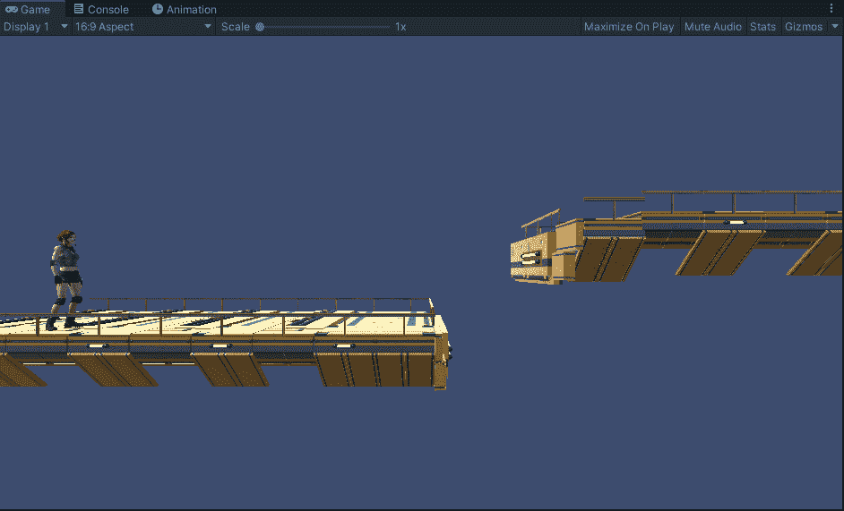

# 统一中的壁架抓取

> 原文：<https://medium.com/nerd-for-tech/ledge-grabbing-in-unity-e1edee3a924?source=collection_archive---------4----------------------->

这篇文章将展示如何为玩家创建一个平台抓取机制。

在播放器的动画中，我们添加了悬空和攀爬的动画，然后我们创建参数来触发动画的过渡，并进行过渡。

在玩家游戏对象上，我们添加了一个盒子碰撞器，作为刚体的触发器。这个触发器将检测何时改变为抓住一个壁架。

在玩家脚本中，我们需要添加一个变量来停止计算在壁架上的移动，然后检查“E”键是否被按下，然后在动画上设置 ClimbUp 触发器。

该方法将被触发器碰撞的壁架调用，以将玩家的位置更改为抓取位置，通过将抓取壁架 bool 设置为 true 并禁用角色控制器来停止计算移动。然后在动画师上我们设置参数来改变悬挂空闲动画。

现在来创建一个可供抓取的壁架。壁架脚本将保存玩家在抓取壁架时将移动到的位置的参考。当玩家的触发器进入壁架的碰撞器时，我们从父组件获取 PlayerController 脚本组件，并在获取位置调用 GrabLedge 方法。

壁架是由一个盒子碰撞器构成的，它被设置为一个触发器，带有一个空的游戏对象，作为玩家抓取位置的子对象。

现在，当玩家跳进壁架碰撞器时，它将启动悬挂动画并移动到抓取位置。

但是，如果我们按下“E”键，攀爬动画将会播放，但之后玩家模型会向后移动，并在先前的位置闲置。

在下面的文章中，我们将使用 Animator 事件将玩家移动到平台顶部的位置。