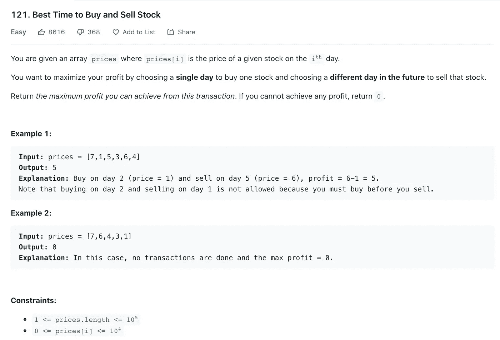
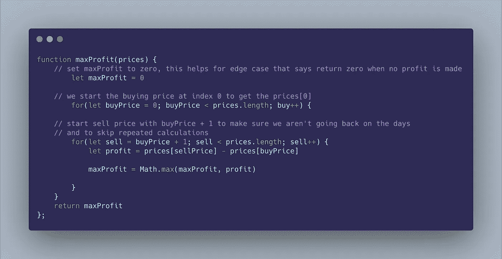
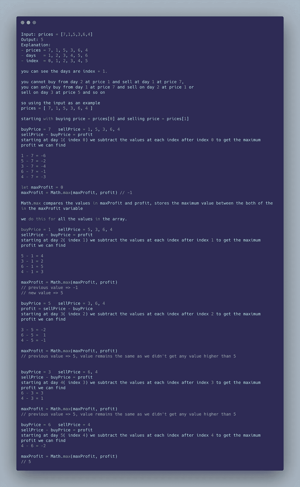
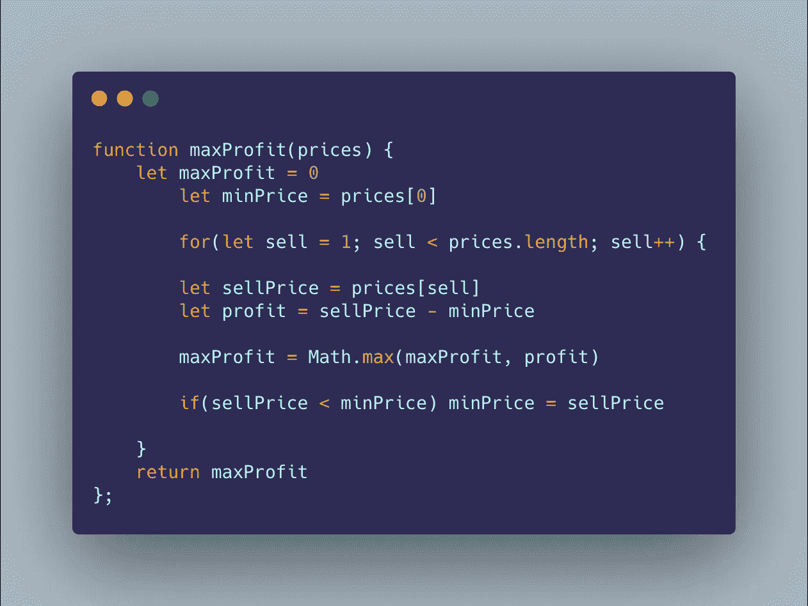
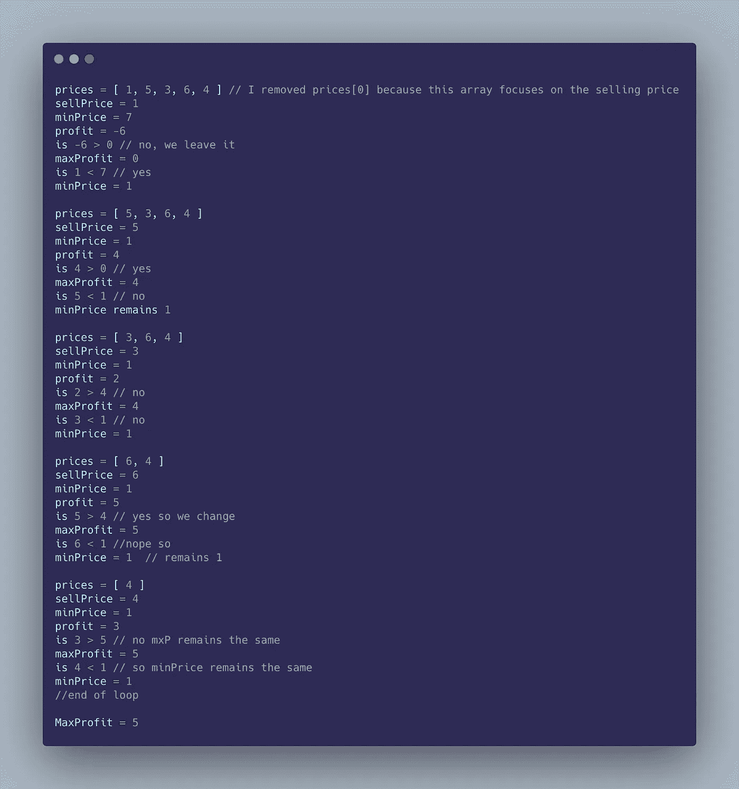

# Leetcode 121:买卖股票的最佳时机 JavaScript 解决方案

> 原文：<https://medium.com/nerd-for-tech/leetcode-121-best-time-to-buy-and-sell-stock-javascript-solution-1e690ce18668?source=collection_archive---------2----------------------->

121.买卖股票的最佳时机

***解释及伪代码:***

为了解决这个问题，首先，我们使用一种**强力算法方法**。我们将尝试从给定的值中获得所有可能的利润，并选择最高的一个。计算每笔交易你能获得的最大利润。

*   创建一个变量`maxProfit`来存储最大利润
*   在数组中循环两次，以获得买价和卖价
*   通过从`sellPrice`中减去`buyPrice`来计算利润
*   如果*利润*值大于*最大利润*值，则将最大利润设置为等于利润
*   返回`maxProfit`

下面是代码如何使用两个循环计算并返回最大利润的分解；

***复杂度分析***

*   时间复杂度:O(n)其中 n 是价格数组的长度
*   空间复杂度:O(1)。只创建了两个变量。最大利润和利润

***一种更好的方法使用一个 For 循环；***

从上面的解释中，你会注意到有一个用于计算最大利润的模式。我们不必互相重新计算所有的值，而是可以跟踪最低价格，并从销售价格中减去它，如下所示

***解释及伪代码:***

*   创建一个变量来存储最高价格
*   创建另一个变量来跟踪最低价格，并将其设置为数组中的第一个值
*   从索引 1 开始循环遍历价格数组，作为您的销售价格
*   要获得利润，你要从卖价中减去`minPrice`
*   如果利润大于最大利润，用利润值替换最大利润值

在计算其他值的利润时，检查当前值*销售价格*是否小于`minPrice`值。如果是，将当前值即售价设置到`minPrice`。

*   返回最大利润

下面是代码如何使用一个 forloop 计算并返回最大利润的分解；

***复杂度分析***

*   时间复杂度:O(n)其中 n 是价格数组的长度
*   空间复杂度:O(1)。只创建了两个变量。最大利润和最小价格

我希望你觉得这个解释很容易理解。编码快乐！