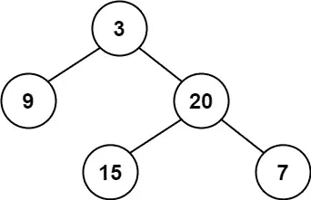
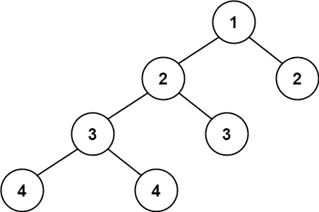

# 平衡二叉树

> 原文：<https://medium.com/nerd-for-tech/leetcode-balanced-binary-tree-c80f02e2ac58?source=collection_archive---------1----------------------->

# 问题陈述

给定一棵二叉树，确定它是否是高度平衡的。

对于这个问题，高度平衡的二叉树被定义为:

```
a binary tree in which the left and right subtrees of every node differ in height by no more than 1.
```

问题陈述摘自:[https://leetcode.com/problems/balanced-binary-tree](https://leetcode.com/problems/balanced-binary-tree)

**例一:**



```
Input: root = [3, 9, 20, null, null, 15, 7] 
Output: true
```

**例二:**



```
Input: root = [1, 2, 2, 3, 3, null, null, 4, 4] 
Output: false
```

**例 3:** **约束:**

```
- The number of nodes in the tree is in the range [0, 5000] 
- -10^4 <= Node.val <= 10^4
```

# 说明

## 强力方法

验证树是否平衡的强力方法是获得左右子树的高度。如果差值不超过 1，则返回 true，否则返回 false。

上述方法的一个 C++片段如下所示:

```
int height(node* node) {
    if (node == NULL)
        return 0;

    return 1 + max(height(node->left), height(node->right));
}

bool isBalanced(node* root) {
    int leftHeight, rightHeight;

    if (root == NULL)
        return 1;

    leftHeight = height(root->left);
    rightHeight = height(root->right);

    if (abs(leftHeight - rightHeight) <= 1 && isBalanced(root->left) && isBalanced(root->right))
        return 1;

    return 0;
}
```

上述方法的时间复杂度为 O(N ) 。

## 优化解决方案

如果我们仔细观察这种方法，我们可以在高度递归函数中计算左右子树的差异。如果在任何时间点左右子树之间的差大于 1，我们返回 false。

我们先检查一下算法。

```
// isBalanced function
1\. - if root == nullptr
     - return true

2\. - return height(root) != -1

// height function
3\. - if root == nullptr
     - return 0

4\. - set leftHeight = height(root->left)
5\. - set rightHeight = height(root->right)

6\. - if leftHeight == -1 || rightHeight == -1 || abs(leftHeight - rightHeight) > 1
     - return -1

7\. - return 1 + max(leftHeight, rightHeight)
```

在 **isBalanced** 函数中，我们首先检查树是否为空。如果它是空的，我们返回 true。如果没有，我们将根传递给高度函数。

在**高度**函数中，我们检查根是否为空。我们为空元素返回 0。

在步骤 4 和 5，我们递归地调用左右子树。在步骤 6 中，我们检查 leftHeight 或 rightHeight 是否为-1，或者左右高度之间的绝对差是否大于 1。如果差值大于 1，则返回-1。流程退回到步骤 2 并验证是否 *-1！= -1* 。这是错误的，表明树是不平衡的。否则我们在步骤 7 返回， *1 + max(leftHeight，rightHeight)*

## C++解决方案

```
class Solution {
public:
    int height(TreeNode* root) {
        if(root == nullptr) {
            return 0;
        }

        int leftHeight = height(root->left);
        int rightHeight = height(root->right);

        if(leftHeight == -1 || rightHeight == -1 || abs(leftHeight - rightHeight) > 1) {
            return -1;
        }

        return 1 + max(leftHeight, rightHeight);
    }

    bool isBalanced(TreeNode* root) {
        if(root == nullptr) {
            return true;
        }

        return height(root) != -1;
    }
};
```

## 戈朗溶液

```
func maximum(a, b int) int {
    if a > b {
        return a
    } else {
        return b
    }
}

func height(root *TreeNode) int {
    if root == nil {
        return 0;
    }

    leftHeight := height(root.Left)
    rightHeight := height(root.Right)

    if leftHeight == -1 || rightHeight == -1 || int(math.Abs(float64(leftHeight - rightHeight))) > 1 {
        return -1
    }

    return 1 + maximum(leftHeight, rightHeight)
}

func isBalanced(root *TreeNode) bool {
    if root == nil {
        return true
    }

    return height(root) != -1
}
```

## Javascript 解决方案

```
var height = function(root) {
    if(root === null) {
        return 0;
    }

    let leftHeight = height(root.left);
    let rightHeight = height(root.right);

    if(leftHeight == -1 || rightHeight == -1 || Math.abs(leftHeight - rightHeight) > 1) {
        return -1;
    }

    return 1 + Math.max(leftHeight, rightHeight);
};

var isBalanced = function(root) {
    if(root === null) {
        return true;
    }

    return height(root) != -1;
};
```

让我们试运行一下我们的算法，看看解决方案是如何工作的。

```
Input: root = [3, 9, 20, null, null, 15, 7]

      root
        |
       [3, 9, 20, null, null, 15, 7]

// In isBalanced function
Step 1: if root == nullptr
           false

Step 2: return height(root) != -1

// In height function

       root
        |
       [3, 9, 20, null, null, 15, 7]

Step 3: if root == nullptr
           false

Step 4: leftHeight = height(root->left)
        root->left points to 9

          root
           |
       [3, 9, 20, null, null, 15, 7]

Step 5: if root == nullptr
           false

Step 6: leftHeight = height(root->left)
        root->left points to null
        So we get back here with value as 0 and it calls the next step.

        rightHeight = height(root->right)
        root->right points to null
        So we get back here with a value of 0, and it calls the next step.

        leftHeight = 0
        rightHeight = 0
        abs(0 - 0) > 1
        false

        if(leftHeight == -1 || rightHeight == -1 || abs(leftHeight - rightHeight) > 1)
          false

        return 1 + max(leftHeight, rightHeight)
               1 + max(0, 0)
               1

Step 7: We fallback to Step 4 and execute the next line
        rightHeight = height(root->right)
        root->right points to 20

             root
              |
       [3, 9, 20, null, null, 15, 7]

Step 9: if root == nullptr
           false

Step 10: leftHeight = height(root->left)
         root->left points to 15

                              root
                               |
        [3, 9, 20, null, null, 15, 7]

Step 11: if root == nullptr
           false

Step 12: leftHeight = height(root->left)
         root->left points to null
         So we get back here with value as 0 and it calls the next step.

         rightHeight = height(root->right)
         root->right points to null
         So we get back here with a value of 0, and it calls the next step.

         leftHeight = 0
         rightHeight = 0
         abs(0 - 0) > 1
         false

         if(leftHeight == -1 || rightHeight == -1 || abs(leftHeight - rightHeight) > 1)
           false

         return 1 + max(leftHeight, rightHeight)
                1 + max(0, 0)
                1

Step 13: We fallback to step 10 and execute next line
         rightHeight = height(root->right)
         root->right points to 7

                                 root
                                   |
        [3, 9, 20, null, null, 15, 7]

Step 14: if root == nullptr
           false

Step 15: leftHeight = height(root->left)
         root->left points to null
         So we get back here with value as 0 and it calls the next step.

         rightHeight = height(root->right)
         root->right points to null
         So we get back here with a value of 0, and it calls the next step.

         leftHeight = 0
         rightHeight = 0
         abs(0 - 0) > 1
         false

         if(leftHeight == -1 || rightHeight == -1 || abs(leftHeight - rightHeight) > 1)
           false

         return 1 + max(leftHeight, rightHeight)
                1 + max(0, 0)
                1

Step 16: We fallback to Step 7 and execute next lines
         leftHeight = 1
         rightHeight = 1
         abs(1 - 1) > 1
         false

         if(leftHeight == -1 || rightHeight == -1 || abs(leftHeight - rightHeight) > 1)
           false

         return 1 + max(leftHeight, rightHeight)
                1 + max(1, 1)
                2

Step 17: We fallback to Step 2 and execute next lines
         leftHeight = 1
         rightHeight = 2
         abs(1 - 2) > 1
         false

         if(leftHeight == -1 || rightHeight == -1 || abs(leftHeight - rightHeight) > 1)
           false

         return 1 + max(leftHeight, rightHeight)
                1 + max(1, 2)
                3

Step 18: We return back to isBalanced function and execute the last return part
         return height(root) != -1
           3 != -1
           true

So we return the answer as true.
```

*原载于*[*https://alkeshghorpade . me*](https://alkeshghorpade.me/post/leetcode-balanced-binary-tree)*。*