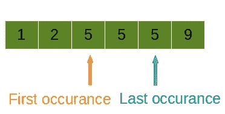

# LeetCode —查找排序数组中元素的第一个和最后一个位置

> 原文：<https://medium.com/nerd-for-tech/leetcode-find-first-and-last-position-of-element-in-sorted-array-946c8eff533d?source=collection_archive---------28----------------------->



# 问题陈述

给定一个按升序排序的整数数组**num**，找出给定**目标**值的起始和结束位置。

如果在数组中没有找到**目标**，返回 **[-1，-1】**。

问题陈述摘自:[https://leet code . com/problems/find-first-and-last-position-of-element-in-sorted-array](https://leetcode.com/problems/find-first-and-last-position-of-element-in-sorted-array)

**例 1:**

```
Input: nums = [5, 7, 7, 8, 8, 10], target = 8
Output: [3, 4]
```

**例 2:**

```
Input: nums = [5, 7, 7, 8, 8, 10], target = 6
Output: [-1, -1]
```

**例 3:**

```
Input: nums = [], target = 0
Output: [-1, -1]
```

**约束:**

```
- 0 <= nums.length <= 10^5
- -10^9 <= nums[i] <= 10^9
- nums is a non-decreasing array.
- -10^9 <= target <= 10^9
```

# 说明

## 强力

强力方法是对阵列进行线性扫描。我们使用两个指针 **leftIndex** 和 **rightIndex** 从第一个数组元素开始。

当找到第一个出现的**目标**元素时，我们将该索引分配给 **leftIndex** 变量。我们继续迭代，直到元素与目标不同。我们将当前的**索引-1**值分配给**右索引**。

上述逻辑的 C++代码片段如下:

```
int firstIndex = -1, lastIndex = -1;
for (int i = 0; i < n; i++) {
    if (x != arr[i])
        continue;

    if (firstIndex == -1)
        firstIndex = i;
    lastIndex = i;
}
```

## 二分搜索法溶液

解决这个问题的有效方法是使用二分搜索法。让我们检查下面的算法:

```
- set i = 0, j = nums.size() - 1
- set leftIndex and rightIndex to -1

- loop while i <= j
  - set mid = i + (j - i)/2

  - if nums[mid] > target
    - set j = mid - 1
  - else if nums[mid] < target
    - set i = mid + 1
  - else
    - leftIndex = mid
    - set j = mid - 1

- set i = 0, j = nums.size() - 1

- loop while i <= j
  - set mid = i + (j - i)/2

  - if nums[mid] > target
    - set j = mid - 1
  - else if nums[mid] < target
    - set i = mid + 1
  - else
    - rightIndex = mid
    - set i = mid + 1

- return [leftIndex, rightIndex]
```

上述方法的时间复杂度为**O(log(N)】**，空间复杂度为 **O(1)** 。

**C++解决方案**

```
class Solution {
public:
    vector<int> searchRange(vector<int>& nums, int target) {
        int i, j, mid;
        i = 0;
        j = nums.size() - 1;
        int leftIndex = -1, rightIndex = -1;

        while(i <= j){
            mid = (i + j)/2;
            if(nums[mid] > target){
                j = mid - 1;
            } else if (nums[mid] < target){
                i = mid + 1;
            } else {
                leftIndex = mid;
                j = mid - 1;
            }
        }

        i = 0; j = nums.size() - 1;
        while(i <= j){
            mid = (i + j)/2;
            if(nums[mid] > target){
                j = mid - 1;
            } else if (nums[mid] < target){
                i = mid + 1;
            } else {
                rightIndex = mid;
                i = mid + 1;
            }
        }

        vector<int> ans;
        ans.push_back(leftIndex);
        ans.push_back(rightIndex);

        return ans;
    }
};
```

**戈朗解决方案**

```
func searchRange(nums []int, target int) []int {
    i, j := 0, len(nums) - 1
    leftIndex, rightIndex := -1, -1

    for i <= j {
        mid := i + (j - i)/2

        if nums[mid] > target {
            j = mid - 1
        } else if nums[mid] < target {
            i = mid + 1
        } else {
            leftIndex = mid
            j = mid - 1
        }
    }

    i, j = 0, len(nums) - 1

    for i <= j {
        mid := i + (j - i)/2

        if nums[mid] > target {
            j = mid - 1
        } else if nums[mid] < target {
            i = mid + 1
        } else {
            rightIndex = mid
            i = mid + 1
        }
    }

    return []int{leftIndex, rightIndex}
}
```

**Javascript 解决方案**

```
var searchRange = function(nums, target) {
    let i = 0, j = nums.length - 1, mid;
    let leftIndex = -1, rightIndex = -1;

    while(i <= j){
        mid = ~~(i + (j - i) / 2);

        if(nums[mid] > target){
            j = mid - 1;
        } else if (nums[mid] < target){
            i = mid + 1;
        } else {
            leftIndex = mid;
            j = mid - 1;
        }
    }

    i = 0;
    j = nums.length - 1;

    while(i <= j){
        mid = ~~(i + (j - i) / 2);

        if(nums[mid] > target){
            j = mid - 1;
        } else if (nums[mid] < target){
            i = mid + 1;
        } else {
            rightIndex = mid;
            i = mid + 1;
        }
    }

    return [leftIndex, rightIndex];
};
```

让我们试运行一下我们的算法，看看解决方案是如何工作的。

```
nums = [5, 7, 7, 8, 8, 10]
target = 8

Step 1: i = 0
        j = nums.size() - 1
          = 6 - 1
          = 5

Step 2: leftIndex = -1
        rightIndex = -1

Step 3: loop while i <= j
        0 <= 5
        mid = 2

        nums[2] > 8
        7 > 8
        false

        nums[2] < 8
        7 < 8
        true
        i = mid + 1
          = 3

Step 4: loop while i <= j
        3 <= 5
        mid = 4

        nums[4] > 8
        8 > 8
        false

        nums[4] < 8
        8 < 8
        false

        nums[4] == 8
        8 == 8
        true
        leftIndex = 4
        j = 4 - 1
          = 3

Step 5: loop while i <= j
        3 <= 3
        mid = 3

        nums[3] > 8
        8 > 8
        false

        nums[3] < 8
        8 < 8
        false

        nums[4] == 8
        8 == 8
        true
        leftIndex = 3
        j = 3 - 1
          = 2

Step 6: loop while i <= j
        3 <= 2
        false

Step 7: i = 0
        j = nums.size() - 1
          = 6 - 1
          = 5

Step 8: loop while i <= j
        0 <= 5
        mid = 2

        nums[2] > 8
        7 > 8
        false

        nums[2] < 8
        7 < 8
        true
        i = mid + 1
          = 3

Step 9: loop while i <= j
        3 <= 5
        mid = 4

        nums[4] > 8
        8 > 8
        false

        nums[4] < 8
        8 < 8
        false

        nums[4] == 8
        8 == 8
        true
        rightIndex = 4
        i = mid + 1
          = 5

Step 10: loop while i <= j
         5 <= 5
         mid = 5

         nums[5] > 8
         10 > 8
         true
         j = mid - 1
           = 5 - 1
           = 4

Step 11: loop while i <= j
         5 <= 4
         false

Step 12: return [3, 4]
```

*原载于*[*https://alkeshghorpade . me*](https://alkeshghorpade.me/post/leetcode-find-first-and-last-position-of-element-in-sorted-array)*。*