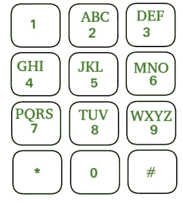

# LeetCode —电话号码的字母组合

> 原文：<https://medium.com/nerd-for-tech/leetcode-letter-combinations-of-a-phone-number-f711ab47dfb1?source=collection_archive---------4----------------------->



# 问题陈述

给定一个包含从 **2 到 9** 的数字的字符串，返回该数字可能代表的所有可能的字母组合。在**任意顺序**返回答案。

下面给出了数字到字母的映射(就像电话按钮一样)。请注意，1 不映射到任何字母。

问题陈述摘自:[https://leet code . com/problems/letter-combinations-of-a-phone-number](https://leetcode.com/problems/letter-combinations-of-a-phone-number)

**例 1:**

```
Input: digits = "23"
Output: ["ad", "ae", "af", "bd", "be", "bf", "cd", "ce", "cf"]
```

**例 2:**

```
Input: digits = ""
Output: []
```

**例 3:**

```
Input: digits = "2"
Output: ["a", "b", "c"]
```

**约束:**

```
- 0 <= digits.length <= 4
- digits[i] is a digit in the range ['2', '9']
```

# 说明

这个问题可以用迭代和递归的方法来解决。我们将在博客中讨论递归解决方案。

## 递归

每个数字(除了 0 和 1)可以代表 3 到 4 个不同的字母。为了存储这些数据，我们可以使用一个哈希映射，其中键是数字，值是相应的字符串。

递归函数将尝试按字母顺序映射到当前数字的所有字母，并为下一个数字再次调用递归函数，并将传递当前输出字符串。

例如，如果数字是 34，数字 3 映射到“def”。将为每个字符 d、e 和 f 调用三个递归函数。对于映射到“ghi”的数字 4，我们将字符 g、h 和 I 附加到所有的 d、e 和 f。这将生成 dg、dh、d i、eg、eh、ei 和 fg、fh、fi。

## 算法

```
- initialize hashmap with key as digit and value with the corresponding string.

- initialize the result as an empty array.

- if digits.size() != 0
  - call recursive function generateCombination("", digits, 0)

- return result.

// generateCombination(current, digits, index)
- if index == digits.size
  - append current in result.

- else
  - currentDigit = digits[index]
  - string mapping = hashmap[currentDigit];
  - Loop
    - for(int i = 0; i < mapping.size(); i++) {
        generateCombination(current + mapping[i], digits, index + 1);
      }
```

**C++解决方案**

```
class Solution {
private:
    map<char, string> m = {
        {'2', "abc"}, {'3', "def"}, {'4', "ghi"},
        {'5', "jkl"}, {'6', "mno"}, {'7', "pqrs"},
        {'8', "tuv"}, {'9', "wxyz"}
    };

    vector<string> result;

public:
    vector<string> letterCombinations(string digits) {
        if(digits.size() != 0){
            generateCombination("", digits, 0);
        }

        return result;
    }

    void generateCombination(string current, string digits, int index) {
        if(index == digits.size()){
            result.push_back(current);
        } else {
            char currentDigit = digits[index];
            string mapping = m[currentDigit];
            for(int i = 0; i < mapping.size(); i++){
                generateCombination(current + mapping[i], digits, index+1);
            }
        }
    }
};
```

**戈朗解决方案**

```
var letters = [...]string{"", "", "abc", "def", "ghi", "jkl",
	"mno", "pqrs", "tuv", "wxyz"}

func letterCombinations(digits string) []string {
    if len(digits) == 0 {
		return nil
	}

	var result []string

    generateCombination("", digits, &result)

	return result
}

func generateCombination(current string, digits string, ans *[]string) {
	if len(digits) == 0 {
		*ans = append(*ans, current)
		return
	}

	currentDigit, _ := strconv.Atoi(string(digits[0]))

	for i := 0; i < len(letters[currentDigit]); i++ {
		generateCombination(current + string(letters[currentDigit][i]), digits[1:], ans)
	}
}
```

**Javascript 解决方案**

```
const map = {
        2: 'abc',
        3: 'def',
        4: 'ghi',
        5: 'jkl',
        6: 'mno',
        7: 'pqrs',
        8: 'tuv',
        9: 'wxyz',
    };

let result = [];

var letterCombinations = function(digits) {
    if (!digits) return [];

    let current = [];

    generateCombination(current, digits, 0);

    return result;
};

function generateCombination(current, digits, index) {
    if (index === digits.length) {
        result.push(current.join(''));
        return;
    }

    for (const char of map[digits[index]]) {
        current.push(char);
        generateCombination(current, digits, index + 1);
        current.pop();
    }
}
```

让我们试运行一下我们的算法，看看解决方案是如何工作的。

```
Input: digits = "23"

Step 1: map<char, string> m = {
            {'2', "abc"}, {'3', "def"}, {'4', "ghi"},
            {'5', "jkl"}, {'6', "mno"}, {'7', "pqrs"},
            {'8', "tuv"}, {'9', "wxyz"}
        };

        vector<string> result;

Step 2: digits.size() == 0
        2 == 0
        false

Step 3: generateCombination("", digits, 0)

Step 4: index == digits.size()
        0 == 2
        false

        char currentDigit = digits[index];
        currentDigit = digits[0];
        currentDigit = "2"

        string mapping = m[currentDigit];
        mapping = m["2"]
        mapping = "abc"

        loop 1.0:
        for(int i = 0; i < mapping.size(); i++)
        0 < 2

        generateCombination(current + mapping[i], digits, index + 1)
        generateCombination("" + mapping[0], "23", 0 + 1)
        generateCombination("" + "a", "23", 0 + 1)
        generateCombination("a", "23", 1)

Step 5: generateCombination("a", "23", 1)
        index == digits.size()
        1 == 2
        false

        char currentDigit = digits[1];
        currentDigit = digits[1];
        currentDigit = "3"

        string mapping = m[currentDigit];
        mapping = m["3"]
        mapping = "def"

        loop 1.1:
        for(int i = 0; i < mapping.size(); i++)
        0 < 3

        generateCombination(current + mapping[i], digits, index + 1)
        generateCombination("a" + mapping[0], "23", 1 + 1)
        generateCombination("a" + "d", "23", 1 + 1)
        generateCombination("ad", "23", 2)

Step 6: generateCombination("ad", "23", 2)
        index == digits.size()
        2 == 2
        true

        result.push_back(current)
        result.push_back("ad")
        result = ["ad"]

Step 7: Algo flow returns to loop 1.1

        loop 1.2:
        for(int i = 0; i < mapping.size(); i++)
        // since i was 0 it is incremented i++ to 1

        i < mapping.size()
        1 < 3
        true

        generateCombination(current + mapping[i], digits, index + 1)
        generateCombination("a" + mapping[1], "23", 1 + 1)
        generateCombination("a" + "e", "23", 1 + 1)
        generateCombination("ae", "23", 2)

Step 8: generateCombination("ae", "23", 2)
        index == digits.size()
        2 == 2
        true

        result.push_back(current)
        result.push_back("ae")
        result = ["ad", "ae"]

Step 9: Algo flow returns to loop 1.2

        loop 1.3:
        for(int i = 0; i < mapping.size(); i++)
        // since i was 1 it is incremented i++ to 2

        i < mapping.size()
        2 < 3
        true

        generateCombination(current + mapping[i], digits, index + 1)
        generateCombination("a" + mapping[2], "23", 1 + 1)
        generateCombination("a" + "f", "23", 1 + 1)
        generateCombination("af", "23", 2)

Step 10: generateCombination("af", "23", 2)
        index == digits.size()
        2 == 2
        true

        result.push_back(current)
        result.push_back("af")
        result = ["ad", "ae", "af"]

Step 11: Algo flow returns to loop 1.3

        loop 1.4:
        for(int i = 0; i < mapping.size(); i++)
        // since i was 2 it is incremented i++ to 3

        i < mapping.size()
        3 < 3
        false

Step 12: Algo flow returns to loop 1.0

        loop 1.5:
        for(int i = 0; i < mapping.size(); i++)
        // since i was 0 it is incremented i++ to 1

        i < mapping.size()
        1 < 3
        true

        generateCombination(current + mapping[i], digits, index + 1)
        generateCombination("" + mapping[1], "23", 0 + 1)
        generateCombination("" + "b", "23", 0 + 1)
        generateCombination("b", "23", 1)

Step 13: generateCombination("b", "23", 1)

        index == digits.size()
        1 == 2
        false

        char currentDigit = digits[1];
        currentDigit = digits[1];
        currentDigit = "3"

        string mapping = m[currentDigit];
        mapping = m["3"]
        mapping = "def"

        loop 2.1:
        for(int i = 0; i < mapping.size(); i++)
        0 < 3

        generateCombination(current + mapping[i], digits, index + 1)
        generateCombination("b" + mapping[0], "23", 1 + 1)
        generateCombination("b" + "d", "23", 1 + 1)
        generateCombination("bd", "23", 2)

Step 14: generateCombination("bd", "23", 2)
        index == digits.size()
        2 == 2
        true

        result.push_back(current)
        result.push_back("bd")
        result = ["ad", "ae", "af", "bd"]

Step 15: Algo flow returns to loop 2.1

        loop 2.2:
        for(int i = 0; i < mapping.size(); i++)
        // since i was 0 it is incremented i++ to 1

        i < mapping.size()
        1 < 3
        true

        generateCombination(current + mapping[i], digits, index + 1)
        generateCombination("b" + mapping[1], "23", 1 + 1)
        generateCombination("b" + "e", "23", 1 + 1)
        generateCombination("be", "23", 2)

Step 16: generateCombination("be", "23", 2)
        index == digits.size()
        2 == 2
        true

        result.push_back(current)
        result.push_back("be")
        result = ["ad", "ae", "af", "bd", "be"]

Step 17: Algo flow returns to loop 2.2

        loop 2.3:
        for(int i = 0; i < mapping.size(); i++)
        // since i was 1 it is incremented i++ to 2

        i < mapping.size()
        2 < 3
        true

        generateCombination(current + mapping[i], digits, index + 1)
        generateCombination("b" + mapping[1], "23", 1 + 1)
        generateCombination("b" + "f", "23", 1 + 1)
        generateCombination("bf", "23", 2)

Step 18: generateCombination("bf", "23", 2)
        index == digits.size()
        2 == 2
        true

        result.push_back(current)
        result.push_back("bf")
        result = ["ad", "ae", "af", "bd", "be", "bf"]

// similar steps are triggered for c with d, e, and f.

The output is
["ad", "ae", "af", "bd", "be", "bf", "cd", "ce", "cf"]
```

*原载于*[*https://alkeshghorpade . me*](https://alkeshghorpade.me/post/leetcode-letter-combinations-of-phone-numbers)*。*