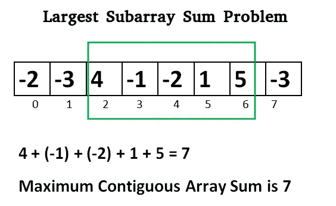

# LeetCode —最大子阵列

> 原文：<https://medium.com/nerd-for-tech/leetcode-maximum-subarray-313d3227826b?source=collection_archive---------12----------------------->



# 问题陈述

给定一个整数数组 **nums** ，找出具有最大和的连续子数组(至少包含一个数)并返回其和*。*

*问题陈述摘自:[https://leetcode.com/problems/maximum-subarray](https://leetcode.com/problems/maximum-subarray)*

***例 1:***

```
*Input: nums = [-2, 1, -3, 4, -1, 2, 1, -5, 4]
Output: 6
Explanation: [4, -1, 2, 1] has the largest sum = 6.*
```

***例 2:***

```
*Input: nums = [1]
Output: 1*
```

***例 3:***

```
*Input: nums = [5, 4, -1, 7, 8] 
Output: 23*
```

***约束:***

```
*- 1 <= nums.length <= 3 * 10^4 - 
-10^5 <= nums[i] <= 10^5*
```

# *说明*

## *强力*

*强力方法是生成所有子阵列并打印具有最大和的子阵列。*

*上述逻辑的一段 C++代码如下:*

```
*for (int i = 0; i < n; i++){
    for (int j = i; j < n; j++){
        for (int k = i; k <= j; k++){
            // calculate sum of all the elements
        }
    }
}*
```

*上述方法的时间复杂度为 **O(N )** 。我们可以使用[卡丹算法](https://www.geeksforgeeks.org/largest-sum-contiguous-subarray/)改进上述逻辑。*

## *Kadane 算法*

*Kadane 算法的简单思想是寻找数组中所有正的连续段(`max_sum`用于此)。并跟踪所有正片段中最大和连续片段(`max_sum_so_far`用于此)。每次我们得到一个正的和，就把它与`max_sum`比较，如果它大于`max_sum_so_far`，就更新`max_sum`。*

*让我们检查下面的算法:*

```
*- set max_sum_so_far = 0, max_sum = INT_MIN

- Loop for i = 0; i < nums.length; i++
  - add max_sum_so_far = max_sum_so_far + nums[i]

  - if max_sum < max_sum_so_far
    - set max_sum = max_sum_so_far

  - if max_sum_so_far < 0
    - set max_sum_so_far = 0

- return max_sum*
```

*上述方法的时间复杂度为 **O(N)** ，空间复杂度为 **O(1)** 。*

***C++解决方案***

```
*class Solution {
public:
    int maxSubArray(vector<int>& nums) {
        int max_sum = INT_MIN;
        int max_sum_so_far = 0;

        for(int i = 0; i < nums.size(); i++){
            max_sum_so_far += nums[i];

            if(max_sum < max_sum_so_far){
                max_sum = max_sum_so_far;
            }

            if(max_sum_so_far < 0){
                max_sum_so_far = 0;
            }
        }

        return max_sum;
    }
};*
```

***戈朗解决方案***

```
*func maxSubArray(nums []int) int {
    maxSum := math.MinInt32
    maxSumSoFar := 0

    for i := 0; i < len(nums); i++ {
        maxSumSoFar += nums[i]

        if maxSum < maxSumSoFar {
            maxSum = maxSumSoFar
        }

        if maxSumSoFar < 0 {
            maxSumSoFar = 0
        }
    }

    return maxSum
}*
```

***Javascript 解决方案***

```
*var maxSubArray = function(nums) {
    let maxSumSoFar = 0;
    let maxSum = -Infinity;

    if(nums.length === 0) return 0;
    if(nums.length === 1) return nums[0]

    for( let i = 0; i<nums.length; i++) {
        maxSumSoFar += nums[i];

        maxSum = Math.max(maxSum, maxSumSoFar);

        if(maxSumSoFar < 0) {
            maxSumSoFar = 0;
        }
    }

    return maxSum;
};*
```

*让我们试运行一下我们的算法，看看解决方案是如何工作的。*

```
*nums = [-2, 1, -3, 4, -1, 2, 1, -5, 4]

Step 1: max_sum_so_far = 0
        max_sum = INT_MIN

Step 2: for i = 0; i < nums.length
        0 < 9
        true

        max_sum_so_far += nums[0]
        max_sum_so_far = 0 + -2
        max_sum_so_far = -2

        max_sum < max_sum_so_far
        -2^31 - 1 < -2
        true

        max_sum = max_sum_so_far
        max_sum = -2

        max_sum_so_far < 0
        -2 < 0
        true

        max_sum_so_far = 0

        i++
        i = 1

Step 3: i < nums.length
        1 < 9
        true

        max_sum_so_far += nums[1]
        max_sum_so_far = 0 + 1
        max_sum_so_far = 1

        max_sum < max_sum_so_far
        -2 < 1
        true

        max_sum = max_sum_so_far
        max_sum = 1

        max_sum_so_far < 0
        1 < 0
        false

        i++
        i = 2

Step 4: i < nums.length
        2 < 9
        true

        max_sum_so_far += nums[2]
        max_sum_so_far = 1 + -3
        max_sum_so_far = -2

        max_sum < max_sum_so_far
        1 < -2
        false

        max_sum_so_far < 0
        -2 < 0
        true

        max_sum_so_far = 0

        i++
        i = 3

Step 5: i < nums.length
        3 < 9
        true

        max_sum_so_far += nums[3]
        max_sum_so_far = 0 + 4
        max_sum_so_far = 4

        max_sum < max_sum_so_far
        1 < 4
        true

        max_sum = max_sum_so_far
        max_sum = 4

        max_sum_so_far < 0
        false

        i++
        i = 4

Step 6: i < nums.length
        4 < 9
        true

        max_sum_so_far += nums[4]
        max_sum_so_far = 4 + -1
        max_sum_so_far = 3

        max_sum < max_sum_so_far
        4 < 3
        false

        max_sum_so_far < 0
        false

        i++
        i = 5

Step 7: i < nums.length
        5 < 9
        true

        max_sum_so_far += nums[5]
        max_sum_so_far = 3 + 2
        max_sum_so_far = 5

        max_sum < 5
        4 < 5
        true

        max_sum = max_sum_so_far
        max_sum = 5

        max_sum_so_far < 0
        false

        i++
        i = 6

Step 8: i < nums.length
        6 < 9
        true

        max_sum_so_far += nums[6]
        max_sum_so_far = 5 + 1
        max_sum_so_far = 6

        max_sum < 6
        5 < 6
        true

        max_sum = max_sum_so_far
        max_sum = 6

        max_sum_so_far < 0
        false

        i++
        i = 7

Step 9: i < nums.length
        7 < 9
        true

        max_sum_so_far += nums[7]
        max_sum_so_far = 6 + -5
        max_sum_so_far = 1

        max_sum < 6
        6 < 1
        false

        max_sum_so_far < 0
        false

        i++
        i = 8

Step 10: i < nums.length
         8 < 9
         true

         max_sum_so_far += nums[8]
         max_sum_so_far = 1 + 4
         max_sum_so_far = 5

         max_sum < 6
         6 < 5
         false

         max_sum_so_far < 0
         false

         i++
         i = 9

Step 11: i < nums.length
         9 < 9
         false

Step 12: return max_sum
         Answer is 6*
```

**原载于*[*https://alkeshghorpade . me*](https://alkeshghorpade.me/post/leetcode-maximum-subarray)*。**