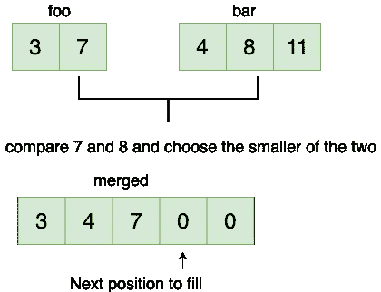

# LeetCode —合并两个排序数组

> 原文：<https://medium.com/nerd-for-tech/leetcode-merge-two-sorted-array-efbb9790e022?source=collection_archive---------2----------------------->



# 问题陈述

给你两个整数数组 **nums1** 和 **nums2** ，按**非递减**顺序排序，还有两个整数 **m** 和 **n** ，分别代表 **nums1** 和 **nums2** 中的元素个数。

**将** **nums1** 和 **nums2** 合并成一个按**非降序**排序的数组。

最终排序后的数组不应由函数返回，而是存储在数组 **nums1** 中。为了适应这一点， **nums1** 的长度为 **m + n** ，其中第一个 **m** 元素表示应该合并的元素，最后一个 **n** 元素被设置为 **0** 并且应该被忽略。 **nums2** 的长度为 **n** 。

问题陈述摘自:[https://leetcode.com/problems/merge-sorted-array](https://leetcode.com/problems/merge-sorted-array)

**例 1:**

```
Input: nums1 = [1, 2, 3, 0, 0, 0], m = 3, nums2 = [2, 5, 6], n = 3
Output: [1, 2, 2, 3, 5, 6]
Explanation: The arrays we are merging are [1, 2, 3] and [2, 5, 6].
The result of the merge is [1, 2, 2, 3, 5, 6] with the underlined elements coming from nums1.
```

**例二:**

```
Input: nums1 = [1], m = 1, nums2 = [], n = 0
Output: [1]
Explanation: The arrays we are merging are [1] and [].
The result of the merge is [1].
```

**例 3:**

```
Input: nums1 = [0], m = 0, nums2 = [1], n = 1
Output: [1]
Explanation: The arrays we are merging are [] and [1].
The result of the merge is [1].
Note that because m = 0, there are no elements in nums1.
The 0 is only there to ensure the merge result can fit in nums1.
```

**约束:**

```
- nums1.length == m + n
- nums2.length == n
- 0 <= m, n <= 200
- 1 <= m + n <= 200
- -10^9 <= nums1[i], nums2[j] <= 10^9
```

# 说明

解决该问题的强力方法是创建一个新的数组 nums3，并不断添加两个排序后的数组中的元素。将 nums1 和 nums2 中的所有元素添加到 nums3 后，我们将 nums3 复制回 nums1。

但是上面的解决方案会额外占用 **O(m + n)** 的空间。我们需要在没有任何额外空间的情况下对元素进行排序。

想法是从右到左迭代两个数组，并从右继续向 nums1 添加元素。

让我们检查下面的算法:

```
- set i = m - 1, j = n - 1, k = m + n - 1

- loop for i >= 0 && j >= 0
  - if nums1[i] > nums2[j]
    - set nums1[k] = nums1[i--]
  - else
    - set nums1[k] = nums2[j--]

- loop while i >= 0
  - set nums1[k--] = nums1[i--]

- loop while j >= 0
  - set nums1[k--] = nums2[j--]
```

**C++解决方案**

```
class Solution {
public:
    void merge(vector<int>& nums1, int m, vector<int>& nums2, int n) {
        int i = m - 1, j = n - 1, k = m + n - 1;

        for(; i >=0 && j >=0; k--){
            if(nums1[i] >= nums2[j]){
                nums1[k] = nums1[i--];
            } else {
                nums1[k] = nums2[j--];
            }
        }

        while(i >= 0) {
            nums1[k--] = nums1[i--];
        }

        while(j >= 0) {
            nums1[k--] = nums2[j--];
        }
    }
};
```

**戈朗溶液**

```
func merge(nums1 []int, m int, nums2 []int, n int)  {
    i := m - 1
    j := n - 1
    k := m + n - 1

    for ; i >= 0 && j >= 0; k-- {
        if nums1[i] >= nums2[j] {
            nums1[k] = nums1[i]
            i--
        } else {
            nums1[k] = nums2[j]
            j--
        }
    }

    for i >= 0 {
        nums1[k] = nums1[i]
        k--
        i--
    }

    for j >= 0 {
        nums1[k] = nums2[j]
        k--
        j--
    }
}
```

**Javascript 解决方案**

```
var merge = function(nums1, m, nums2, n) {
    let i, j, k;

    for(i = m - 1, j = n - 1, k = m + n - 1; i >= 0 && j >= 0; k--){
        if(nums1[i] >= nums2[j]){
            nums1[k] = nums1[i--];
        } else {
            nums1[k] = nums2[j--];
        }
    }

    while(i >= 0) {
        nums1[k--] = nums1[i--];
    }

    while(j >= 0) {
        nums1[k--] = nums2[j--];
    }
};
```

让我们试运行一下我们的算法，看看解决方案是如何工作的。

```
Input:
nums1 = [1, 2, 3, 0, 0, 0]
m = 3

nums2 = [2, 5, 6]
n = 3

Step 1: i = m - 1
          = 3 - 1
          = 2

        j = n - 1
          = 3 - 1
          = 2

        k = m + n - 1
          = 3 + 3 - 1
          = 5

Step 2: loop for i >= 0 && j >= 0
        2 >= 0 && 2 >= 0
        true

        if nums1[i] >= nums2[j]
        nums1[2] >= nums2[2]
        3 > 6
        false

        nums1[k] = nums2[j--]
        nums1[5] = 3

        j--
        j = 1

        k--
        k = 4

        nums1 = [1, 2, 3, 0, 0, 6]

Step 3: loop for i >= 0 && j >= 0
        2 >= 0 && 1 >= 0
        true

        if nums1[i] >= nums2[j]
        nums1[2] >= nums2[1]
        3 > 5
        false

        nums1[k] = nums2[j--]
        nums1[4] = 6

        j--
        j = 0

        k--
        k = 3

        nums1 = [1, 2, 3, 0, 5, 6]

Step 4: loop for i >= 0 && j >= 0
        2 >= 0 && 0 >= 0
        true

        if nums1[i] >= nums2[j]
        nums1[2] >= nums2[0]
        3 > 2
        true

        nums1[k] = nums1[i--]
        nums1[3] = 3

        i--
        i = 1

        k--
        k = 2

        nums1 = [1, 2, 3, 3, 5, 6]

Step 5: loop for i >= 0 && j >= 0
        1 >= 0 && 0 >= 0
        true

        if nums1[i] >= nums2[j]
        nums1[1] >= nums2[0]
        2 >= 2
        true

        nums1[k] = nums1[i--]
        nums1[2] = 2

        i--
        i = 0

        k--
        k = 1

        nums1 = [1, 2, 2, 3, 5, 6]

Step 6: loop for i >= 0 && j >= 0
        0 >= 0 && 0 >= 0
        true

        if nums1[i] >= nums2[j]
        nums1[0] >= nums2[0]
        1 >= 2
        false

        nums1[k] = nums2[j--]
        nums1[1] = 2

        j--
        j= -1

        k--
        k = 0

        nums1 = [1, 2, 2, 3, 5, 6]

Step 7: loop for i >= 0 && j >= 0
        0 >= 0 && -1 >= 0
        false

Step 8: for i >= 0
        0 >= 0
        true

        nums1[k--] = nums1[i--]
        nums1[0] = nums1[0]
        nums1[0] = 1

        k--
        k = -1

        i--
        i = -1

Step 9: for j >= 0
        -1 >= 0
        false

So the answer is [1, 2, 2, 3, 5, 6].
```

*原发表于*[*https://alkeshghorpade . me*](https://alkeshghorpade.me/post/leetcode-merge-sorted-array)*。*