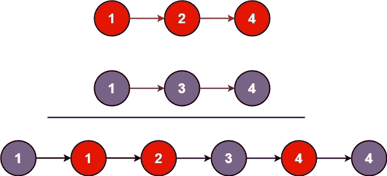

# LeetCode —合并两个排序列表

> 原文：<https://medium.com/nerd-for-tech/leetcode-merge-two-sorted-lists-99cc19e1b06e?source=collection_archive---------0----------------------->



# 问题陈述

合并两个排序的链表，并将其作为一个**排序的**列表返回。应该通过将前两个列表的节点拼接在一起来制作列表。

问题陈述摘自:【https://leetcode.com/problems/merge-two-sorted-lists】T2

**例一:**

```
Input: l1 = [1, 2, 4], l2 = [1, 3, 4]
Output: [1, 1, 2, 3, 4, 4]
```

**例 2:**

```
Input: l1 = [], l2 = []
Output: []
```

**例 3:**

```
Input: l1 = [], l2 = [0]
Output: [0]
```

**约束:**

```
- The number of nodes in both lists is in the range [0, 50].
- -100 <= Node.val <= 100
- Both l1 and l2 are sorted in non-decreasing order.
```

# 说明

由于列表已经排序，我们可以比较列表的节点，并将较小的节点添加到新列表中。

让我们检查一下这种方法的算法。

```
- return list l2 if list l1 == null

- return list l1 if list l2 == null

- set ListNode *head = null

- if l1->val < l2->val
  - set head = l1
  - move ahead l1 = l1->next
- else
  - set head = l2
  - move ahead l2 = l2->next

- initialize ListNode *p and set p = head

- while(l1 && l2) // l1 and l2 both are not null
  - if l1->val < l2->val
    - set p->next = l1
    - set l1 = l1->next
  - else
    - set p->next = l2
    - set l2 = l2->next

  - set p = p->next

// append the pending elements of the remaining list
- if l1 != null
  - set p->next = l1
- else
  - set p->next = l2
```

**C++解决方案**

```
class Solution {
public:
    ListNode* mergeTwoLists(ListNode* l1, ListNode* l2) {
        if (l1 == NULL){
            return l2;
        }

        if(l2 == NULL) {
            return l1;
        }

        ListNode *head = NULL;

        if(l1->val < l2->val){
            head = l1;
            l1 = l1->next;
        } else {
            head = l2;
            l2 = l2->next;
        }

        ListNode *p;
        p = head;

        while(l1 && l2){
            if(l1->val < l2->val){
                p->next = l1;
                l1 = l1->next;
            } else {
                p->next = l2;
                l2 = l2->next;
            }

            p = p->next;
        }

        if(l1 != NULL){
            p->next = l1;
        } else {
            p->next = l2;
        }

        return head;
    }
};
```

**Golang 解决方案**

```
func mergeTwoLists(l1 *ListNode, l2 *ListNode) *ListNode {
    if l1 == nil {
        return l2
    }

    if l2 == nil {
        return l1
    }

    var head *ListNode

    if l1.Val < l2.Val {
        head = l1
        l1 = l1.Next
    } else {
        head = l2
        l2 = l2.Next
    }

    var p *ListNode;
    p = head;

    for l1 != nil && l2 != nil {
        if l1.Val < l2.Val {
            p.Next = l1
            l1 = l1.Next
        } else {
            p.Next = l2
            l2 = l2.Next
        }

        p = p.Next
    }

    if l1 != nil {
        p.Next = l1
    } else {
        p.Next = l2
    }

    return head
}
```

**Javascript 解决方案**

```
var mergeTwoLists = function(l1, l2) {
    if( !l1 ){
        return l2;
    }

    if( !l2 ){
        return l1;
    }

    let head = new ListNode(0, null);

    if( l1.val < l2.val ){
        head = l1;
        l1 = l1.next;
    } else {
        head = l2;
        l2 = l2.next;
    }

    let p = head;

    while(l1 && l2) {
        if (l1.val < l2.val) {
            p.next = l1;
            l1 = l1.next;
        } else {
            p.next = l2;
            l2 = l2.next;
        }

        p = p.next;
    }

    if( l1 ){
        p.next = l1;
    } else {
        p.next = l2;
    }

    return head;
};
```

让我们试运行一下我们的算法，看看解决方案是如何工作的。

```
Input: l1 = [1, 2, 4], l2 = [1, 3, 4]

Step 1: if l1 == NULL
        false

Step 2: if l2 == NULL
        false

Step 3: ListNode *head = NULL;

Step 4: if l1->val < l2->val
        1 < 1
        false

        head = l2

        head
          |
          1 -> 3 -> 4

        l2 = l2->next

               l2
               |
          1 -> 3 > 4

Step 5: ListNode *p
        p = head

        head, p
          |
          1 -> 3 -> 4

Step 6: loop while l1 && l2
        true && true
        true

        - if l1->val < l2->val
          1 < 3
          true

          p->next = l1

          head, p
           |
           1 -> 1

          l1 = l1->next

               l1
               |
          1 -> 2 -> 4

          p = p->next

          head  p
           |    |
           1 -> 1

Step 7: loop while l1 && l2
        true && true
        true

        - if l1->val < l2->val
          2 < 3
          true

          p->next = l1

          head  p
           |    |
           1 -> 1 -> 2

          l1 = l1->next

                   l1
                    |
          1 -> 2 -> 4

          p = p->next

          head       p
           |         |
           1 -> 1 -> 2

Step 8: loop while l1 && l2
        true && true
        true

        - if l1->val < l2->val
          4 < 3
          false

          p->next = l2

          head       p
           |         |
           1 -> 1 -> 2 -> 3

          l2 = l2->next

                   l2
                    |
          1 -> 3 -> 4

          p = p->next

          head            p
           |              |
           1 -> 1 -> 2 -> 3

Step 9: loop while l1 && l2
        true && true
        true

        - if l1->val < l2->val
          4 < 4
          false

          p->next = l2

          head            p
           |              |
           1 -> 1 -> 2 -> 3 -> 4

           l2 = l2->next

                         l2
                          |
          1 -> 3 -> 4 -> null

          p = p->next

          head                 p
           |                   |
           1 -> 1 -> 2 -> 3 -> 4

Step 10: loop while l1 && l2
         true && false
         false

Step 11: if l1 != NULL
         true

         p->next = l1

         head                 p
          |                   |
          1 -> 1 -> 2 -> 3 -> 4 -> 4

Step 12: return head;

         head
          |
          1 -> 1 -> 2 -> 3 -> 4 -> 4
```

*原载于*[*https://alkeshghorpade . me*](https://alkeshghorpade.me/post/leetcode-merge-two-sorted-lists)*。*