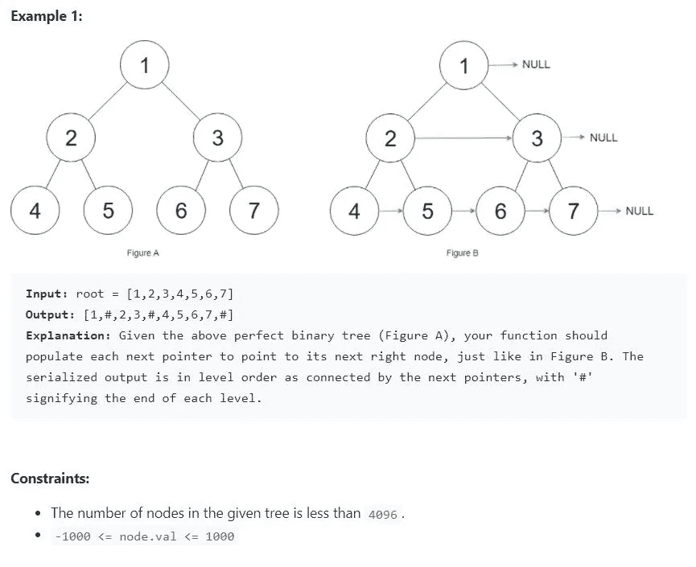
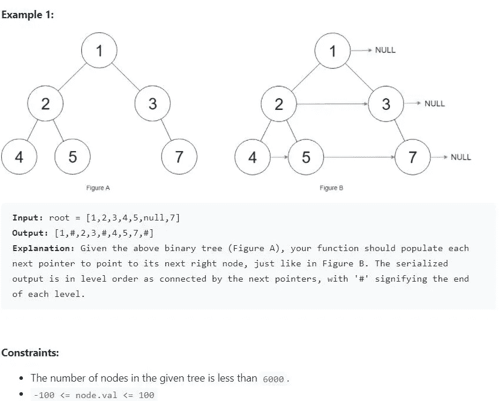

# LeetCode:在每个节点 I 和 II 中填充下一个右指针— [Medium]

> 原文：<https://medium.com/nerd-for-tech/leetcode-populating-next-right-pointers-in-each-node-i-and-ii-medium-3f953b1db167?source=collection_archive---------4----------------------->

问题链接:

[](https://leetcode.com/problems/populating-next-right-pointers-in-each-node/) [## 在每个节点中填充右下指针- LeetCode

### 给你一棵完美的二叉树，所有的叶子都在同一层，每个父母都有两个孩子。的…

leetcode.com](https://leetcode.com/problems/populating-next-right-pointers-in-each-node/) 

## 问题描述:

你得到了一棵**完美二叉树**，其中所有的叶子都在同一层，并且每个父母都有两个孩子。二叉树具有以下定义:

```
struct Node {
  int val;
  Node *left;
  Node *right;
  Node *next;
}
```

填充每个下一个指针以指向它的下一个右节点。如果没有下一个右节点，下一个指针应该设置为`NULL`。

最初，所有后续指针都被设置为`NULL`。



## 解决办法

如果你仔细观察这个例子，我们只是在树的每一层操作节点的下一个指针。所以，基本上是一个层次顺序遍历问题。一旦您知道如何从左到右获取节点，解决方案就非常简单了。

你如何逐级获取二叉树的节点？如果你知道 bfs 遍历，那么它只是 bfs 的一个小小的扩展。使用迭代方法，计算当前级别的节点数，将节点的子节点添加到队列中。此外，在将节点从队列中出队时，将其添加到一个列表中(在代码中命名为“rows ”),以便某一级别的所有节点都存储在列表“rows”中

时间复杂度:O(n)

## 跟进:

使用恒定的额外空间可以做到吗？是的。下面的问题与这个问题相似，后续问题的解决方案在这里讨论。[继续阅读]

## 在每个节点 II 中填充右下指针

问题链接

[](https://leetcode.com/problems/populating-next-right-pointers-in-each-node-ii/) [## 在每个节点中填充右下指针 II - LeetCode

### 给定一个二叉树结构节点{ int val 节点*左侧；节点*右；节点*下一个；}填充每个下一个指针以指向…

leetcode.com](https://leetcode.com/problems/populating-next-right-pointers-in-each-node-ii/) 

## 问题描述:

给定一棵二叉树

```
struct Node {
  int val;
  Node *left;
  Node *right;
  Node *next;
}
```

填充每个下一个指针以指向它的下一个右节点。如果没有下一个右节点，下一个指针应该设置为`NULL`。

最初，所有后续指针都被设置为`NULL`。



## 解决办法

和帖子第一部分的问题类似。同样的代码也可以工作，因为我们没有将我们的代码限制为完美的二叉树。所以上面提供的代码是有效的。

## 跟进:

使用恒定的额外空间可以做到吗？是的。

要在不使用队列的情况下解决这个问题，我们首先需要提出一个不同的逻辑，它不涉及在列表中存储节点。

1.  在每一层，我们希望该层的所有节点
2.  一旦我们在一个级别得到所有节点，我们就移动到下一个级别

两个 while 循环。一个循环用于移动到下一层，另一个内部 while 循环用于遍历该层的所有节点。

我们使用两个指针 childhead 和 child，它们在开始时都是空的。我们使用 childhead 指针移动到下一级，即我们将它分配给 root，这样 root 移动到下一级的第一个节点。

如果不理解逻辑，理解代码会有点困难。所以我建议你考虑一个例子，在开始写代码之前先把逻辑框起来。