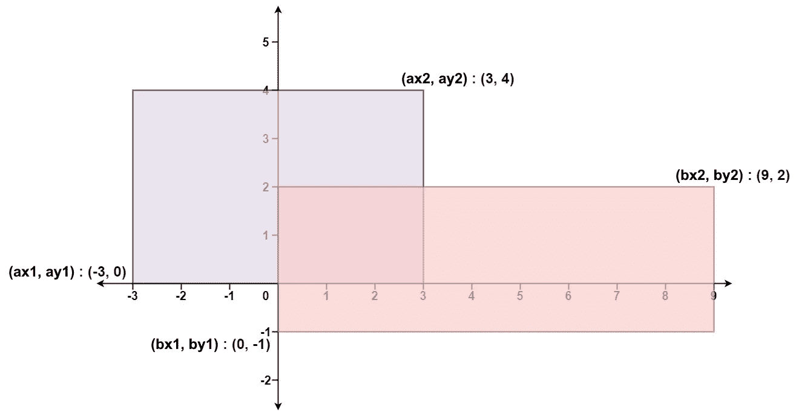

# LeetCode —矩形区域

> 原文：<https://medium.com/nerd-for-tech/leetcode-rectangle-area-b9aadd61a813?source=collection_archive---------0----------------------->

# 问题陈述

给定两个**直线**矩形在 2D 平面上的坐标，返回*两个矩形*覆盖的总面积。

第一个矩形由它的**左下角**角 *(ax1，ay1)* 和它的**右上角**角 *(ax2，ay2)* 定义。

第二个矩形由它的**左下角**角 *(bx1，by1)* 和它的右上角 *(bx2，by2)* 定义。

问题陈述摘自:[https://leetcode.com/problems/rectangle-area](https://leetcode.com/problems/rectangle-area)

例 1:



资料来源:LeetCode

```
Input: ax1 = -3, ay1 = 0, ax2 = 3, ay2 = 4, bx1 = 0, by1 = -1, bx2 = 9, by2 = 2 
Output: 45
```

**例 2:**

```
Input: ax1 = -2, ay1 = -2, ax2 = 2, ay2 = 2, bx1 = -2, by1 = -2, bx2 = 2, by2 = 2 
Output: 16
```

**约束:**

```
- -10^4 <= ax1 <= ax2 <= 10^4 
- -10^4 <= ay1 <= ay2 <= 10^4 
- -10^4 <= bx1 <= bx2 <= 10^4 
- -10^4 <= by1 <= by2 <= 10^4
```

# 说明

这个问题的解决方案很简单。我们需要用学校的数学概念来求两个矩形的面积。

```
area = Area of rectangle 1 + Area of rectangle 2 - Area of intersecting portion
```

为了计算相交部分的面积，我们需要计算下面四个坐标:

```
maxCommonX = max(ax1, bx1) 
maxCommonY = max(ay1, by1) minCommonX = min(ax2, bx2) 
minCommonY = min(ay2, by2) commonArea = (minCommonX - maxCommonX) * (minCommonY - maxCommonY)
```

我们来检查一下算法。

```
// compute the area of rectangles using L * H
- set area1 = (ax2 - ax1) * (ay2 - ay1)
  set area2 = (bx2 - by1) * (by2 - by1)

// if the rectangles do not intersect, return area1 + area2
- if bx1 >= ax2 || bx2 <= ax1 || by1 >= ay2 || by2 <= ay1
  - return area1 + area2

- set maxCommonX = max(ax1, bx1)
  set maxCommonY = max(ay1, by1)

- set minCommonX = min(ax2, bx2)
  set minCommonY = min(ay2, by2)

- return area1 + area2 - (minCommonX - maxCommonX) * (minCommonY - maxCommonY);
```

让我们在 **C++** 、 **Golang** 、 **Javascript** 中检查一下我们的算法。

## C++解决方案

```
class Solution {
public:
    int computeArea(int ax1, int ay1, int ax2, int ay2, int bx1, int by1, int bx2, int by2) {
        int area1 = (ax2 - ax1) * (ay2 - ay1);
        int area2 = (bx2 - bx1) * (by2 - by1);

        if(bx1 >= ax2 || bx2 <= ax1 || by1 >= ay2 || by2 <= ay1) {
            return area1 + area2;
        }

        int maxCommonX = max(ax1, bx1);
        int maxCommonY = max(ay1, by1);

        int minCommonX = min(ax2, bx2);
        int minCommonY = min(ay2, by2);

        return area1 + area2 - (minCommonX - maxCommonX) * (minCommonY - maxCommonY);
    }
};
```

## 戈朗溶液

```
func computeArea(ax1 int, ay1 int, ax2 int, ay2 int, bx1 int, by1 int, bx2 int, by2 int) int {
    area1 := (ax2 - ax1) * (ay2 - ay1)
    area2 := (bx2 - bx1) * (by2 - by1)

    if bx1 >= ax2 || bx2 <= ax1 || by1 >= ay2 || by2 <= ay1 {
        return area1 + area2;
    }

    maxCommonX := max(ax1, bx1)
    maxCommonY := max(ay1, by1)

    minCommonX := min(ax2, bx2)
    minCommonY := min(ay2, by2)

    return area1 + area2 - (minCommonX - maxCommonX) * (minCommonY - maxCommonY)
}

func max(a, b int) int {
    if a > b {
        return a
    }

    return b
}

func min(a, b int) int {
    if a < b {
        return a
    }

    return b
}
```

## Javascript 解决方案

```
var computeArea = function(ax1, ay1, ax2, ay2, bx1, by1, bx2, by2) {
    let area1 = (ax2 - ax1) * (ay2 - ay1);
    let area2 = (bx2 - bx1) * (by2 - by1);

    if(bx1 >= ax2 || bx2 <= ax1 || by1 >= ay2 || by2 <= ay1) {
       return area1 + area2;
    }

    let maxCommonX = Math.max(ax1, bx1);
    let maxCommonY = Math.max(ay1, by1);

    let minCommonX = Math.min(ax2, bx2);
    let minCommonY = Math.min(ay2, by2);

    return area1 + area2 - (minCommonX - maxCommonX) * (minCommonY - maxCommonY) ;
};
```

让我们为**示例 1** 预演我们的算法。

```
Input: ax1 = -3, ay1 = 0, ax2 = 3, ay2 = 4, bx1 = 0, by1 = -1, bx2 = 9, by2 = 2

Step 1: area1 = (ax2 - ax1) * (ay2 - ay1)
              = (3 - -3) * (4 - 0)
              = 6 * 4
              = 24

        area2 = (bx2 - bx1) * (by2 - by1)
              = (9 - 0) * (2 - -1)
              = 9 * 3
              = 27

Step 2: if bx1 >= ax2 || bx2 <= ax1 || by1 >= ay2 || by2 <= ay1
           0 >= 3 || 9 <= -3 || -1 >= 4 || 2 <= 0
           false

Step 3: maxCommonX = max(ax1, bx1)
                   = max(-3, 0)
                   = 0

        maxCommonY = max(ay1, by1)
                   = max(0, -1)
                   = 0

Step 4: minCommonX = min(ax2, bx2)
                   = min(3, 9)
                   = 3

        minCommonY = min(ay2, by2)
                   = min(4, 2)
                   = 2

Step 5: return area1 + area2 - (minCommonX - maxCommonX) * (minCommonY - maxCommonY)
               24 + 27 - (3 - 0) * (2 - 0)
               51 - 3*2
               51 - 6
               45

We return the answer as 45.
```

*原载于*[*https://alkeshghorpade . me*](https://alkeshghorpade.me/post/leetcode-rectangle-area)*。*