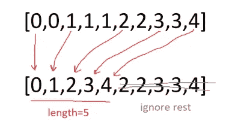

# LeetCode —从排序数组中删除重复项

> 原文：<https://medium.com/nerd-for-tech/leetcode-remove-duplicates-from-sorted-array-c399cc31fe9a?source=collection_archive---------8----------------------->



# 问题陈述

给定一个排序后的数组 **nums** ，就地删除重复的元素，这样每个元素只出现一次，并返回新的长度。

不要为另一个数组分配额外的空间，必须通过用 **O(1)** 额外的内存就地修改输入数组来做到这一点。

问题陈述摘自:[https://leet code . com/problems/remove-duplicates-from-sorted-array](https://leetcode.com/problems/remove-duplicates-from-sorted-array)

**例 1:**

```
Input: nums = [1, 1, 2]
Output: 2, nums = [1, 2]
Explanation: Your function should return length = 2, with the first two elements of nums being 1 and 2 respectively. It doesn't matter what you leave beyond the returned length.
```

**例 2:**

```
Input: nums = [0, 0, 1, 1, 1, 2, 2, 3, 3, 4]
Output: 5, nums = [0, 1, 2, 3, 4]
Explanation: Your function should return length = 5, with the first five elements of nums being modified to 0, 1, 2, 3, and 4 respectively. It doesn't matter what values are set beyond the returned length.
```

**约束:**

```
- 0 <= nums.length <= 3 * 10^4
- -10^4 <= nums[i] <= 10^4
- nums is sorted in ascending order.
```

# 说明

## 强力

嗯，问题说解决它不需要任何额外的空间，但我们得到的第一个强力方法是计数不同元素的出现次数，并将其存储在一个散列(或对象)中。

关键字是数组元素，值是元素在数组中出现的次数。

然后，我们对散列进行迭代，并将键存储在一个新的数组中。

该解决方案需要额外的空间来存放新数组和新散列。

## 两点

为了改进上面的方法，我们可以利用这里的排序数组。我们可以使用两个指针 **i** 和 **j** 。我们一直递增 **j** ，直到时间 **nums[i] == nums[j]** 。

让我们检查下面的算法:

```
- return if nums size <= 1

- set i = 0

- Loop for j = 1; j < nums.size(); j++
  - if nums[j] != nums[i]
    - i++
    - nums[i] = nums[j]

- return i + 1
```

上述方法的时间复杂度为 **O(N)** ，空间复杂度为 **O(1)** 。

**C++解决方案**

```
class Solution {
public:
    int removeDuplicates(vector<int>& nums) {
        if(nums.size() <= 1){
            return nums.size();
        }

        int i = 0;

        for(int j = 1; j < nums.size(); j++){
            if(nums[j] != nums[i){
                i++
                nums[i] = nums[j];
            }
        }

        return i + 1;
    }
};
```

**戈朗解**

```
func removeDuplicates(nums []int) int {
    length := len(nums)

    if length <= 1 {
        return length
    }

    i := 0

    for j := 1; j < length; j++ {
        if nums[i] != nums[j] {
            i++
            nums[i] = nums[j]
        }
    }

    return i + 1
}
```

**Javascript 解决方案**

```
var removeDuplicates = function(nums) {
    const length = nums.length;

    if( length <= 1 ){
        return length;
    }

    let i = 0;

    for(let j = 1; j < length; j++){
        if( nums[i] != nums[j] ){
            i++;
            nums[i] = nums[j];
        }
    }

    return i + 1;
};
```

让我们试运行一下我们的算法，看看解决方案是如何工作的。

```
nums = [0, 0, 1, 1, 1, 2, 2, 3, 3, 4]

Step 1: length = nums.size()
               = 10

Step 2: length <= 1
            10 <= 1
            false

Step 3: i = 0

Step 4: Loop for j = 1; 1 < 10
        nums[i] != nums[j]
        nums[0] != nums[1]
        0 != 0
        false

        j++
        j = 2

Step 5: Loop for j = 2; 2 < 10
        nums[i] != nums[j]
        nums[0] != nums[2]
        0 != 1
        true

        i++
        i = 1

        nums[i] = nums[j]
        nums[1] = nums[2]
        nums[1] = 1

        j++
        j = 3

Step 6: Loop for j = 3; 3 < 10
        nums[i] != nums[j]
        nums[1] != nums[3]
        1 != 1
        false

        j++
        j = 4

Step 7: Loop for j = 4; 4 < 10
        nums[i] != nums[j]
        nums[1] != nums[4]
        1 != 1
        false

        j++
        j = 5

Step 8: Loop for j = 5; 5 < 10
        nums[i] != nums[j]
        nums[1] != nums[5]
        1 != 2
        true

        i++
        i = 2

        nums[i] = nums[j]
        nums[2] = nums[5]
        nums[2] = 2

        j++
        j = 6

Step 9: Loop for j = 6; 6 < 10
        nums[i] != nums[j]
        nums[2] != nums[6]
        2 != 2
        false

        j++
        j = 7

Step 10: Loop for j = 7; 7 < 10
         nums[i] != nums[j]
         nums[2] != nums[7]
         2 != 3
         true

         i++
         i = 3

         nums[i] = nums[j]
         nums[3] = nums[7]
         nums[3] = 3

         j++
         j = 8

Step 11: Loop for j = 8; 8 < 10
         nums[i] != nums[j]
         nums[3] != nums[8]
         3 != 3
         false

         j++
         j = 9

Step 12: Loop for j = 9; 9 < 10
         nums[i] != nums[j]
         nums[3] != nums[9]
         3 != 4
         true

         i++
         i = 4

         nums[i] = nums[j]
         nums[4] = nums[9]
         nums[4] = 4

         j++
         j = 10

Step 13: Loop for j = 10; 10 < 10
         false

Step 14: return i + 1
         return 4 + 1 = 5
```

*原载于*[*https://alkeshghorpade . me*](https://alkeshghorpade.me/post/leetcode-remove-duplicates-from-sorted-array)*。*