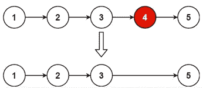
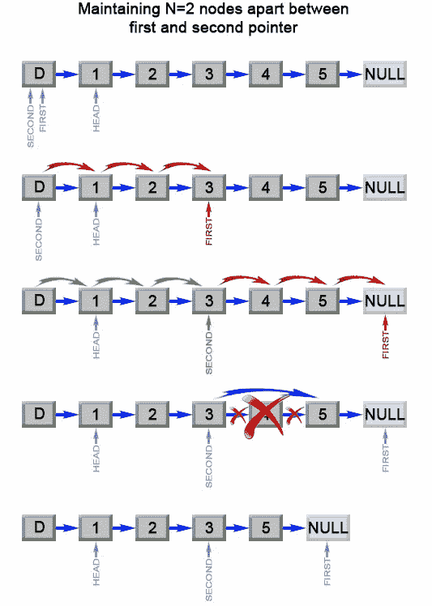

# 从列表末尾删除第 n 个节点

> 原文：<https://medium.com/nerd-for-tech/leetcode-remove-nth-node-from-end-of-list-3e7902c4c2af?source=collection_archive---------3----------------------->

# 问题陈述

给定一个链表的**头**，从链表的末尾移除第 n 个节点**，并返回其头。**

**例一:**



```
Input: head = [1,2,3,4,5], n = 2 
Output: [1,2,3,5]
```

**例 2:**

```
Input: head = [1], n = 1
Output: []
```

**例 3:**

```
Input: head = [1,2], n = 1 
Output: [1]
```

**约束:**

```
- The number of nodes in the list is sz. 
- 1 <= sz <= 30 
- 0 <= Node.val <= 100 
- 1 <= n <= sz
```

# 说明

## 单指针

解决这个问题的方法之一是按照下面的步骤使用单指针

*   计算链表的长度
*   从长度中减去 n
*   从头开始迭代到第 n 个节点。

上述解决方案的 C++代码片段如下:

```
ListNode* first = head;

while (first != null) {
    length++;
    first = first.next;
}

length -= n;
first = dummy;

while (length > 0) {
    length--;
    first = first.next;
}

first.next = first.next.next;

// dummy next is pointing to the head of the list.
return dummy.next;
```

上面的解决方案很好，但是这里主要关注的是链表的重复迭代。

考虑这样一种情况，列表非常大，长度为 1，000，000，我们需要从最后一个节点中删除第五个节点。使用上面的方法，我们对列表进行了两次迭代。

## 双指针

我们可以使用两个指针，在一次操作中从列表中删除节点。让我们检查一下这个的算法。

**算法**

```
- Initialize two pointers slow and fast pointing to the head of the list.

- Loop while n > 0
  - fast = fast->next
  - decrement n--

// if fast is nil it means the first node is supposed to be removed
- if fast == nil
  - head = head->next
  - return head

- Loop while fast->next != nil
  - slow = slow->next
  - fast = fast->next

- if slow->next != nil && slow->next->next
  - slow->next = slow->next->next
- else
  - slow->next = nil
- end

return head
```

**C++解决方案**

```
class Solution {
public:
    ListNode* removeNthFromEnd(ListNode* head, int n) {
        ListNode* fast;
        ListNode* slow;

        fast = head;
        slow = head;

        while(n){
            fast = fast->next;
            n--;
        }

        if(fast == NULL){
            head = head->next;
            return head;
        }

        while(fast->next){
            slow = slow->next;
            fast = fast->next;
        }

        if(slow->next && slow->next->next){
            slow->next = slow->next->next;
        } else {
            slow->next = NULL;
        }

        return head;
    }
};
```

**戈朗解决方案**

```
func removeNthFromEnd(head *ListNode, n int) *ListNode {
    node := &ListNode{}
	node.Next = head

	slow, fast := node, node

	for ; n > 0; n-- {
		fast = fast.Next
	}

	for ; fast.Next != nil; slow, fast = slow.Next, fast.Next {}

	slow.Next = slow.Next.Next

	return node.Next
}
```

**Javascript 解决方案**

```
var removeNthFromEnd = function(head, n) {
    let fast = head;
    let slow = head;

    while(n > 0) {
        fast = fast.next;
        n--;
    }

    if(fast === null) return head.next;

    while(fast.next !== null) {
        slow = slow.next;
        fast = fast.next;
    }

    slow.next = slow.next.next;

    return head;
};
```

让我们试运行一下我们的算法。

```
head = [1, 2, 3, 4, 5]
n = 2

Step 1: fast = head, slow = head

        slow, fast -- [1, 2, 3, 4, 5]

Step 2: Loop while n > 0
        2 > 0 = true

        fast = fast->next

                   fast
                    |
        slow -- [1, 2, 3, 4, 5]

        n--
        n = 1

Step 3: Loop while n > 0
        1 > 0 = true

        fast = fast->next

                      fast
                       |
        slow -- [1, 2, 3, 4, 5]

        n--
        n = 0

Step 4: Loop while n > 0
        0 > 0 = false

Step 5: if fast == nil
        = false

Step 6: Loop while fast.next != nil
        = true
        // fast.next pointing to node 4 address

        slow = slow.next
        fast = fast.next

           slow  fast
            |     |
        [1, 2, 3, 4, 5]

Step 7: Loop while fast.next != nil
        = true
        // fast.next pointing to node 5 address

        slow = slow.next
        fast = fast.next

             slow  fast
               |     |
        [1, 2, 3, 4, 5]

Step 8: while fast.next != nil
        = false

Step 9: if slow.next && slow.next.next
        slow is node 3
        slow.next is node 4
        slow.next is node 5

        slow.next = slow.next.next
        // so node 3 next is now pointing to 5

Step 10: return head

         [1, 2, 3, 5]
```



*原载于*[*https://alkeshghorpade . me*](https://alkeshghorpade.me/post/leetcode-remove-nth-node-from-list/)*。*