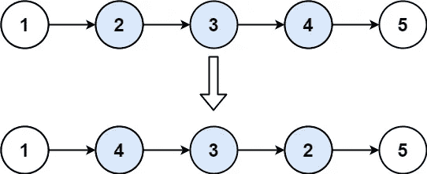

# LeetCode —反向链表 II

> 原文：<https://medium.com/nerd-for-tech/leetcode-reverse-linked-list-ii-6b605acfd383?source=collection_archive---------1----------------------->

# 问题陈述

给定一个单链表的头和两个整数 *left* 和 *right* 其中 *left < = right* ，将链表的节点从位置 *left* 反转到位置 *right* ，返回反转后的链表。

问题陈述摘自:[https://leetcode.com/problems/reverse-linked-list-ii](https://leetcode.com/problems/reverse-linked-list-ii)

**例 1:**



```
Input: head = [1, 2, 3, 4, 5], left = 2, right = 4 
Output: [1, 4, 3, 2, 5]
```

**例 2:**

```
Input: head = [5], left = 1, right = 1 
Output: [5]
```

**约束:**

```
- The number of nodes in the list is n. 
- 1 <= n <= 500 
- -500 <= Node.val <= 500 
- 1 <= left <= right <= n
```

# 说明

## 迭代解

这个问题类似于反转一个链表，但是我们只需要反转它的一个子集，而不是整个链表。假设我们考虑原始列表**1->2->3->4->5->6->7**的一个子列表，我们想要对其进行反转。子列表需要反转为 **3 < - 4 < - 5** 。让我们将我们的**当前**节点指向 **4** ，将**先前**节点指向 **3** 。我们可以很容易地将当前的下一个指针反转到上一个

```
current->next = previous
```

但是在这种情况下，我们将无法导航到节点 5。因此，我们还需要一个指针，我们称之为**迭代器**，它将帮助继续链接反转过程。因此，我们需要做到以下几点:

```
iterator = current->next 
current->next = prev 
prev = current 
current = iterator
```

我们继续执行上述步骤，直到到达正确的节点。现在我们来检查一下算法。

```
- return NUll if head == NULL

- return head if left == right

- set current = head, prev = NULL

- loop while left > 1
  - set prev = current
  - update current = current->next
  - decrement left--
  - decrement right--

- set tailPrev = prev, tail = current, iterator = NULL

- loop while right > 0
  - iterator = current->next
  - current->next = prev
  - prev = current
  - current = iterator
  - decrement right--

- if tailPrev != NULL
  - set tailPrev->next = prev
- else
  - head = prev

- set tail->next = current

- return head
```

让我们来看看我们在 **C++** 、 **Golang** 和 **Javascript** 中的解决方案。

## C++解决方案

```
class Solution {
public:
    ListNode* reverseBetween(ListNode* head, int left, int right) {
        if(head == NULL) {
            return NULL;
        }

        if(left == right) {
            return head;
        }

        ListNode *current = head, *prev = NULL;

        while(left > 1) {
            prev = current;
            current = current->next;
            left--;
            right--;
        }

        ListNode *tailPrev = prev, *tail = current, *iterator = NULL;

        while(right > 0) {
            iterator = current->next;
            current->next = prev;
            prev = current;
            current = iterator;
            right--;
        }

        if(tailPrev != NULL) {
            tailPrev->next = prev;
        } else {
            head = prev;
        }

        tail->next = current;

        return head;
    }
};
```

## 戈朗溶液

```
func reverseBetween(head *ListNode, left int, right int) *ListNode {
    if head == nil {
        return nil
    }

    if left == right {
        return head
    }

    current := head
    var prev *ListNode

    for left > 1 {
        prev = current
        current = current.Next
        left--
        right--
    }

    tailPrev, tail := prev, current
    var iterator *ListNode

    for right > 0 {
        iterator = current.Next
        current.Next = prev
        prev = current
        current = iterator
        right--
    }

    if tailPrev != nil {
        tailPrev.Next = prev
    } else {
        head = prev
    }

    tail.Next = current

    return head;
}
```

## Javascript 解决方案

```
var reverseBetween = function(head, left, right) {
    if(head == null) {
        return null;
    }

    if(left == right) {
        return head;
    }

    let current = head, prev = null;

    while(left > 1) {
        prev = current;
        current = current.next;
        left--;
        right--;
    }

    let tailPrev = prev, tail = current, iterator = null;

    while(right > 0) {
        iterator = current.next;
        current.next = prev;
        prev = current;
        current = iterator;
        right--;
    }

    if(tailPrev != null) {
        tailPrev.next = prev;
    } else {
        head = prev;
    }

    tail.next = current;

    return head;
};
```

让我们试运行一下我们的算法，看看解决方案是如何工作的。

```
Input: head = [1, 2, 3, 4, 5], left = 2, right = 4

    head - [1, 2, 3, 4, 5]

Step 1: head == NULL
        false

Step 2: left == right
        2 == 4
        false

Step 3: current = head, prev = null
             current
               |
       head - [1, 2, 3, 4, 5]

Step 3: loop while left > 1
        2 > 1
        true

        prev = current
        current = current->next

                current
                   |
        prev - [1, 2, 3, 4, 5]

        left--
        left = 1

        right --
        right = 3

Step 4: loop while left > 1
        1 > 1
        false

Step 5: tailPrev = prev
                 = 1

        tail = current
             = 2

        iterator = NULL

Step 6: loop while right > 0
        3 > 0
        true

        iterator = current->next
                 = 3

                   iterator
                      |
        prev - [1, 2, 3, 4, 5]

        current->next = prev
        2->next = 1

        prev = current
        prev = 2

        current = iterator
                = 3

        right--
        right = 2

           prev  --    --- iterator
                   |  |
               [1, 2, 3, 4, 5]
                      |
                   current

Step 7: loop while right > 0
        2 > 0
        true

        iterator = current->next
                 = 4

                iterator
                     |
           [1, 2, 3, 4, 5]

        current->next = prev
        3->next = 2

        prev = current
        prev = 3

        current = iterator
                = 4

        right--
        right = 1

               prev  --   --- iterator
                      |  |
               [1, 2, 3, 4, 5]
                         |
                      current

Step 8: loop while right > 0
        1 > 0
        true

        iterator = current->next
                 = 5

                    iterator
                        |
           [1, 2, 3, 4, 5]

        current->next = prev
        4->next = 3

        prev = current
        prev = 4

        current = iterator
                = 5

        right--
        right = 0

                  prev  --  --- iterator
                         |  |
               [1, 2, 3, 4, 5]
                            |
                         current

Step 9: loop while right > 0
        0 > 0
        false

Step 10: tailPrev != NULL
           1 != NULL
           true

           tailPrev->next = prev
           1->next = 4

Step 11: tail->next = current
         2->next = 5

Step 12: return head

So we return the answer as [1, 4, 3, 2, 5].
```

*原载于*[*https://alkeshghorpade . me*](https://alkeshghorpade.me/post/leetcode-reverse-linked-list-ii)*。*