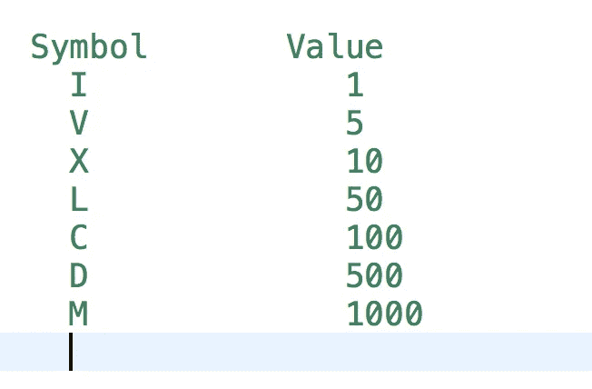

# LeetCode 罗马到整数

> 原文：<https://medium.com/nerd-for-tech/leetcode-roman-to-integer-94db5376ce3?source=collection_archive---------9----------------------->



图片提供:谷歌

# 问题陈述

罗马数字用七种不同的符号表示: **I** 、 **V** 、 **X** 、 **L** 、 **C** 、 **D** 和 **M** 。

```
Symbol       Value
I             1
V             5
X             10
L             50
C             100
D             500
M             1000
```

例如， **2** 用罗马数字写成 **II** ，只是两个 1 加在一起。 **12** 写成 **XII** ，简单来说就是 **X + II** 。数字 **27** 写成 **XXVII** ，就是 **XX + V + II** 。

罗马数字通常从左到右由大到小书写。但是，四的数字不是 **IIII** 。而是把数字四写成 **IV** 。因为 1 在 5 之前，我们减去它，得到 4。同样的道理也适用于数字九，写为 **IX** 。有六种使用减法的情况:

*   **I** 可以放在 **V** (5)和 **X** (10)之前做成 4 和 9。
*   **X** 可以放在 **L** (50)和 C (100)之前，做成 40°和 90°。
*   **C** 可以放在 **D** (500)和 M (1000)之前做成 400 和 900。

给定一个罗马数字，将其转换为整数。

问题陈述摘自:[https://leetcode.com/problems/roman-to-integer](https://leetcode.com/problems/roman-to-integer)

**例 1:**

```
Input: s = "III"
Output: 3
```

**例 2:**

```
Input: s = "IV"
Output: 4
```

**例 3:**

```
Input: s = "IX"
Output: 9
```

**例 4:**

```
Input: s = "LVIII"
Output: 58
Explanation: L = 50, V= 5, III = 3.
```

**例 5:**

```
Input: s = "MCMXCIV"
Output: 1994
Explanation: M = 1000, CM = 900, XC = 90 and IV = 4.
```

**约束:**

```
- 1 <= s.length <= 15
- s contains only the characters ('I', 'V', 'X', 'L', 'C', 'D', 'M').
- It is guaranteed that s is a valid roman numeral in the range [1, 3999].
```

# 说明

这个问题的解决方法很简单。我们需要注意字符串中罗马字符的顺序。

我们用 **IV** 代替 **IIII** 来表示 4。这给了我们一个提示，如果我们需要减去字符的当前值或把它加到总和中。

## 算法

```
- initialize an hash map characterMap with keys as 'I', 'V', 'X', 'L', 'C', 'D', 'M'
  and value as 1, 5, 10, 50, 100, 500, 1000.
- return 0 if s.length() == 0.

- if s.length == 1, return characterMap[s[0]]

- set sum = characterMap[s[s.length() - 1]].
  - characterMap[s[s.length() - 1]] is the value of the last character in the string s.

- Loop for i = s.length() - 2; i >= 0; i--
  // if value of the current character is less than next character we subtract current value from sum
  - if characterMap[s[i]] < characterMap[s[i+1]]
    - subtract sum = sum - characterMap[s[i]]
  - else
    - add sum = sum + characterMap[s[i]]

- return sum
```

**C++解决方案**

```
class Solution {
public:
    int romanToInt(string s) {
        map<char, int> characterMap = {
            {'I', 1},
            {'V', 5},
            {'X', 10},
            {'L', 50},
            {'C', 100},
            {'D', 500},
            {'M', 1000}
        };

        int length = s.length();

        if(length == 0) {
            return 0;
        }

        if(length == 1){
            return characterMap[s[0]];
        }

        int sum = characterMap[s[length - 1]];
        for(int i = length - 2; i >= 0; i--){
            if(characterMap[s[i]] < characterMap[s[i+1]]){
                sum -= characterMap[s[i]];
            } else {
                sum += characterMap[s[i]];
            }
        }

        return sum;
    }
};
```

**戈朗解决方案**

```
func romanToInt(s string) int {
    characterMap := map[byte]int{
		'I': 1,
		'V': 5,
		'X': 10,
		'L': 50,
		'C': 100,
		'D': 500,
		'M': 1000,
	}

    length := len(s)

    if length == 0 {
        return 0
    }

    if length == 1 {
        return characterMap[s[0]]
    }

    sum := characterMap[s[length - 1]]

    for i := length - 2; i >= 0; i-- {
        if characterMap[s[i]] < characterMap[s[i+1]] {
            sum -= characterMap[s[i]]
        } else {
            sum += characterMap[s[i]]
        }
    }

    return sum
}
```

**Javascript 解决方案**

```
var romanToInt = function(s) {
    const characterMap = {
        'I': 1,
		'V': 5,
		'X': 10,
		'L': 50,
		'C': 100,
		'D': 500,
		'M': 1000
    };

    const length = s.length;

    if( length == 0 ) {
        return 0;
    }

    if( length == 1 ){
        return characterMap[s[0]];
    }

    var sum = characterMap[s[length - 1]];

    for( var i = length - 2; i >= 0; i-- ) {
        if( characterMap[s[i]] < characterMap[s[i + 1]] ) {
            sum -= characterMap[s[i]];
        } else {
            sum += characterMap[s[i]];
        }
    }

    return sum;
};
```

让我们试运行一下我们的算法，看看解决方案是如何工作的。

```
s = "MCMXCIV"
map<char, int> characterMap = {
            {'I', 1},
            {'V', 5},
            {'X', 10},
            {'L', 50},
            {'C', 100},
            {'D', 500},
            {'M', 1000}
        };

length = s.length()
       = 7

Step 1: length == 0
        7 == 0
        false

Step 2: length == 1
        7 == 1
        false

Step 3: sum = characterMap[s[length - 1]]
            = characterMap[s[7 - 1]]
            = characterMap[s[6]]
            = characterMap['V']
            = 5

Step 4: for i = length - 2; i >= 0; i--
        i = 5
        5 >= 0

        characterMap[s[i]] < characterMap[s[i + 1]]
        characterMap[s[5]] < characterMap[s[6]]
        characterMap['I'] < characterMap['V']
        1 < 5
        true

        sum -= characterMap[s[i]]
             = characterMap[s[5]]
             = characterMap['I']
             = 1

        sum = 5 - 1
            = 4

        i--
        i = 4

Step 5: i >= 0
        i = 4
        4 >= 0

        characterMap[s[i]] < characterMap[s[i + 1]]
        characterMap[s[4]] < characterMap[s[5]]
        characterMap['C'] < characterMap['I']
        100 < 1
        false

        sum += characterMap[s[i]]
             = characterMap[s[4]]
             = characterMap['C']
             = 100

        sum = 4 + 100
            = 104

        i--
        i = 3

Step 6: i >= 0
        i = 3
        3 >= 0

        characterMap[s[i]] < characterMap[s[i + 1]]
        characterMap[s[3]] < characterMap[s[4]]
        characterMap['X'] < characterMap['C']
        10 < 100
        true

        sum -= characterMap[s[i]]
             = characterMap[s[3]]
             = characterMap['X']
             = 10

        sum = 104 - 10
            = 94

        i--
        i = 2

Step 7: i >= 0
        i = 2
        2 >= 0

        characterMap[s[i]] < characterMap[s[i + 1]]
        characterMap[s[2]] < characterMap[s[3]]
        characterMap['M'] < characterMap['X']
        1000 < 10
        false

        sum += characterMap[s[i]]
             = characterMap[s[2]]
             = characterMap['M']
             = 1000

        sum = 94 + 1000
            = 1094

        i--
        i = 1

Step 8: i >= 0
        i = 1
        1 >= 0

        characterMap[s[i]] < characterMap[s[i + 1]]
        characterMap[s[1]] < characterMap[s[2]]
        characterMap['C'] < characterMap['M']
        100 < 1000
        true

        sum -= characterMap[s[i]]
             = characterMap[s[1]]
             = characterMap['C']
             = 100

        sum = 1094 - 100
            = 994

        i--
        i = 0

Step 9: i >= 0
        i = 0
        0 >= 0

        characterMap[s[i]] < characterMap[s[i + 1]]
        characterMap[s[0]] < characterMap[s[1]]
        characterMap['M'] < characterMap['C']
        1000 < 100
        false

        sum += characterMap[s[i]]
             = characterMap[s[0]]
             = characterMap['M']
             = 100

        sum = 994 + 1000
            = 1994

        i--
        i = -1

Step 10: i >= 0
         i = -1
         -1 >= 0

return sum as 1994
```

*最初发布于*[*https://alkeshghorpade . me*](https://alkeshghorpade.me/post/leetcode-container-with-most-water)*。*