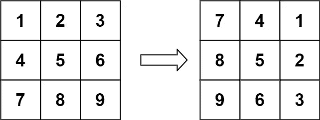
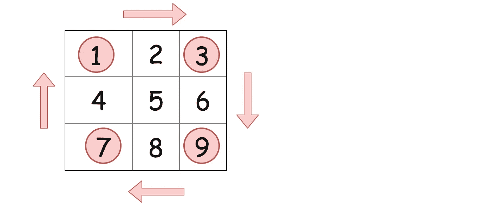

# LeetCode —旋转图像

> 原文：<https://medium.com/nerd-for-tech/leetcode-rotate-image-3c80fb48bd03?source=collection_archive---------9----------------------->



(摘自 LeetCode)

# 问题陈述

给你一个代表图像的 **n x n** 2D **矩阵**，将图像旋转 **90** 度(顺时针)。

你必须原地旋转图像**，这意味着你必须直接修改输入的 2D 矩阵。**不要**分配另一个 2D 矩阵并进行旋转。**

**问题陈述摘自:[https://leetcode.com/problems/rotate-image](https://leetcode.com/problems/rotate-image)**

****例 1:****

```
Input: matrix = [[1, 2, 3], [4, 5, 6], [7, 8, 9]]
Output: [[7, 4, 1], [8, 5, 2], [9, 6, 3]]
```

****例 2:****

```
Input: matrix = [[5, 1, 9, 11], [2, 4, 8, 10], [13, 3, 6, 7], [15, 14, 12, 16]]
Output: [[15, 13, 2, 5], [14, 3, 4, 1], [12, 6, 8, 9], [16, 7, 10, 11]]
```

****例 3:****

```
Input: matrix = [[1]]
Output: [[1]]
```

****例 4:****

```
Input: matrix = [[1, 2], [3, 4]]
Output: [[3, 1], [4, 2]]
```

****约束:****

```
- matrix.length == n
- matrix[i].length == n
- 1 <= n <= 20
- -1000 <= matrix[i][j] <= 1000
```

# **说明**

## **旋转四个单元格的组**

**我们能想到的第一个解决方案是旋转矩阵的四个角。我们对随后的细胞也重复这一过程。**

****

**(摘自 LeetCode)**

**我们来检查一下算法。**

```
- initialize m = matrix.size, tmp- loop for i = 0; i < m / 2; i++
    - loop for j = i; j < m - 1 - i; j++
      - tmp = matrix[i][j]
      - matrix[i][j] = matrix[m - 1 - j][i]
      - matrix[m - 1 - j][i] = matrix[m - 1 - i][m - 1 - j]
      - matrix[m - 1 - i][m - 1 - j] = matrix[j][m - 1 - i]
      - matrix[j][m - 1 - i] = tmp
```

**程序的时间复杂度是 **O(M)** 因为每个单元被读取一次和写入一次。空间复杂度是 O(1) ，因为我们没有使用任何其他额外的数据结构。**

****C++解决方案****

```
class Solution {
public:
    void rotate(vector<vector<int>>& matrix) {
        int m = matrix.size(), tmp;
        int j = 0;

        for(int i = 0; i < m/2; i++){
            for(int j = i; j < m - 1 - i; j++){
                tmp = matrix[i][j];
                matrix[i][j] = matrix[m - 1 - j][i];
                matrix[m - 1 - j][i] = matrix[m - 1 - i][m - 1 - j];
                matrix[m - 1 - i][m - 1 - j] = matrix[j][m - 1 - i];
                matrix[j][m - 1 - i] = tmp;
            }
        }
    }
};
```

****戈朗解****

```
func rotate(matrix [][]int)  {
    m := len(matrix)
    tmp := 0

    for i := 0; i < m / 2; i++ {
        for j := i; j < m - 1 - i; j++ {
            tmp = matrix[i][j];
            matrix[i][j] = matrix[m - 1 - j][i];
            matrix[m - 1 - j][i] = matrix[m - 1 - i][m - 1 - j];
            matrix[m - 1 - i][m - 1 - j] = matrix[j][m - 1 - i];
            matrix[j][m - 1 - i] = tmp;
        }
    }
}
```

****Javascript 解决方案****

```
var rotate = function(matrix) {
    let m = matrix.length;
    let tmp = 0;
    let i, j;

    for(i = 0; i < m/2; i++){
        for(j = i; j < m - 1 - i; j++){
            tmp = matrix[i][j];
            matrix[i][j] = matrix[m - 1 - j][i];
            matrix[m - 1 - j][i] = matrix[m - 1 - i][m - 1 - j];
            matrix[m - 1 - i][m - 1 - j] = matrix[j][m - 1 - i];
            matrix[j][m - 1 - i] = tmp;
        }
    }
};
```

**让我们试运行一下我们的算法，看看解决方案是如何工作的。**

```
Input:
matrix = [[1, 2, 3], [4, 5, 6], [7, 8, 9]]

Step 1: m = matrix.length
        m = 3

Step 2: tmp = 0

Step 3: loop i = 0; i < 3/2
        0 < 3/2
        0 < 1
        true

        j = i; j < 3 - 1 - 0
        0 < 2
        true

        tmp = matrix[i][j]
        tmp = 1

        matrix[i][j] = matrix[m - 1 - j][i]
        matrix[0][0] = matrix[3 - 1 - 0][0]
        matrix[0][0] = matrix[2][0]
        matrix[0][0] = 7

        matrix[m - 1 - j][i] = matrix[m - 1 - i][m - 1 - j]
        matrix[3 - 1 - 0][0] = matrix[3 - 1 - 0][3 - 1 - 0]
        matrix[2][0] = matrix[2][2]
        matrix[2][0] = 9

        matrix[m - 1 - i][m - 1 - j] = matrix[j][m - 1 - i]
        matrix[3 - 1 - 0][3 - 1 - 0] = matrix[0][3 - 1 - 0]
        matrix[2][2] = matrix[0][2]
        matrix[2][2] = 3

        matrix[j][m - 1 - i] = tmp
        matrix[0][3 - 1 - 0] = 1
        matrix[0][2] = 1

        j++
        j = 1

Step 4: j < 2
        1 < 2
        true

        tmp = matrix[0][1]
        tmp = 2

        matrix[i][1] = matrix[m - 1 - j][i]
        matrix[0][1] = matrix[3 - 1 - 1][0]
        matrix[0][1] = matrix[1][0]
        matrix[0][1] = 4

        matrix[m - 1 - j][i] = matrix[m - 1 - i][m - 1 - 1]
        matrix[3 - 1 - 1][0] = matrix[3 - 1 - 0][3 - 1 - 1]
        matrix[1][0] = matrix[2][1]
        matrix[1][0] = 8

        matrix[m - 1 - i][m - 1 - j] = matrix[j][m - 1 - i]
        matrix[3 - 1 - 0][3 - 1 - 1] = matrix[1][3 - 1 - 0]
        matrix[2][1] = matrix[1][2]
        matrix[2][1] = 6

        matrix[1][m - 1 - i] = tmp
        matrix[1][3 - 1 - 0] = 1
        matrix[1][2] = 2

        j++
        j = 2

Step 5: j < 2
        2 < 2
        false

Step 6: i++
        i = 1

        1 < 3/2
        1 < 1
        false

Output:
[[7, 4, 1], [8, 5, 2], [9, 6, 3]]
```

***原载于*[*https://alkeshghorpade . me*](https://alkeshghorpade.me/post/leetcode-maximum-subarray)*。***