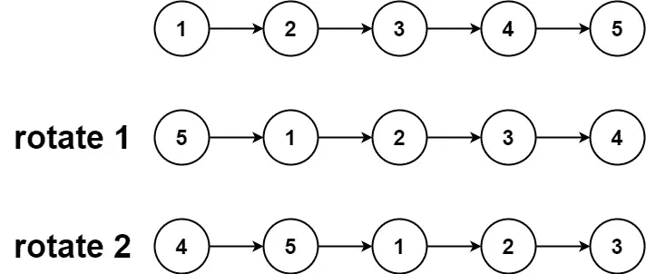
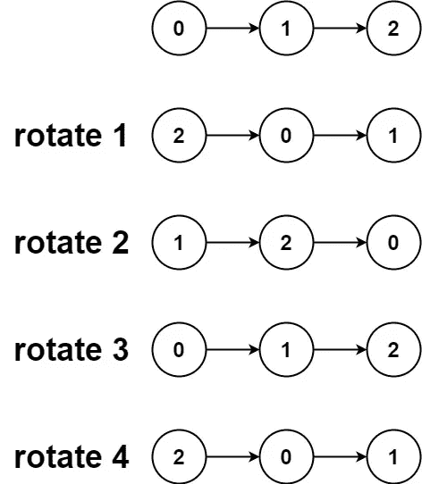

# LeetCode —旋转列表

> 原文：<https://medium.com/nerd-for-tech/leetcode-rotate-list-3169d4b0c710?source=collection_archive---------2----------------------->

# 问题陈述

给定链表的*头*，将链表向右旋转 *k* 位。

问题陈述摘自:【https://leetcode.com/problems/rotate-list 

**例 1:**



```
Input: head = [1, 2, 3, 4, 5], k = 2 
Output: [4, 5, 1, 2, 3]
```

**例 2:**



```
Input: head = [0, 1, 2], k = 4 
Output: [2, 0, 1]
```

**约束:**

```
- The number of nodes in the list is in the range [0, 500] 
- -100 <= Node.val <= 100 
- 0 <= k <= 2 * 10^9
```

# 说明

问题提到向右旋转列表。我们首先要得到列表中节点的总数。如果 k 大于列表长度，我们首先用列表长度取 k 的模，然后从列表长度中减去 k 的值。如果 k 更小，我们从列表长度中减去 k 的值。

**注:**如果问题提到了左旋转，我们就不按列表长度减去 k 了。

我们先来检查一下算法:

```
// empty list
- if head == nil
  - return head

- set ListNode *p = head
  set listLength = 1

- loop while p->next != null
  - update p = p->next
  - increment listLength++

- if k > listLength
  - k = k % listLength

- k = listLength - k

- if k == 0 || k == listLength
  - return head

- set ListNode *current = head

- loop while k > 1 && current != null
  - update current = current->next
  - decrement k--

- if current == null
  - return head

- update p->next = head
  update head = current->next
  update current->next = null

- return head
```

## C++解决方案

```
class Solution {
public:
    ListNode* rotateRight(ListNode* head, int k) {
        if(!head){
            return head;
        }

        ListNode *p = head;
        int listLength = 1;

        while(p->next != NULL){
            p = p->next;
            listLength++;
        }

        if(k > listLength) {
            k = k % listLength;
        }

        k = listLength - k;

        if(k == 0 || k == listLength) {
            return head;
        }

        ListNode *current = head;

        while(k > 1 && current != NULL){
            current = current->next;
            k--;
        }

        if(current == NULL){
            return head;
        }

        p->next = head;
        head = current->next;
        current->next = NULL;

        return head;
    }
};
```

## 戈朗溶液

```
func rotateRight(head *ListNode, k int) *ListNode {
    if head == nil {
        return head
    }

    p := head
    listLength := 1

    for p.Next != nil {
        p = p.Next
        listLength++
    }

    if k > listLength {
        k = k % listLength
    }

    k = listLength - k

    if k == 0 || k == listLength {
        return head
    }

    current := head
    for k > 1 && current != nil {
        current = current.Next
        k--
    }

    if current == nil {
        return head
    }

    p.Next = head
    head = current.Next
    current.Next = nil

    return head
}
```

## Javascript 解决方案

```
var rotateRight = function(head, k) {
    if(!head) {
        return head;
    }

    let p = head;
    let listLength = 1;

    while(p.next != null) {
        p = p.next;
        listLength++;
    }

    if(k > listLength) {
        k = k % listLength;
    }

    k = listLength - k;

    if(k == 0 || k == listLength){
        return head;
    }

    let current = head;

    while(k > 1 && current != null) {
        current = current.next;
        k--;
    }

    if(current == null){
        return head;
    }

    p.next = head;
    head = current.next;
    current.next = null;

    return head;
};
```

让我们试运行一下我们的算法，看看解决方案是如何工作的。

```
 head
        |
Input: [1, 2, 3, 4, 5], k = 2

Step 1: if !head
          head == nil
          false

Step 2: ListNode *p = head
        int listLength = 1

Step 3: loop while p->next != nil
          p = p->next
          listLength++

        The above loop reaches at the last node of the linked list.

        listLength = 5

        head         p
        |            |
        [1, 2, 3, 4, 5]

Step 4: if k > listLength
           2 > 5
           false

Step 5: k = listLength - k
          = 5 - 2
          = 3

Step 6: if k == 0 || k == listLength
           3 == 0 || 3 == 5
           false

Step 7: ListNode *current = head

          head         p
           |           |
current - [1, 2, 3, 4, 5]

Step 8: loop while k > 1 && current != NULL
          3 > 1 && current != NULL
            true

            current = current->next

            head         p
             |           |
            [1, 2, 3, 4, 5]
                |
              current

            k--
            k = 2

          2 > 1 && current != NULL
            true

            current = current->next

            head         p
             |           |
            [1, 2, 3, 4, 5]
                   |
                 current

            k--
            k = 1

          1 > 1 && current != NULL
            false

Step 9: if current == NULL
          false

Step 10: p->next = head

            head
             |
     p - [5, 1, 2, 3, 4]
                   |
                 current

         head = current->next

                    head
                      |
     p - [5, 1, 2, 3, 4]
                   |
                 current

         current->next = NULL

         head       current
          |           |
         [4, 5, 1, 2, 3]

Step 11: return head

So we return the answer as [4, 5, 1, 2, 3].
```

*原发布于*[*https://alkeshghorpade . me*](https://alkeshghorpade.me/post/leetcode-rotate-list)*。*