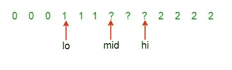

# LeetCode —排序颜色

> 原文：<https://medium.com/nerd-for-tech/leetcode-sort-colors-b62131dd8a0d?source=collection_archive---------14----------------------->



# 问题陈述

给定一个带有红色、白色或蓝色的 **n** 个对象的数组 **nums** ，将它们**就地**排序，使相同颜色的对象相邻，颜色依次为红色、白色和蓝色。

我们将使用整数 **0** 、 **1** 和 **2** 分别代表红色、白色和蓝色。

您必须在不使用库的排序函数的情况下解决这个问题。

问题陈述摘自:[https://leetcode.com/problems/sort-colors](https://leetcode.com/problems/sort-colors)

**例 1:**

```
Input: nums = [2, 0, 2, 1, 1, 0]
Output: [0, 0, 1, 1, 2, 2]
```

**例 2:**

```
Input: nums = [2, 0, 1]
Output: [0, 1, 2]
```

**例 3:**

```
Input: nums = [0]
Output: [0]
```

**例 4:**

```
Input: nums = [1]
Output: [1]
```

**约束:**

```
- n == nums.length
- 1 <= n <= 300
- nums[i] is 0, 1, or 2
```

# 说明

## 简单计数

简单的方法是使用三个不同的变量来计算每个整数 0、1 和 2 的出现次数。

我们使用上面的三个计数变量填充数组。

该方法的一小段 C++代码如下所示:

```
for (int i = 0; i < n; i++) {
    if (arr[i] == 0)
        count0++;
    if (arr[i] == 1)
        count1++;
    if (arr[i] == 2)
        count2++;
}

for (int i = 0; i < count0; i++)
    arr[i] = 0;

for (int i = count0; i < (count0 + count1); i++)
    arr[i] = 1;

for (int i = (count0 + count1); i < n; i++)
    arr[i] = 2;
```

上述程序的时间复杂度为 O(N)。但是在上面的方法中，我们迭代数组两次。

## 荷兰国旗问题

我们可以用[荷兰国旗问题](http://users.monash.edu/~lloyd/tildeAlgDS/Sort/Flag/)的做法。这个问题有三种颜色，这里我们有 0，1 和 2。为了解决这个问题，阵列被分成四个部分。

让我们检查算法:

```
-  Keep three indices low = 1, mid = 1 and, high = N and, there are four ranges,
   1 to low (the range containing 0),
   low to mid (the range containing 1),
   mid to high (the range containing unknown elements) and
   high to N (the range containing 2).

-  Traverse the array from start to end and mid is less than high. (Loop counter is i)

-  if element == 0
  - swap the element with the element at index low and update low = low + 1 and mid = mid + 1

-  if element == 1
  - set mid = mid + 1

-  if element == 2
  - swap the element with the element at index high and update high = high – 1.
  - set i = i – 1.

- return array
```

程序的时间复杂度是 O(N) ,因为我们只迭代数组一次。空间复杂度是 O(1) ，因为我们没有使用任何其他额外的数据结构。

**C++解决方案**

```
class Solution {
public:
    void sortColors(vector<int>& nums) {
        int low = 0, mid = 0, high = nums.size() - 1;

        while(mid <= high){
            switch (nums[mid]){
                case 0:
                    swap(nums[low++], nums[mid++]);
                    break;
                case 1:
                    mid++;
                    break;
                case 2:
                    swap(nums[mid], nums[high--]);
                    break;
            }
        }
    }
};
```

**Golang 解决方案**

```
func sortColors(nums []int)  {
    low := 0
    mid := 0
    high := len(nums) - 1

    for mid <= high {
        switch (nums[mid]) {
            case 0:
                tmp := nums[low]
                nums[low] = nums[mid]
                nums[mid] = tmp
                low++
                mid++
                break
            case 1:
                mid++
                break
            case 2:
                tmp := nums[mid]
                nums[mid] = nums[high]
                nums[high] = tmp
                high--
                break
        }
    }
}
```

**Javascript 解决方案**

```
var sortColors = function(nums) {
    function swap(i, j) {
        [nums[i], nums[j]] = [nums[j], nums[i]];
    }

    let low = 0;
    let high = nums.length - 1;
    let mid = 0;

    while (mid <= high) {
    const n = nums[mid];

      if (n === 0) {
        swap(mid, low);
        low++;
        mid++;
      } else if (n === 2) {
        swap(mid, high);
        high--;
      } else {
        mid++;
      }
    }
};
```

让我们试着解决这个问题

```
Input: nums = [2, 0, 2, 1, 1, 0]

Step 1: low = 0
        mid = 0
        high = nums.length() - 1
             = 6 - 1
             = 5

Step 2: loop while mid < = high
        0 <= 5
        true

        switch (nums[mid])
        nums[mid] = nums[0]
                  = 2

        case 2:
        swap(nums[mid], nums[high--])
        swap(nums[0], nums[5])
        swap(2, 0)

        nums = [0, 0, 2, 1, 1, 2]

        high--
        high = 4

Step 3: loop while mid < = high
        0 <= 4
        true

        switch (nums[mid])
        nums[mid] = nums[0]
                  = 0

        case 0:
        swap(nums[low++], nums[mid++])
        swap(nums[0], nums[0])
        swap(0, 0)

        nums = [0, 0, 2, 1, 1, 2]
        low++
        mid++

        low = 1
        mid = 1

Step 4: loop while mid < = high
        1 <= 4
        true

        switch (nums[mid])
        nums[mid] = nums[1]
                  = 0

        case 0:
        swap(nums[low++], nums[mid++])
        swap(nums[1], nums[1])
        swap(1, 1)

        nums = [0, 0, 2, 1, 1, 2]
        low++
        mid++

        low = 2
        mid = 2

Step 5: loop while mid < = high
        2 <= 4
        true

        switch (nums[mid])
        nums[mid] = nums[2]
                  = 2

        case 2:
        swap(nums[mid], nums[high--])
        swap(nums[2], nums[4])
        swap(2, 1)

        nums = [0, 0, 1, 1, 2, 2]

        high--
        high = 3

Step 6: loop while mid < = high
        2 <= 3
        true

        switch (nums[mid])
        nums[mid] = nums[2]
                  = 1

        case 1:
        mid++
        mid = 3

Step 7: loop while mid < = high
        3 <= 3
        true

        switch (nums[mid])
        nums[mid] = nums[3]
                  = 1

        case 1:
        mid++
        mid = 4

Step 8: loop while mid < = high
        4 <= 3
        false

The result is [0, 0, 1, 1, 2, 2]
```

*原载于*[*https://alkeshghorpade . me*](https://alkeshghorpade.me/post/leetcode-sort-colors)*。*