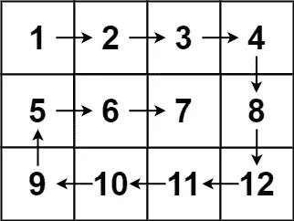

# LeetCode —螺旋矩阵

> 原文：<https://medium.com/nerd-for-tech/leetcode-spiral-matrix-60d7568b50ca?source=collection_archive---------3----------------------->

# 问题陈述

给定一个 **m x n 矩阵**，返回*该矩阵中所有元素的螺旋顺序*。

问题陈述摘自:【https://leetcode.com/problems/spiral-matrix 

**例 1:**


资料来源:LeetCode

```
Input: matrix = [[1, 2, 3], [4, 5, 6], [7, 8, 9]]
Output: [1, 2, 3, 6, 9, 8, 7, 4, 5]
```

**例 2:**



资料来源:LeetCode

```
Input: matrix = [[1, 2, 3, 4], [5, 6, 7, 8], [9, 10, 11, 12]]
Output: [1, 2, 3, 4, 8, 12, 11, 10, 9, 5, 6, 7]
```

**约束:**

```
- m == matrix.length
- n == matrix[i].length
- 1 <= m, n <= 10
- -100 <= matrix[i][j] <= 100
```

# 说明

## 顺时针(螺旋)矩阵遍历

根据上面的例子，我们可以看到外循环的元素首先以顺时针方向被打印，然后内循环的元素被打印。所以问题可以通过把矩阵分成边界来解决。我们需要使用四个循环，以螺旋顺时针形式打印数组元素。

让我们检查算法:

```
- set k = 0, l = 0
  set m = matrix.size(), n = matrix[0].size()
  initialize result array and i

/*
    k - starting row index
    m - ending row index
    l - starting column index
    n - ending column index
    i - iterator
*/
- loop while k < m && l < n
  - loop for i = l; i < n; i++
    - result.push(matrix[k][i])
  - k++

  - loop for i = k; i < m; i++
    - result.push(matrix[i][n - 1])
  - n--

  - if k < m
    - loop for i = n - 1; i >= l; i--
      - result.push(matrix[m - 1][i])
    - m--

  - if l < n
    - loop for i = m - 1; i >= k; i--
      - result.push(matrix[i][l])
    - l++

- return result
```

## C++解决方案

```
class Solution {
public:
    vector<int> spiralOrder(vector<vector<int>>& matrix) {
        int k = 0, l = 0;
        int i;
        int m = matrix.size();
        int n = matrix[0].size();
        vector<int> result;

        while(k < m && l < n) {
            for(i = l; i < n; i++) {
                result.push_back(matrix[k][i]);
            }
            k++;

            for(i = k; i < m; i++) {
                result.push_back(matrix[i][n - 1]);
            }
            n--;

            if(k < m) {
                for(i = n - 1; i >= l; i--) {
                    result.push_back(matrix[m - 1][i]);
                }
                m--;
            }

            if(l < n) {
                for(i = m - 1; i >= k; i--) {
                    result.push_back(matrix[i][l]);
                }
                l++;
            }
        }

        return result;
    }
};
```

## 戈朗溶液

```
func spiralOrder(matrix [][]int) []int {
    m := len(matrix)
    n := len(matrix[0])
    result := make([]int, m * n)
    counter := 0
    k , l := 0, 0
    var i int

    for k < m && l < n {
        for i = l; i < n; i++ {
            result[counter] = matrix[k][i]
            counter++
        }
        k++

        for i = k; i < m; i++ {
            result[counter] = matrix[i][n - 1]
            counter++
        }
        n--

        if k < m {
            for i = n - 1; i >= l; i-- {
                result[counter] = matrix[m - 1][i]
                counter++
            }
            m--
        }

        if l < n {
            for i = m - 1; i >= k; i-- {
                result[counter] = matrix[i][l]
                counter++
            }
            l++
        }
    }

    return result
}
```

## Javascript 解决方案

```
var spiralOrder = function(matrix) {
    let m = matrix.length, n = matrix[0].length;
    let result = [];
    let k = 0, l = 0, i;

    while(k < m && l < n) {
        for(i = l; i < n; i++) {
            result.push(matrix[k][i]);
        }
        k++;

        for(i = k; i < m; i++) {
            result.push(matrix[i][n - 1]);
        }
        n--;

        if(k < m) {
            for(i = n - 1; i >= l; i--) {
                result.push(matrix[m - 1][i]);
            }
            m--;
        }

        if(l < n) {
            for(i = m - 1; i >= k; i--) {
                result.push(matrix[i][l]);
            }
            l++;
        }
    }

    return result;
};
```

让我们试运行一下我们的算法，看看解决方案是如何工作的。

```
Input: matrix = [[1, 2, 3], [4, 5, 6], [7, 8, 9]]

Step 1: k = 0, l = 0, i
        m = matrix.size()
          = 3
        n = matrix[0].size()
          = 3
        initialize vector<int> result

Step 2: loop while k < m && l < n
        0 < 3 && 0 < 3
        true

          loop for i = l; i < n; i++
            result.push_back(matrix[k][i])

            // the for loop iterates for i = 0 to 2
            // we fetch matrix[0][0], matrix[0][1] and matrix[0][2]
            result = [1, 2, 3]
            k++
            k = 1

          loop for i = k; i < m; i++
            result.push_back(matrix[i][n - 1])

            // the for loop iterates for i = 1 to 2
            // we fetch matrix[1][2] and matrix[2][2]
            result = [1, 2, 3, 6, 9]
            n--
            n = 2

          if k < m
            1 < 3
            true

            loop for i = n - 1; i >= l; i--
              result.push_back(matrix[m - 1][i])

              // the for loop iterates for i = 2 to 0
              // we fetch matrix[2][1] and matrix[2][0]
              result = [1, 2, 3, 6, 9, 8, 7]
              m--
              m = 2

          if l < n
            0 < 2
            true

            loop for i = m - 1; i >= k; i--
              result.push_back(matrix[i][l])

              // the for loop iterates for i = 1 to 1
              // we fetch matrix[1][0]
              result = [1, 2, 3, 6, 9, 8, 7, 4]
              l++
              l = 1

Step 3: loop while k < m && l < n
        1 < 2 && 1 < 2
        true

          loop for i = l; i < n; i++
            result.push_back(matrix[k][i])

            // the for loop iterates for i = 1 to 1
            // we fetch matrix[1][1]
            result = [1, 2, 3, 6, 9, 8, 7, 4, 5]
            k++
            k = 2

          loop for i = k; i < m; i++
            result.push_back(matrix[i][n - 1])

            // no iteration as k is 2 and m is 2
            // i = k; i = 2 and 2 < 2 false
            n--
            n = 1

          if k < m
            2 < 3
            true

            loop for i = n - 1; i >= l; i--
              result.push_back(matrix[m - 1][i])

            // no iteration as n is 1 and l is 1
            // i = n - 1; i = 0 and 0 >= 1 false
            m--
            m = 1

          if l < n
            1 < 1
            false

            l++
            l = 2

Step 4: loop while k < m && l < n
        2 < 1 && 2 < 1
        false

Step 5: return result

So we return the answer as [1, 2, 3, 6, 9, 8, 7, 4, 5].
```

*原发布于*[*https://alkeshghorpade . me*](https://alkeshghorpade.me/post/leetcode-spiral-matrix)*。*