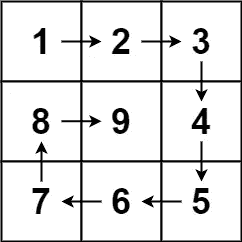

# LeetCode —螺旋矩阵 II

> 原文：<https://medium.com/nerd-for-tech/leetcode-spiral-matrix-ii-4cc44f887d1a?source=collection_archive---------2----------------------->

# 问题陈述

给定一个正整数 *n* ，生成一个*n×n 矩阵*，矩阵中按照螺旋顺序填充从 *1* 到 *n* 的元素。

问题陈述摘自:[https://leetcode.com/problems/spiral-matrix-ii](https://leetcode.com/problems/spiral-matrix-ii)

**例 1:**



资料来源:LeetCode

```
Input: n = 3
Output: [[1, 2, 3], [8, 9, 4], [7, 6, 5]]
```

**例 2:**

```
Input: n = 1
Output: [[1]]
```

**约束:**

```
- 1 <= n <= 20
```

# 说明

## 顺时针(螺旋)矩阵遍历

这个问题类似于我们之前的[螺旋矩阵](http://alkeshghorpade.me/post/leetcode-spiral-matrix)博文。我们需要用 1 到 n^2 的值填充矩阵，而不是打印传递的数组的值。

我们来检查一下算法。

```
- set k = 0, l = 0
  set m = n, value = 1
  initialize 2D result as vector<vector<int>>

/*
    k - starting row index
    m - ending row index
    l - starting column index
    n - ending column index
    i - iterator
*/

- loop while k < m && l < n
  - loop for i = l; i < n; i++
    - set result[k][i] = value
    - increment value++
  - k++

  - loop for i = k; i < m; i++
    - set result[i][n - 1] = value
    - increment value++
  - n--

  - loop for i = n - 1; i >= l; i--
    - set result[m - 1][i] = value
    - increment value++
  - m--

  - loop for i = m - 1; i >= k; i--
    - set result[i][l] = value
    - increment value++
  - l++

- return result
```

## C++解决方案

```
class Solution {
public:
    vector<vector<int>> generateMatrix(int n) {
        vector<vector<int>> result (n, vector<int>(n));
        int m = n;
        int l = 0, k = 0;
        int i, value = 1;

        while(k < m && l < n) {
            for(i = l; i < n; i++) {
                result[k][i] = value++;
            }
            k++;

            for(i = k; i < m; i++) {
                result[i][n - 1] = value++;
            }
            n--;

            for(i = n - 1; i >= l; i--) {
                result[m - 1][i] = value++;
            }
            m--;

            for(i = m - 1; i >= k; i--) {
                result[i][l] = value++;
            }
            l++;
        }

        return result;
    }
};
```

## 戈朗溶液

```
func generateMatrix(n int) [][]int {
    m := n
    value := 1
    k , l := 0, 0
    var i int

    result := make([][]int, n)
    for i := 0; i < n; i++ {
        result[i] = make([]int, m)
    }

    for k < m && l < n {
        for i = l; i < n; i++ {
            result[k][i] = value
            value++
        }
        k++

        for i = k; i < m; i++ {
           result[i][n - 1] = value
            value++
        }
        n--

        for i = n - 1; i >= l; i-- {
            result[m - 1][i] = value
            value++
        }
        m--

        for i = m - 1; i >= k; i-- {
            result[i][l] = value
            value++
        }
        l++
    }

    return result
}
```

## Javascript 解决方案

```
var generateMatrix = function(n) {
    let m = n, i;
    let k = 0, l = 0, value = 1;

    let result = [];
    for (i = 0; i < n; i++) {
        result[i] = new Array(n);
    }

    while(k < m && l < n) {
        for(i = l; i < n; i++) {
            result[k][i] = value++;
        }
        k++;

        for(i = k; i < m; i++) {
            result[i][n - 1] = value++;
        }
        n--;

        for(i = n - 1; i >= l; i--) {
            result[m - 1][i] = value++;
        }
        m--;

        for(i = m - 1; i >= k; i--) {
            result[i][l] = value++;
        }
        l++;
    }

    return result;
};
```

让我们试运行一下我们的算法，看看解决方案是如何工作的。

```
Input: n = 3

Step 1: k = 0, l = 0, i
        m = n
          = 3
        value = 1
        initialize vector<vector<int>> result

Step 2: loop while k < m && l < n
        0 < 3 && 0 < 3
        true

          loop for i = l; i < n; i++
            result[k][i] = value++

            // the for loop iterates for i = 0 to 2
            // we set result[0][0], result[0][1] and result[0][2] to 1, 2 and 3 respectively
            k++
            k = 1

          loop for i = k; i < m; i++
            result[i][n - 1] = value++

            // the for loop iterates for i = 1 to 2
            // we set result[1][2] and result[2][2] to 4 and 5 respectively
            n--
            n = 2

          loop for i = n - 1; i >= l; i--
            result[m - 1][i] = value++

            // the for loop iterates for i = 2 to 0
            // we set matrix[2][1] and matrix[2][0] to 6 and 7 respectively
            m--
            m = 2

          loop for i = m - 1; i >= k; i--
            result[i][l] = value++

            // the for loop iterates for i = 1 to 1
            // we set matrix[1][0] to 8
            l++
            l = 1

Step 3: loop while k < m && l < n
        1 < 2 && 1 < 2
        true

          loop for i = l; i < n; i++
            result[k][i] = value++

            // the for loop iterates for i = 1 to 1
            // we set matrix[1][1] to 9
            k++
            k = 2

          loop for i = k; i < m; i++
            result[i][n - 1] = value++

            // no iteration as k is 2 and m is 2
            // i = k; i = 2 and 2 < 2 false
            n--
            n = 1

          loop for i = n - 1; i >= l; i--
            result[m - 1][i] = value++

            // no iteration as n is 1 and l is 1
            // i = n - 1; i = 0 and 0 >= 1 false
            m--
            m = 1

Step 4: loop while k < m && l < n
        2 < 1 && 2 < 1
        false

Step 5: return result

So we return the answer as [[1, 2, 3], [8, 9, 4], [7, 6, 5]].
```

*原载于*[*https://alkeshghorpade . me*](https://alkeshghorpade.me/post/leetcode-spiral-matrix-ii)*。*