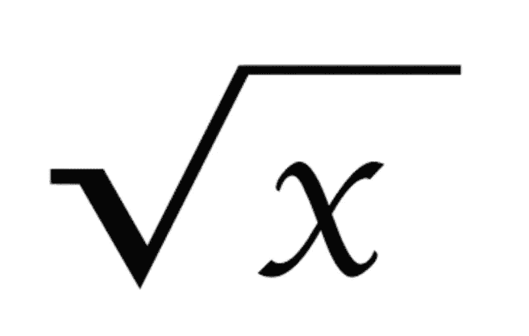

# LeetCode Sqrt(x)

> 原文：<https://medium.com/nerd-for-tech/leetcode-sqrt-x-9ee925c44969?source=collection_archive---------24----------------------->



# 问题陈述

给定一个非负整数 **x** ，计算并返回 **x** 的平方根。

由于返回类型是整数，所以小数位数被**截断**，只返回结果的整数部分**。**

**注意**:不允许使用任何内置的指数函数或运算符，如`pow(x, 0.5)`或`x ** 0.5`。

问题陈述摘自:[https://leetcode.com/problems/sqrtx](https://leetcode.com/problems/sqrtx)

**例 1:**

```
Input: x = 4
Output: 2
```

**例 2:**

```
Input: x = 8 
Output: 2 
Explanation: The square root of 8 is 2.82842..., and since the decimal part is truncated, 2 is returned.
```

**约束:**

```
0 <= x <= 2^31 - 1
```

# 说明

## 强力

解决这个问题的简单方法是尝试从 1 开始的全自然数。我们继续增加数字，直到数字的平方大于 **x** 。

上述方法的 C++代码片段如下所示:

```
int i = 1, result = 1;

while (result <= x)
{
    i++;
    result = i * i;
}

return i - 1;
```

上述方法的时间复杂度是 **O(√ n)** ，因为我们正在运行一个从 1 到那个数的平方根的循环。

该算法仍然可以通过在这里使用二分搜索法概念来改进。

## 二进位检索

由于 **i*i** 的值，即数字的平方单调增加，我们可以使用这个概念通过二分搜索法找到数字的平方根。

让我们检查下面的算法:

```
- return x if x <= 1
- initialize start = 2, end = x, middle = 0

- Loop while start <= end
  - middle = start + ( end - start )/ 2
  - if middle == x / middle
    - return middle

  - if middle < x / middle
    - set start = middle + 1
  - else
    - set end = middle - 1

- if start > x /start
  - return start - 1

- return start
```

上述方法的时间复杂度为 **O(log(n))。**

**C++解决方案**

```
class Solution {
public:
    int mySqrt(int x) {
        if(x <= 1){
            return x;
        }

        int start = 2, end = x, middle;

        while(start <= end){
            middle = start + (end - start)/2;

            if(middle == x/middle){
                return middle;
            }

            if(middle < x/middle){
                start = middle + 1;
            } else {
                end = middle - 1;
            }
        }

        if(start > x/start){
            return start - 1;
        }

        return start;
    }
};
```

**Golang 解决方案**

```
func mySqrt(x int) int {
    start := 0
    end := x

    for start <= end {
		middle := start + ( end - start )/2
		if middle * middle > x {
			end = middle - 1
		} else if (middle + 1)*( middle + 1) > x {
			return middle
		} else {
			start = middle + 1
		}
	}

    return start
}
```

**Javascript 解决方案**

```
var mySqrt = function(x) {
    let start = 0, end = x, middle = 0;

    while (start < end) {
        middle = parseInt((start + end)/2);
        if (middle * middle === x) {
            return middle;
        }
        if (x < middle * middle) {
            end = middle - 1;
        } else {
            start = middle + 1;
        }
    }

    return x < end * end ? end - 1 : end;
};
```

让我们试运行一下我们的算法，看看解决方案是如何工作的。

```
x = 8

Step 1: x <= 1
        8 <= 1
        false

Step 2: start = 2
        end = 8

Step 3: Loop while 2 <= 8
        true

        middle = 2 + (8 - 2) / 2
               = 2 + 6 / 2
               = 2 + 3
               = 5

        middle == x / middle
        5 == 8 / 5
        5 == 1
        false

        middle < x/middle
        5 < 8 / 5
        5 < 1
        false

        end = middle - 1
        end = 5 - 1
        end = 4

Step 4: Loop while 2 <= 4
        true

        middle = 2 + (4 - 2) / 2
               = 2 + 2 / 2
               = 2 + 1
               = 3

        middle == x / middle
        3 == 8 / 3
        3 == 2
        false

        middle < x/middle
        3 < 8 / 3
        3 < 2
        false

        end = middle - 1
        end = 3 - 1
        end = 2

Step 4: Loop while 2 <= 2
        true

        middle = 2 + (2 - 2) / 2
               = 2 + 0 / 2
               = 2 + 0
               = 2

        middle == x / middle
        2 == 8 / 2
        2 == 4
        false

        middle < x/middle
        2 < 8 / 2
        2 < 4
        true

        start = middle + 1
        start = 2 + 1
        start = 3

Step 5: Loop while 3 <= 2
        false

Step 6: if start > x/start
        3 > 8 / 3
        3 > 2

        return start - 1

So the answer is 2.
```

*原载于*[*https://alkeshghorpade . me*](https://alkeshghorpade.me/post/leetcode-sqrt-x)*。*