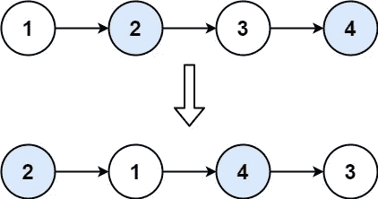

# LeetCode —成对交换节点

> 原文：<https://medium.com/nerd-for-tech/leetcode-swap-nodes-in-pairs-976916df0e71?source=collection_archive---------5----------------------->



# 问题陈述

给定一个链表，交换每两个相邻的节点并返回它的头。您必须在不修改列表节点中的值的情况下解决问题(即，只能更改节点本身。)

问题陈述摘自:[https://leetcode.com/problems/swap-nodes-in-pairs](https://leetcode.com/problems/swap-nodes-in-pairs)

**例一:**

```
Input: head = [1, 2, 3, 4] 
Output: [2, 1, 4, 3]
```

**例二:**

```
Input: head = []
Output: []
```

**例 3:**

```
Input: head = [1]
Output: [1]
```

**约束:**

```
- The number of nodes in the list is in the range [0, 100]. 
- 0 <= Node.val <= 100
```

# 说明

## 交换链接

由于节点值不能交换，通常来说，更改链接是一个更好的主意。

**算法**

```
- if head == NULL || head->next == NULL
  - return head

- set ListNode* prev = head
      ListNode* curr = head->next

- set head = curr and initialize ListNode* next

- loop while true
  - set next = curr->next
  - point curr->next = prev

  - if next == NULL || next->next == NULL
    - set prev->next = next
    - break // break the loop

  - point prev->next = next->next

  - set prev = next

  - set curr = prev->next

- return head
```

上述程序的时间复杂度为 **O(N)** 其中 N 是给定链表中的节点数。

**C++解决方案**

```
class Solution {
public:
    ListNode* swapPairs(ListNode* head) {
        if(head == NULL || head->next == NULL){
            return head;
        }

        ListNode* prev = head;
        ListNode* curr = head->next;

        head = curr;

        ListNode* next;
        while(true){
            next = curr->next;
            curr->next = prev;

            if(next == NULL || next->next == NULL){
                prev->next = next;
                break;
            }

            prev->next = next->next;

            prev = next;

            curr = prev->next;
        }

        return head;
    }
};
```

**戈朗解决方案**

```
func swapPairs(head *ListNode) *ListNode {
    if head == nil || head.Next == nil {
        return head
    }

    prev := head
    curr := head.Next

    head = curr

    for true {
        next := curr.Next
        curr.Next = prev

        if next == nil || next.Next == nil {
            prev.Next = next;
            break;
        }

        prev.Next = next.Next;

        prev = next;

        curr = prev.Next;
    }

    return head
}
```

**Javascript 解决方案**

```
var swapPairs = function(head) {
    if( head == null || head.next == null ){
        return head;
    }

    let prev = head;
    let curr = head.next;

    head = curr;

    while(true){
        let next = curr.next;
        curr.next = prev;

        if(next == null || next.next == null){
            prev.next = next;
            break;
        }

        prev.next = next.next;

        prev = next;

        curr = prev.next;
    }

    return head;
};
```

让我们试运行一下我们的算法，看看解决方案是如何工作的。

```
Input: head = [1, 2, 3, 4]

Step 1: if (head == NULL || head->next == NULL )
          - false

Step 2: ListNode* prev = head
        ListNode* curr = head->next

                prev
                 |
        head -- [1, 2, 3, 4]
                    |
                   curr

Step 3: head = curr

        prev
         |
        [1, 2, 3, 4]
            |
           curr,
           head

Step 4: ListNode* next

Step 5: loop while true
        - next = curr->next
          - next = 3
        - curr->next = prev
          - curr->next = 1

        - if next == null || next->next == null
          - false

        - prev->next = next->next
          - prev->next = 4

        - prev = next
          - prev = 3

        - curr = prev->next
          - curr = 4

Step 6: loop while true
        - next = curr->next
          - next = nil

        - curr->next = prev
          - curr->next = 3

        - if next == null || next->next == null
          - true
          - break

So the answer is 2 -> 1 -> 4 -> 3
```

*原载于*[*https://alkeshghorpade . me*](https://alkeshghorpade.me/post/leetcode-swap-nodes-in-pairs)*。*