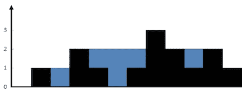

# leet code——收集雨水

> 原文：<https://medium.com/nerd-for-tech/leetcode-trapping-rain-water-446bcdf58d8f?source=collection_archive---------3----------------------->

# 问题陈述

给定代表高程图的 *n* 个非负整数，其中每个条形的宽度为 *1* ，计算雨后它可以收集多少水。

问题陈述摘自:【https://leetcode.com/problems/trapping-rain-water[。](https://leetcode.com/problems/trapping-rain-water)

**例 1:**



```
Input: height = [0, 1, 0, 2, 1, 0, 1, 3, 2, 1, 2, 1]
Output: 6
Explanation: The above elevation map (black section) is represented by array [0, 1, 0, 2, 1, 0, 1, 3, 2, 1, 2, 1]. In this case, 6 units of rain water (blue section) are being trapped.
```

**例 2:**

```
Input: height = [4, 2, 0, 3, 2, 5] 
Output: 9
```

**约束:**

```
- n == height.length 
- 1 <= n <= 2 * 10^4 
- 0 <= height[i] <= 10^5
```

# 说明

## 强力方法

最简单的解决方案是计算阵列的每个元素可以存储的最大水位。它等于两边条形的最小-最大高度减去它的高度。

上述方法的 C++代码片段如下所示:

```
int maxWater(int arr[], int n) {
    int res = 0;

    for (int i = 1; i < n - 1; i++) {

        int left = arr[i];
        for (int j = 0; j < i; j++)
           left = max(left, arr[j]);

        int right = arr[i];
        for (int j = i + 1; j<n; j++)
           right = max(right, arr[j]);

        res = res + (min(left, right) - arr[i]);
    }
    return res;
}
```

上述方法的时间复杂度是 **O(N )** ，因为我们使用了两个嵌套的 for 循环。空间复杂度为 **O(1)** 。

## 动态规划方法

在蛮力方法中，我们反复迭代数组的左右部分来计算蓄水量。但是我们可以存储这个最大值。

我们创建了两个名为 left 和 right 的数组。我们在迭代数组时不断更新最大左侧和最大右侧。

为了计算最终结果，我们使用下面的公式:

```
ans += min(left_max[i], right_max[i]) - height[i]
```

上述方法的一个 C++片段如下所示:

```
int ans = 0;
int size = height.size();

vector<int> left_max(size), right_max(size);
left_max[0] = height[0];

for (int i = 1; i < size; i++) {
    left_max[i] = max(height[i], left_max[i - 1]);
}

right_max[size - 1] = height[size - 1];

for (int i = size - 2; i >= 0; i--) {
    right_max[i] = max(height[i], right_max[i + 1]);
}

for (int i = 1; i < size - 1; i++) {
    ans += min(left_max[i], right_max[i]) - height[i];
}
return ans;
```

该方法的时间复杂度为 O(N) 。我们使用了左右两个数组，所以这种方法的空间复杂度是 **O(N)** 。

## 空间优化动态规划方法。

我们可以通过使用两个简单的变量而不是两个数组来优化上面的解决方案。可以使用以下公式计算在任何元件处截留的水:

```
ans += min(max_left, max_right) - arr[i]
```

我们可以相应地移动左指针和右指针。

让我们检查算法:

```
- set low = 0, high = height.size() - 1, res = 0
  set low_max = 0, high_max = 0

- loop while low <= high
  - if height[low] < height[high]
    - if height[low] > low_max
      - set low_max = height[low]
    - else
      - update res += low_max - height[low]
    - update low++
  - else
    - if height[high] > high_max
      - set high_max = height[high]
    - else
      - update res += high_max - height[high]
    - update high--

- return res
```

## C++解决方案

```
class Solution {
public:
    int trap(vector<int>& height) {
        int low = 0, high = height.size() - 1, res = 0;
        int low_max = 0, high_max = 0;

        while(low <= high){
            if(height[low] < height[high]){
                if (height[low] > low_max){
                    low_max = height[low];
                } else {
                    res += low_max - height[low];
                }
                low++;
            } else {
                if (height[high] > high_max){
                    high_max = height[high];
                } else {
                    res += high_max - height[high];
                }
                high--;
            }
        }

        return res;
    }
};
```

## 戈朗溶液

```
func trap(height []int) int {
    low, high, res := 0, len(height) - 1, 0
    low_max, high_max := 0, 0

    for low <= high {
        if height[low] < height[high] {
            if height[low] > low_max {
                low_max = height[low]
            } else {
                res += low_max - height[low]
            }
            low++
        } else {
            if height[high] > high_max {
                high_max = height[high]
            } else {
                res += high_max - height[high]
            }
            high--
        }
    }

    return res
}
```

## Javascript 解决方案

```
var trap = function(height) {
    let low = 0, high = height.length - 1, res = 0;
    let low_max = 0, high_max = 0;

    while( low <= high ) {
        if( height[low] < height[high] ) {
           if( height[low] > low_max ) {
               low_max = height[low];
           } else {
               res += low_max - height[low];
           }

           low++;
        } else {
            if( height[high] > high_max ) {
                high_max = height[high];
            } else {
                res += high_max - height[high];
            }

            high--;
        }
    }

    return res;
};
```

让我们试运行一下我们的算法，看看解决方案是如何工作的。

```
Input: height = [4, 2, 0, 3, 2, 5]

Step 1: int low = 0, high = height.size() - 1, res = 0
        low = 0, high = 5, res = 0
        int low_max = 0, high_max = 0

Step 2: loop while low <= high
        0 <= 5
        true

        if height[low] < height[high]
           height[0] < height[5]
           4 < 5
           true

           if height[low] > low_max
              height[0] > 0
              4 > 0
              true

              set low_max = height[low]
                          = height[0]
                          = 4

        low++
        low = 1

Step 3: loop while low <= high
        1 <= 5
        true

        if height[low] < height[high]
           height[1] < height[5]
           2 < 5
           true

           if height[low] > low_max
              height[1] > 4
              2 > 4
              false

              res = res + low_max - height[low]
                  = 0 + 4 - 2
                  = 2

        low++
        low = 2

Step 4: loop while low <= high
        2 <= 5
        true

        if height[low] < height[high]
           height[2] < height[5]
           0 < 5
           true

            if height[low] > low_max
               height[2] > 4
               0 > 4
               false

               res = res + low_max - height[low]
                   = 2 + 4 - 0
                   = 6

        low++
        low = 3

Step 5: loop while low <= high
        3 <= 5
        true

        if height[low] < height[high]
           height[3] < height[5]
           3 < 5
           true

           if height[low] > low_max
              height[3] > 4
              3 > 4
              false

              res = res + low_max - height[low]
                   = 6 + 4 - 3
                   = 7

        low++
        low = 4

Step 6: loop while low <= high
        4 <= 5
        true

        if height[low] < height[high]
           height[4] < height[5]
           2 < 5
           true

           if height[low] > low_max
              height[4] > 4
              2 > 4
              false

              res = res + low_max - height[low]
                   = 7 + 4 - 2
                   = 9

        low++
        low = 5

Step 7: loop while low <= high
        5 <= 5
        true

        if height[low] < height[high]
           height[5] < height[5]
           5 < 5
           false

           if height[high] > high_max
              height[5] > 0
              5 > 0
              true

              high_max = height[high]
                       = height[5]
                       = 5

        high--
        high = 4

Step 8: loop while low <= high
        5 <= 4
        false

Step 9: return res

So the answer we return is 9.
```

*原载于*[*https://alkeshghorpade . me*](https://alkeshghorpade.me/post/leetcode-trapping-rain-water)*。*