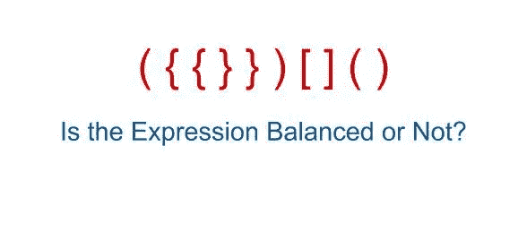

# LeetCode —有效括号

> 原文：<https://medium.com/nerd-for-tech/leetcode-valid-parentheses-772565465fe7?source=collection_archive---------5----------------------->



# 问题陈述

给定一个仅包含字符 **'('** 、 **')'** 、 **'{'** 、 **'}'** 、 **'['** 和 **']'** 的字符串 **s** ，确定输入的字符串是否有效。

在以下情况下，输入字符串有效:

```
1\. Open brackets must be closed by the same type of brackets.
2\. Open brackets must be closed in the correct order.
```

问题陈述摘自:[https://leetcode.com/problems/valid-parentheses](https://leetcode.com/problems/valid-parentheses)

**例 1:**

```
Input: s = "()"
Output: true
```

**例 2:**

```
Input: s = "()[]{}"
Output: true
```

例 3:

```
Input: s = "(]"
Output: false
```

**例 4:**

```
Input: s = "([)]"
Output: false
```

**例 5:**

```
Input: s = "{[]}"
Output: true
```

**约束:**

```
- 1 <= s.length <= 10^4
- s consists of parentheses only '()[]{}'
```

# 说明

这个问题可以通过使用堆栈或递归来解决。对于一个大字符串，构建一个递归调用堆栈会临时消耗内存，并且可能比迭代解决方案占用更多的空间。

我们可以使用堆栈和散列表形式的额外存储。让我们检查算法和解决方案。

## 堆

```
- initialize stack st and i = 0.- return true if the string is empty.- Loop while i < 0
  - if s[i] == '(' || s[i] == '[' || s[i] == '{' // push the char to stack
    - st.push(s[i]) - else if s[i] == ')' && !st.empty() && st.top() == '(' ||
            s[i] == '}' && !st.empty() && st.top() == '{' ||
            s[i] == ']' && !st.empty() && st.top() == '[' // pop the top element if the current char is a closing brace provided
    // stack is not empty.
    - st.pop() - else // the string is not a valid parenthesis
    - return false i++- return true if st.empty()- return false.
```

**C++解决方案**

```
class Solution {
public:
    bool isValid(string s) {
        stack<char> st; if(s.size() == 0){
            return true;
        } int i = 0;
        while(i < s.size()){
            if( s[i] == '(' || s[i] == '[' || s[i] == '{' ){
                st.push(s[i]);
            } else if ( (s[i] == ')' && !st.empty() && st.top() == '(') ||
                        (s[i] == '}' && !st.empty() && st.top() == '{') ||
                        (s[i] == ']' && !st.empty() && st.top() == '[')
                      ){
                st.pop();
            } else {
                return false;
            }
            i++;
        } if(st.empty()) {
            return true;
        } return false;
    }
};
```

**Golang 解决方案**

```
func isValid(s string) bool {
    st := []rune{}
	bracketsMap := map[rune]rune{
		')': '(',
		'}': '{',
		']': '[',
	} for _, v := range s {
		if len(st) == 0 {
			st = append(st, v)
			continue
		} if bracketsMap[v] == st[len(st)-1] {
			st = st[:len(st)-1]
		} else {
			st = append(st, v)
		}
	} return len(st) == 0
}
```

**Javascript 解决方案**

```
var isValid = function(s) {
   let st = [];
   const legend = {
     '(': ')',
     '{': '}',
     '[': ']'
   }; for (let i = 0; i < s.length; i++) {
     if (s[i] === '(' || s[i] === '{' || s[i] === '[') {
       st.push(s[i]);
     } else if (legend[st.pop()] !== s[i]) {
       return false;
     }
   } return st.length ? 0 : 1;
};
```

让我们试运行一下我们的算法，看看解决方案是如何工作的。

```
Input:
s = ()[]{}Step 1: stack<char> st;Step 2: s.size() == 0
        s.size() = 6
        6 == 0
        falseStep 3: i = 0Step 4: loop while i < 6
        0 < 6
        true // stack is empty
        st = [] if s[i] == '(' || s[i] == '[' || s[i] == '{'
          true
          st.push(s[i])
          st.push( '(' ) top
                  |
          st = [ '(' ] i++
        i = 1Step 5: loop while i < 6
        1 < 6
        true top
                |
        st = [ '(' ] if s[i] == '(' || s[i] == '[' || s[i] == '{'
          false else if (s[i] == ')' && !st.empty() && st.top() == '(')
          true
          st.pop()
          st = [] i++
        i = 2Step 6: loop while i < 6
        2 < 6
        true // stack is empty
        st = [] if s[i] == '(' || s[i] == '[' || s[i] == '{'
          true
          st.push(s[i])
          st.push( '[' ) top
                  |
          st = [ '[' ] i++
        i = 3Step 7: loop while i < 6
        3 < 6
        true top
                |
        st = [ '[' ] if s[i] == '(' || s[i] == '[' || s[i] == '{'
          false else if (s[i] == ']' && !st.empty() && st.top() == '[')
          true
          st.pop()
          st = [] i++
        i = 4Step 8: loop while i < 6
        4 < 6
        true // stack is empty
        st = [] if s[i] == '(' || s[i] == '[' || s[i] == '{'
          true
          st.push(s[i])
          st.push( '{' ) top
                  |
          st = [ '{' ] i++
        i = 5Step 9: loop while i < 6
        5 < 6
        true top
                |
        st = [ '{' ] if s[i] == '(' || s[i] == '[' || s[i] == '{'
          false else if (s[i] == '}' && !st.empty() && st.top() == '{')
          true
          st.pop()
          st = [] i++
        i = 6Step 10: loop while i < 6
        6 < 6
        falseStep 11: if st.empty()
           trueThe answer is true.
```

*原载于*[*https://alkeshghorpade . m*](https://alkeshghorpade.me/post/leetcode-maximum-subarray)*e .*