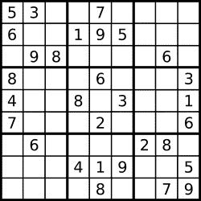

# LeetCode —有效的数独

> 原文：<https://medium.com/nerd-for-tech/leetcode-valid-sudoku-49b88745a2f4?source=collection_archive---------0----------------------->

# 问题陈述

确定一个 *9 x 9* 数独板是否有效。根据以下规则，仅需要验证已填充的单元格**:**

每一行必须包含数字*1–9*，不能重复。每一列都必须包含数字*1–9*，不能重复。网格的九个 *3 x 3* 子框中的每一个都必须包含数字*1–9*且不能重复。

**注:**

数独棋盘(部分填充)可能是有效的，但不一定是可解的。只有填充的单元格需要根据上述规则进行验证。

**例 1:**



```
Input: board =
[["5", "3", ".", ".", "7", ".", ".", ".", "."]
,["6", ".", ".", "1", "9", "5", ".", ".", "."]
,[".", "9", "8", ".", ".", ".", ".", "6", "."]
,["8", ".", ".", ".", "6", ".", ".", ".", "3"]
,["4", ".", ".", "8", ".", "3", ".", ".", "1"]
,["7", ".", ".", ".", "2", ".", ".", ".", "6"]
,[".", "6", ".", ".", ".", ".", "2", "8", "."]
,[".", ".", ".", "4", "1", "9", ".", ".", "5"]
,[".", ".", ".", ".", "8", ".", ".", "7", "9"]]
Output: true
```

**例 2:**

```
Input: board =
[["8", "3", ".", ".", "7", ".", ".", ".", "."]
,["6", ".", ".", "1", "9", "5", ".", ".", "."]
,[".", "9", "8", ".", ".", ".", ".", "6", "."]
,["8", ".", ".", ".", "6", ".", ".", ".", "3"]
,["4", ".", ".", "8", ".", "3", ".", ".", "1"]
,["7", ".", ".", ".", "2", ".", ".", ".", "6"]
,[".", "6", ".", ".", ".", ".", "2", "8", "."]
,[".", ".", ".", "4", "1", "9", ".", ".", "5"]
,[".", ".", ".", ".", "8", ".", ".", "7", "9"]]
Output: false
Explanation: Same as Example 1, except with the 5 in the top left corner being modified to 8\. Since there are two 8's in the top left 3 x 3 sub-box, it is invalid.
```

**约束:**

```
- board.length == 9
- board[i].length == 9
- board[i][j] is a digit 1-9 or '.'
```

# 说明

问题需要我们验证数独板是否有效。解决问题的方法将类似于我们填充数独的方式。我们检查每一行、每一列和每一个 *3 x 3* 单元格，以验证它们是否包含任何重复的数字。

直接查算法吧。

```
// isValidSudoku function
- initialize i- for every row verify if it's valid
  loop for i = 0; i < 9; i++
    - if !isValidRow(board[i])
      - return false- for every column verify if it's valid
  loop for i = 0; i < 9; i++
    - if !isValidColumn(board, i)
      - return false- for every cell in sudoku verify if it's valid
  loop for = 0; i < 9; i = i + 3
    for j = 0; j < 9; j = j + 3
      - if !isValidCell(board, i, j)
        - return false// isValidRow function
- set checker = 0
  initialize num- loop for i = 0; i < 9; i++
  - if row[i] != '.'
    - set num = row[i] - '0'
    - if checker & (1 << num) > 0
      - return false
    - checker = checker | (1 << num)- return true// isValidColumn function
- set checker = 0
  initialize num- loop for i = 0; i < 9; i++
  - if board[i][j] != '.'
    - set num = board[i][j] - '0'
    - if checker & (1 << num) > 0
      - return false
    - checker = checker | (1 << num)- return true// isValidCell function
- set checker = 0
  initialize num- loop for i = n; i < n + 3; i++
  - loop for j = m; j < m + 3; j++
    - if board[i][j] != '.'
      - set num = board[i][j] - '0'
      - if checker & (1 << num) > 0
        - return false
      - checker = checker | (1 << num)- return true
```

## C++解决方案

```
class Solution {
static bool isValidRow(vector<char>& row){
    int checker = 0, num; for(int i = 0; i < 9; i++){
        if(row[i] != '.'){
            num = row[i] - '0';
            if((checker & (1 << num)) > 0)
                return false;
            checker = (checker | (1 << num));
        }
    } return true;
};static bool isValidColumn(vector<vector<char>>& board, int j){
    int checker = 0, num; for(int i = 0; i < 9; i++){
        if(board[i][j] != '.'){
            num = board[i][j] - '0';
            if((checker & (1 << num)) > 0)
                return false;
            checker = (checker | (1 << num));
        }
    } return true;
};static bool isValidCell(vector<vector<char>>& board, int n, int m){
    int checker = 0, num; for(int i = n; i < n + 3; i++){
        for(int j = m; j < m + 3; j++){
            if(board[i][j] != '.'){
                num = board[i][j] - '0';
                if((checker & (1 << num)) > 0)
                    return false;
                checker = (checker | (1 << num));
            }
        }
    } return true;
};public:
    bool isValidSudoku(vector<vector<char>>& board) {
        int i; for(i = 0; i < 9; i++){
            if(!isValidRow(board[i])){
                return false;
            }
        } for(i = 0; i < 9; i++){
            if(!isValidColumn(board, i)){
                return false;
            }
        } for(i = 0; i < 9; i += 3){
            for(int j = 0; j < 9; j += 3){
               if(!isValidCell(board, i, j)){
                    return false;
                }
            }
        } return true;
    }
};
```

## 戈朗溶液

```
func isValidRow(board []byte) bool {
    checker, num := 0, 0 for i := 0; i < 9; i++ {
        if board[i] != '.' {
            num = int(board[i] - '0')
            if checker & (1 << num) != 0 {
                return false
            } checker = checker | (1 << num)
        }
    } return true
}func isValidColumn(board [][]byte, j int) bool {
    checker, num := 0, 0 for i := 0; i < 9; i++ {
        if board[i][j] != '.' {
            num = int(board[i][j] - '0')
            if checker & (1 << num) != 0 {
                return false
            } checker = checker | (1 << num)
        }
    } return true
}func isValidCell(board [][]byte, n, m int) bool {
    checker, num := 0, 0 for i := n; i < n + 3; i++ {
        for j := m; j < m + 3; j++ {
            if board[i][j] != '.' {
                num = int(board[i][j] - '0')
                if checker & (1 << num) != 0 {
                    return false
                } checker = checker | (1 << num)
            }
        }
    } return true
}func isValidSudoku(board [][]byte) bool {
    for i := 0; i < 9; i++ {
        if !isValidRow(board[i]) {
            return false
        }
    } for i := 0; i < 9; i++ {
        if !isValidColumn(board, i) {
            return false
        }
    } for i := 0; i < 9; i += 3 {
        for j := 0; j < 9; j += 3 {
            if !isValidCell(board, i, j) {
                return false
            }
        }
    } return true
}
```

## Javascript 解决方案

```
var isValidRow = function(board) {
    let checker = 0, num; for(let i = 0; i < 9; i++){
        if(board[i] != '.'){
            num = board[i] - '0';
            if((checker & (1 << num)) > 0)
                return false;
            checker = (checker | (1 << num));
        }
    } return true;
}var isValidColumn = function(board, j) {
    let checker = 0, num; for(let i = 0; i < 9; i++){
        if(board[i][j] != '.'){
            num = board[i][j] - '0';
            if((checker & (1 << num)) > 0)
                return false;
            checker = (checker | (1 << num));
        }
    } return true;
}var isValidCell = function(board, n, m) {
    let checker = 0, num; for(let i = n; i < n + 3; i++){
        for(let j = m; j < m + 3; j++){
            if(board[i][j] != '.'){
                num = board[i][j] - '0';
                if((checker & (1 << num)) > 0)
                    return false;
                checker = (checker | (1 << num));
            }
        }
    } return true;
}var isValidSudoku = function(board) {
    let i; for(i = 0; i < 9; i++){
        if(!isValidRow(board[i])){
            return false;
        }
    } for(i = 0; i < 9; i++){
        if(!isValidColumn(board, i)){
            return false;
        }
    } for(i = 0; i < 9; i += 3){
        for(let j = 0; j < 9; j += 3){
           if(!isValidCell(board, i, j)){
                return false;
            }
        }
    } return true;
};
```

让我们试运行一行，了解它是如何验证每一列和每一个单元格的。

```
Input board =
[["5", "3", ".", ".", "7", ".", ".", ".", "."]
,["6", ".", ".", "1", "9", "5", ".", ".", "."]
,[".", "9", "8", ".", ".", ".", ".", "6", "."]
,["8", ".", ".", ".", "6", ".", ".", ".", "3"]
,["4", ".", ".", "8", ".", "3", ".", ".", "1"]
,["7", ".", ".", ".", "2", ".", ".", ".", "6"]
,[".", "6", ".", ".", ".", ".", "2", "8", "."]
,[".", ".", ".", "4", "1", "9", ".", ".", "5"]
,[".", ".", ".", ".", "8", ".", ".", "7", "9"]]// isValidSudoku functionStep 1: initialize iStep 2: for(i = 0; i < 9; i++){
           if(!isValidRow(board[i])){
               return false;
            }
        }// we will only check for the first 0th row
// in isValidRowStep 3: set checker = 0
        initialize num loop for i = 0; i < 9; i++
          - if board[i] != '.'
            board[0] != '.'
            '5' != '.'
            true num = board[i] - '0'
                = '5' - '0'
                = 5 if checker & (1 << num) > 0
               0 & (1 << 5) > 0
               0 > 0
               false checker = (checker | (1 << num))
                    = 0 | 1 << 5
                    = 0 | 32
                    = 32 i++
            i = 1Step 4: i < 9
        1 < 9
        true - if board[i] != '.'
          board[1] != '.'
          '3' != '.'
          true num = board[i] - '0'
            = '3' - '0'
            = 3 if checker & (1 << num) > 0
           0 & (1 << 3) > 0
           0 > 0
           false checker = (checker | (1 << num))
                = 32 | 1 << 3
                = 32 | 8
                = 40 i++
        i = 2Step 5: i < 9
        2 < 9
        true - if board[i] != '.'
          board[2] != '.'
          '.' != '.'
          false i++
        i = 3Step 6: i < 9
        3 < 9
        true - if board[i] != '.'
          board[3] != '.'
          '.' != '.'
          false i++
        i = 4Step 7: i < 9
        4 < 9
        true - if board[i] != '.'
          board[4] != '.'
          '7' != '.'
          true num = board[i] - '0'
            = '7' - '0'
            = 7 if checker & (1 << num) > 0
           0 & (1 << 7) > 0
           0 > 0
           false checker = (checker | (1 << num))
                = 40 | 1 << 7
                = 40 | 128
                = 168 i++
        i = 5Step 8: i < 9
        5 < 9
        true - if board[i] != '.'
          board[5] != '.'
          '.' != '.'
          false i++
        i = 6Step 9: i < 9
        6 < 9
        true - if board[i] != '.'
          board[6] != '.'
          '.' != '.'
          false i++
        i = 7Step 10: i < 9
         7 < 9
         true - if board[i] != '.'
           board[7] != '.'
           '.' != '.'
           false i++
         i = 8Step 11: i < 9
         8 < 9
         true - if board[i] != '.'
           board[8] != '.'
           '.' != '.'
           false i++
         i = 9Step 12: i < 9
         9 < 9
         falseStep 13: return trueSo we calculate the answer in the same way for the rest of the rows, columns, and 3 x 3 cells.For this 9 x 9 matrix, the answer is true. The answer we return is true.
```

*原载于*[*https://alkeshghorpade . me*](https://alkeshghorpade.me/post/leetcode-valid-sudoku)*。*