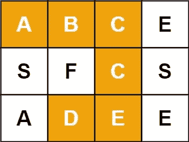

# LeetCode —单词搜索

> 原文：<https://medium.com/nerd-for-tech/leetcode-word-search-516d236b9515?source=collection_archive---------2----------------------->

# 问题陈述

给定一个 *m x n* 的字符网格*棋盘*和一串*字*，如果网格中存在*字*，则返回*真*。

该单词可以由顺序相邻单元的字母构成，其中相邻单元水平或垂直相邻。同一个字母单元格不能使用多次。

问题陈述摘自:[https://leetcode.com/problems/word-search](https://leetcode.com/problems/word-search)

**例 1:**



```
Input: board = [["A", "B", "C", "E"], ["S", "F", "C", "S"], ["A", "D", "E", "E"]], word = "ABCCED"
Output: true
```

**例 2:**

```
Input: board = [["A", "B", "C", "E"], ["S", "F", "C", "S"], ["A", "D", "E", "E"]], word = "SEE"
Output: true
```

**例 3:**

```
Input: board = [["A", "B", "C", "E"], ["S", "F", "C", "S"], ["A", "D", "E", "E"]], word = "ABCB"
Output: false
```

**约束条件**

```
- m == board.length
- n = board[i].length
- 1 <= m, n <= 6
- 1 <= word.length <= 15
- board and word consists of only lowercase and uppercase English letters.
```

# 说明

## DFS 算法

在 m * n 板上的移动被限制在水平和垂直相邻区域。所以我们只能沿着四个方向移动，而不是八个方向，因为对角线方向的移动受到限制。

当我们指向一个特定的单元格时，我们检查单词的第一个字符是否与当前单元格中的字符匹配。如果是，我们在当前网格单元的所有四个方向上匹配单词的下一个字符。我们继续这样做，直到我们找到完整的单词。

我们穿越网格的方式类似于**深度优先搜索**。

让我们检查算法:

```
// function main
- set x[4] = {1, -1, 0, 0}
      y[4] = {0, 0, 1, -1}

- initialize i and j

- loop for i = 0; i < board.size(); i++
  - loop for j = 0; j < board[0].size(); j++
    - if dfs(board, i, j, 0, word)
      - return true

// function dfs(board, i, j, position, word)
- if position >= word.size()
  - return true

// call resolvable function to check the boundary conditions of grid
// and see if the char at word position matches the board index board[i][j]
- if resolvable(board, i, j, position, word)
  - char t = board[i][j]
  - board[i][j] = '.'

  // if the current char matches we move across all the four directions to match the next char
  - loop for k = 0; k < 4; k++
    - if dfs(board, i + x[k], j + y[k], position + 1, word)
      - return true

  - board[i][j] = t

- return false

// function resolvable(board, i, j, position, word)
- return i >= 0 && i < board.size() && j >= 0 && j < board[0].size() && board[i][j] == word[position]
```

## C++解决方案

```
class Solution {
int x[4] = {1, -1, 0, 0};
int y[4] = {0, 0, 1, -1};

public:
bool resolvable(vector<vector<char>>& board, int i, int j, int position, string word){
    return (i >= 0 && i < board.size() && j >= 0 && j < board[0].size() && board[i][j] == word[position]);
}

public:
bool dfs(vector<vector<char>>& board, int i, int j, int position, string word){
    if(position >= word.size()){
        return true;
    }

    if(resolvable(board, i, j, position, word)){
        char t = board[i][j];
        board[i][j] = '.';
        for(int k = 0; k < 4; ++k){
            if(dfs(board, i + x[k], j + y[k], position + 1, word)){
                return true;
            }
        }

        board[i][j] = t;
    }

    return false;
}

public:
bool exist(vector<vector<char>>& board, string word) {
    int i, j;

    for(i = 0; i < board.size(); i++){
        for(j = 0; j < board[0].size(); j++){
            if(dfs(board, i, j, 0, word)){
                return true;
            }
        }
    }

    return false;
}
};
```

## 戈朗溶液

```
var x [4]int
var y [4]int

func resolvable(board [][]byte, i, j, position int, word string) bool {
    return i >= 0 && i < len(board) && j >= 0 && j < len(board[0]) && word[position] == board[i][j]
}

func dfs(board [][]byte, i, j, position int, word string) bool {
    if position >= len(word) {
        return true
    }

    if resolvable(board, i, j, position, word) {
        t := board[i][j]
        board[i][j] = '.'

        for k := 0; k < 4; k++ {
            if dfs(board, i + x[k], j + y[k], position + 1, word) {
                return true
            }
        }

        board[i][j] = t
    }

    return false
}

func exist(board [][]byte, word string) bool {
    x = [...]int{1, -1, 0, 0}
    y = [...]int{0, 0 , 1, -1}

    for i := 0; i < len(board); i++ {
        for j := 0; j < len(board[0]); j++ {
            if dfs(board, i, j, 0, word) {
                return true
            }
        }
    }

    return false
}
```

## Javascript 解决方案

```
var x = [1, -1, 0, 0];
var y = [0, 0, 1, -1];

function resolvable(board, i, j, position, word){
    return i >= 0 && i < board.length && j >= 0 && j < board[0].length && word[position] == board[i][j]
}

function dfs(board, i, j, position, word){
    if(position >= word.length) {
        return true;
    }

    if(resolvable(board, i, j, position, word)) {
        var t = board[i][j];
        board[i][j] = '.';

        for(var k = 0 ; k < 4; k++){
            if(dfs(board, i + x[k], j + y[k], position + 1, word)){
                return true;
            }
        }

        board[i][j] = t;
    }

    return false;
}

var exist = function(board, word) {
    for(var i = 0; i < board.length; i++){
        for(var j = 0; j < board[0].length; j++){
            if(dfs(board, i, j, 0, word)) {
                return true;
            }
        }
    }

    return false;
}
```

让我们试运行一下我们的算法，看看解决方案是如何工作的。

```
Input: board = [["A", "B", "C", "E"], ["S", "F", "C", "S"], ["A", "D", "E", "E"]]
       word = "SEE"

Step 1: initialize i, j

Step 2: loop for i = 0; i < board.size()
        0 < 3
        true

        loop for j = 0; j < board[0].size()
        0 < 4
        true

        dfs(board, i, j, 0, word)
        dfs(board, 0, 0, 0, word)

Step 3: //in function dfs
        if position >= word.size()
           0 >= 3
           false

        if resolvable(board, i, j, position, word)
          - i >= 0 && i < board.size() && j >= 0 && j < board[0].size && word[position] == board[i][j]
          - 0 >= 0 && 0 < 3 && j >= 0 && 0 < 4 && word[0] == board[0][0]
          - true && 'S' == 'A'
          - false

        return false

Step 4: We reach at step 2 and increment j
        i = 0
        j = 1

        dfs(board, i, j, 0, word)
        dfs(board, 0, 1, 0, word)

Step 5: //in function dfs
        if position >= word.size()
           0 >= 3
           false

        if resolvable(board, i, j, position, word)
          - i >= 0 && i < board.size() && j >= 0 && j < board[0].size && word[position] == board[i][j]
          - 0 >= 0 && 0 < 3 && 1 >= 0 && 1 < 4 && word[0] == board[0][1]
          - true && 'S' == 'B'
          - false

        return false

Step 6: We reach at step 2 and increment j
        i = 0
        j = 2

        dfs(board, i, j, 0, word)
        dfs(board, 0, 2, 0, word)

Step 7: //in function dfs
        if position >= word.size()
           0 >= 3
           false

        if resolvable(board, i, j, position, word)
          - i >= 0 && i < board.size() && j >= 0 && j < board[0].size && word[position] == board[i][j]
          - 0 >= 0 && 0 < 3 && 2 >= 0 && 2 < 4 && word[0] == board[0][2]
          - true && 'S' == 'C'
          - false

        return false

Step 8: We reach at step 2 and increment j
        i = 0
        j = 3

        dfs(board, i, j, 0, word)
        dfs(board, 0, 3, 0, word)

Step 9: //in function dfs
        if position >= word.size()
           0 >= 3
           false

        if resolvable(board, i, j, position, word)
          - i >= 0 && i < board.size() && j >= 0 && j < board[0].size && word[position] == board[i][j]
          - 0 >= 0 && 0 < 3 && 3 >= 0 && 3 < 4 && word[0] == board[0][3]
          - true && 'S' == 'E'
          - false

        return false

Step 10: We reach at step 2 and increment j
        i = 0
        j = 4

        dfs(board, i, j, 0, word)
        dfs(board, 0, 3, 0, word)

Step 11: //in function dfs
        if position >= word.size()
           0 >= 3
           false

        if resolvable(board, i, j, position, word)
          - i >= 0 && i < board.size() && j >= 0 && j < board[0].size && word[position] == board[i][j]
          - 0 >= 0 && 0 < 3 && 3 >= 0 && 4 < 4 && word[0] == board[0][3]
          - false && 'S' == 'E'
          - false

        return false

Step 12: We reach at step 2 and increment i and j is 0
        i = 1
        j = 0

        dfs(board, i, j, 0, word)
        dfs(board, 1, 0, 0, word)

Step 13: //in function dfs
        if position >= word.size()
           0 >= 3
           false

        if resolvable(board, i, j, position, word)
          - i >= 0 && i < board.size() && j >= 0 && j < board[0].size && word[position] == board[i][j]
          - 1 >= 0 && 1 < 3 && 0 >= 0 && 0 < 4 && word[0] == board[1][0]
          - true && 'S' == 'S'
          - true

          - t = board[i][j]
          - t = 'S'
          - board[i][j] = '.'
          - board[1][0] = '.'

          loop for k = 0; k < 4
            - dfs(board, i + x[k], j + y[k], position + 1, word)
            - dfs(board, 1 + x[0], 0 + y[0], 0 + 1, word)
            - dfs(board, 1 + 1, 0 + 0, 0 + 1, word)
            - dfs(board, 2, 0 + 0, 1, word)

        // recursive call to dfs function
        if position >= word.size()
           1 >= 3
           false

        if resolvable(board, i, j, position, word)
          - i >= 0 && i < board.size() && j >= 0 && j < board[0].size && word[position] == board[i][j]
          - 2 >= 0 && 2 < 3 && 0 >= 0 && 0 < 4 && word[1] == board[2][0]
          - true && 'E' == 'A'
          - false

          k++
          k = 1

          loop for k < 4
            - dfs(board, i + x[k], j + y[k], position + 1, word)
            - dfs(board, 1 + x[1], 0 + y[1], 0 + 1, word)
            - dfs(board, 1 - 1, 0 + 0, 0 + 1, word)
            - dfs(board, 0, 0, 1, word)

        // recursive call to dfs function
        if position >= word.size()
           1 >= 3
           false

        if resolvable(board, i, j, position, word)
          - i >= 0 && i < board.size() && j >= 0 && j < board[0].size && word[position] == board[i][j]
          - 0 >= 0 && 0 < 3 && 0 >= 0 && 0 < 4 && word[1] == board[0][0]
          - true && 'E' == 'A'
          - false

          k++
          k = 2

          loop for k < 4
            - dfs(board, i + x[k], j + y[k], position + 1, word)
            - dfs(board, 1 + x[2], 0 + y[2], 0 + 1, word)
            - dfs(board, 1 + 0, 0 + 1, 0 + 1, word)
            - dfs(board, 1, 1, 1, word)

        // recursive call to dfs function
        if position >= word.size()
           1 >= 3
           false

        if resolvable(board, i, j, position, word)
          - i >= 0 && i < board.size() && j >= 0 && j < board[0].size && word[position] == board[i][j]
          - 1 >= 0 && 1 < 3 && 1 >= 0 && 1 < 4 && word[1] == board[1][1]
          - true && 'E' == 'F'
          - false

          k++
          k = 3

          loop for k < 4
            - dfs(board, i + x[k], j + y[k], position + 1, word)
            - dfs(board, 1 + x[3], 0 + y[3], 0 + 1, word)
            - dfs(board, 1 + 0, 0 - 1, 0 + 1, word)
            - dfs(board, 1, -1, 1, word)

        // recursive call to dfs function
        if position >= word.size()
           1 >= 3
           false

        if resolvable(board, i, j, position, word)
          - i >= 0 && i < board.size() && j >= 0 && j < board[0].size && word[position] == board[i][j]
          - 1 >= 0 && 1 < 3 && -1 >= 0 && 1 < 4 && word[1] == board[1][1]
          - false

          k++
          k = 4

          loop for k < 4
            - false

        return false

Step 14: We reach at step 2 and increment i and j is 0
        i = 1
        j = 1

        dfs(board, i, j, 0, word)
        dfs(board, 1, 1, 0, word)

        This is false since word[0] != board[1][1]
        'S' != 'F'

Step 15: We reach at step 2 and increment i and j is 1
        i = 1
        j = 2

        dfs(board, i, j, 0, word)
        dfs(board, 1, 2, 0, word)

        This is false since word[0] != board[1][2]
        'S' != 'C'

Step 16: We reach at step 2 and increment i and j is 2
        i = 1
        j = 3

        dfs(board, i, j, 0, word)
        dfs(board, 1, 3, 0, word)

Step 17: //in function dfs
        if position >= word.size()
           0 >= 3
           false

        if resolvable(board, i, j, position, word)
          - i >= 0 && i < board.size() && j >= 0 && j < board[0].size && word[position] == board[i][j]
          - 1 >= 0 && 1 < 3 && 3 >= 0 && 3 < 4 && word[0] == board[1][3]
          - true && 'S' == 'S'
          - true

          - t = board[i][j]
          - t = 'S'
          - board[i][j] = '.'
          - board[1][3] = '.'

          loop for k = 0; k < 4
            - dfs(board, i + x[k], j + y[k], position + 1, word)
            - dfs(board, 1 + x[0], 3 + y[0], 0 + 1, word)
            - dfs(board, 1 + 1, 3 + 0, 0 + 1, word)
            - dfs(board, 2, 3, 1, word)

        // recursive call to dfs function
        if position >= word.size()
           1 >= 3
           false

        if resolvable(board, i, j, position, word)
          - i >= 0 && i < board.size() && j >= 0 && j < board[0].size && word[position] == board[i][j]
          - 2 >= 0 && 2 < 3 && 3 >= 0 && 3 < 4 && word[1] == board[2][3]
          - true && 'E' == 'E'
          - true

          - t = board[i][j]
          - t = 'E'
          - board[i][j] = '.'
          - board[2][3] = '.'

          loop for k = 0; k < 4
            - dfs(board, i + x[k], j + y[k], position + 1, word)
            - dfs(board, 2 + x[0], 3 + y[0], 1 + 1, word)
            - dfs(board, 2 + 1, 3 + 0, 2, word)
            - dfs(board, 3, 3, 1, word)

        // recursive call to dfs function
        if position >= word.size()
           2 >= 3
           false

        if resolvable(board, i, j, position, word)
          - i >= 0 && i < board.size() && j >= 0 && j < board[0].size && word[position] == board[i][j]
          - 3 >= 0 && 3 < 3 && 3 >= 0 && 3 < 4 && word[2] == board[2][3]
          - false && 'E' == 'E'
          - false

          k++
          k = 1

          loop for k = 0; k < 4
            - dfs(board, i + x[k], j + y[k], position + 1, word)
            - dfs(board, 2 + x[1], 3 + y[1], 1 + 1, word)
            - dfs(board, 2 - 1, 3 + 0, 2, word)
            - dfs(board, 1, 3, 2, word)

        // recursive call to dfs function
        if position >= word.size()
           2 >= 3
           false

        if resolvable(board, i, j, position, word)
          - i >= 0 && i < board.size() && j >= 0 && j < board[0].size && word[position] == board[i][j]
          - 1 >= 0 && 1 < 3 && 3 >= 0 && 3 < 4 && word[2] == board[1][3]
          - false && 'E' == 'C'
          - false

          k++
          k = 2

          loop for k = 0; k < 4
            - dfs(board, i + x[k], j + y[k], position + 1, word)
            - dfs(board, 2 + x[2], 3 + y[2], 1 + 1, word)
            - dfs(board, 2 + 0, 3 + 1, 2, word)
            - dfs(board, 2, 4, 2, word)

        // recursive call to dfs function
        if position >= word.size()
           2 >= 3
           false

        if resolvable(board, i, j, position, word)
          - i >= 0 && i < board.size() && j >= 0 && j < board[0].size && word[position] == board[i][j]
          - 2 >= 0 && 2 < 3 && 4 >= 0 && 4 < 4 && word[2] == board[2][4]
          - false

          k++
          k = 3

          loop for k = 0; k < 4
            - dfs(board, i + x[k], j + y[k], position + 1, word)
            - dfs(board, 2 + x[3], 3 + y[3], 1 + 1, word)
            - dfs(board, 2 + 0, 3 - 1, 2, word)
            - dfs(board, 2, 2, 2, word)

        // recursive call to dfs function
        if position >= word.size()
           2 >= 3
           false

        if resolvable(board, i, j, position, word)
          - i >= 0 && i < board.size() && j >= 0 && j < board[0].size && word[position] == board[i][j]
          - 2 >= 0 && 2 < 3 && 2 >= 0 && 2 < 4 && word[2] == board[2][2]
          - true && 'E' == 'E'
          - true

          - t = board[i][j]
          - t = 'E'
          - board[i][j] = '.'
          - board[2][2] = '.'

          loop for k = 0; k < 4
            - dfs(board, i + x[k], j + y[k], position + 1, word)
            - dfs(board, 2 + x[0], 2 + y[0], 2 + 1, word)
            - dfs(board, 2 + 1, 2 + 0, 3, word)
            - dfs(board, 2, 2, 3, word)

        // recursive call to dfs function
        if position >= word.size()
           3 >= 3
           true

Step 18: // Here we have covered all chars of the string "SEE" and found in the grid.
         // So we return true from this recursive calls and return to exist function.

So the answer we return is true.
```

*原载于*[*https://alkeshghorpade . me*](https://alkeshghorpade.me/post/leetcode-word-search)*。*