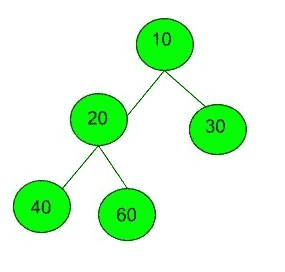
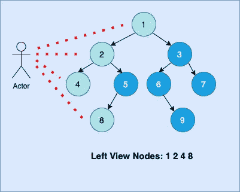
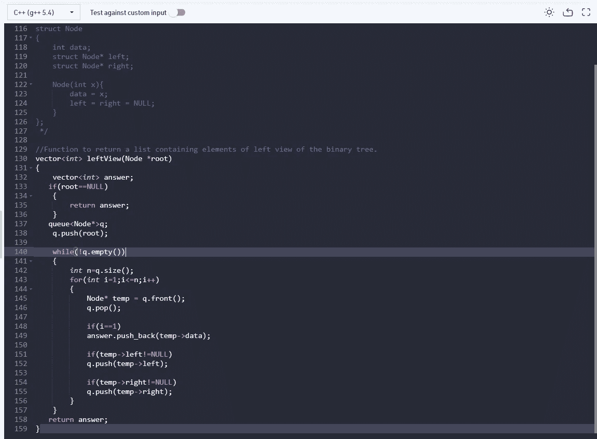

# 二叉树的左视图

> 原文：<https://medium.com/nerd-for-tech/left-view-of-a-binary-tree-3eab265d2437?source=collection_archive---------6----------------------->

给定一棵二叉树，打印它的左视图。二叉树的左视图是从左侧访问树时可见的一组节点。任务是完成函数 **leftView()** ，它接受树根作为参数。

**例一:**

```
**Input:
**   1
 /  \
3    2
**Output:** 1 3
```

**例二:**

```
**Input:**
```



```
**Output:** 10 20 40
```

**任务:**
你只需要**完成**打印左视图的函数 **leftView()** 。驱动程序代码会自动追加换行符。
**期望时间复杂度:** O(N)。
**期望辅助空间:** O(树的高度)。

**约束:**
0 < =节点数< = 100
1 < =一个节点的数据< = 1000



***那么让我们来理解二叉树的左视图是什么意思？*** *看上图，演员可以看到呈现在给定树最左侧的节点。
用更简单的话来说，我可以说它是每个级别中的第一个元素，
级别 0: 1
级别 1: 2
级别 2: 4
级别 3: 8*

> **方法:** *这里我将使用一个队列来存储二叉树中的元素，使用一个向量数组来存储出现在左视图中的元素。
> 对于每一级，我将把第一个元素推入向量数组&将继续推动&弹出队列中的元素，直到它变空。*

现在让我们看看代码:

```
***// function to find the left view***vector<int> leftView(Node *root){***//vector array to store the left view elements***vector<int> answer;***//if the root is NULL return empty vector array***if(root==NULL){return answer;}queue<Node*>q; ***//queue***q.push(root); ***//push root element in the queue***while(!q.empty()) ***//check if the queue is empty or not***{int n=q.size(); ***//find the size of the queue , initially it will be 1******//because it has only one element in it, ie. the root node***for(int i=1;i<=n;i++) ***//looping everytime the size gets updated***{***// temp points to the front element in the queue***Node* temp = q.front();***//pop the first element in each level***q.pop();if(i==1)***//pushing first element in the vector array***answer.push_back(temp->data);***// check if left node has an element******// if it is not null , push the element into the queue***if(temp->left!=NULL)q.push(temp->left);***// check if right node has an element******// if it is not null , push the element into the queue***if(temp->right!=NULL)q.push(temp->right);}}return answer; ***//vector containing the left view of the binary tree***}
```

> **代码片段:**



***希望有帮助！继续编码！既然你喜欢看我的博客，为什么不请我喝杯咖啡，在这里支持我的工作呢！！[https://www.buymeacoffee.com/sukanyabharati](https://www.buymeacoffee.com/sukanyabharati)☕***