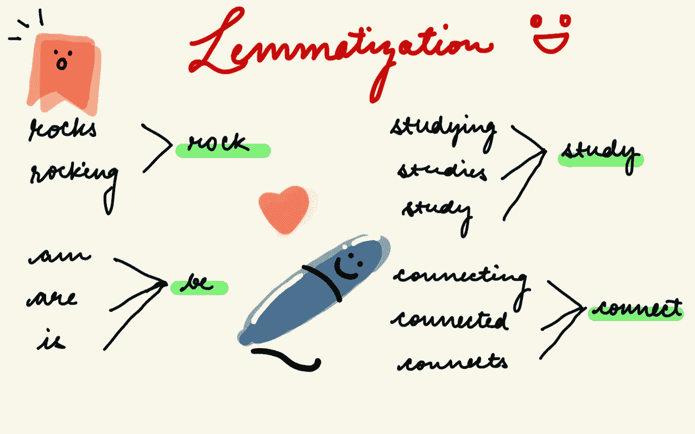
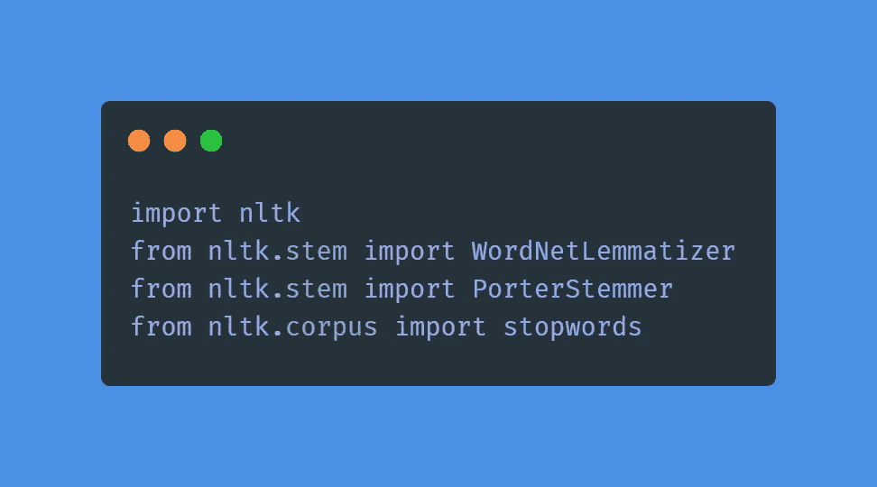
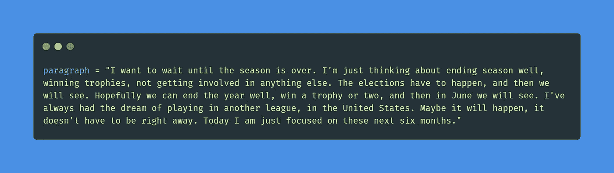
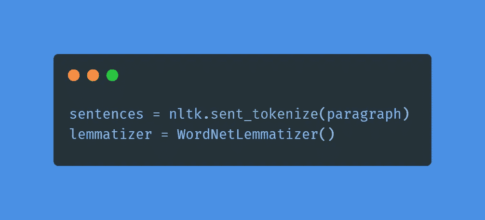
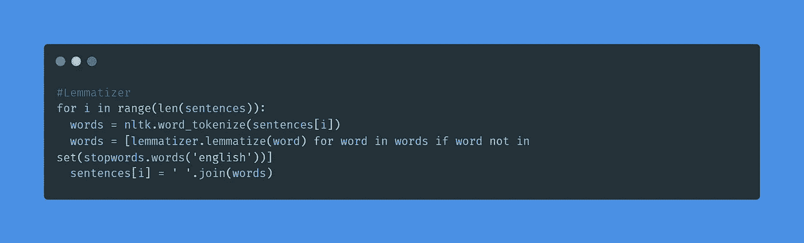
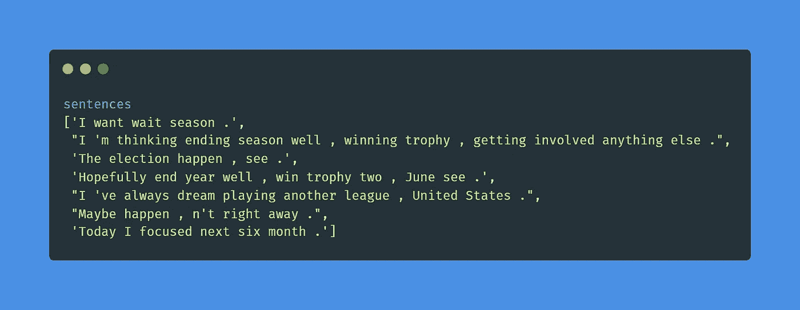
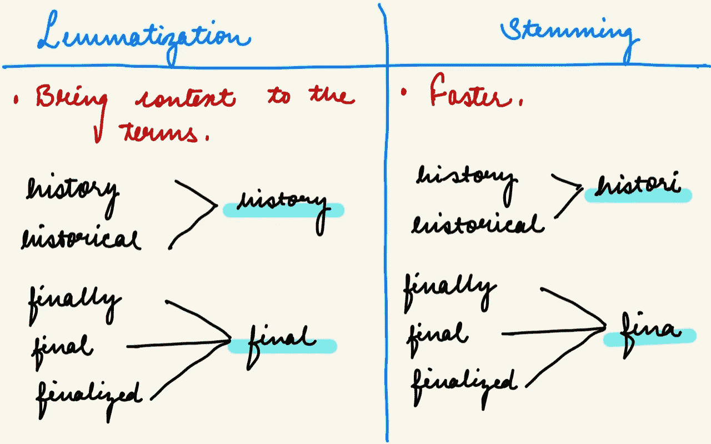
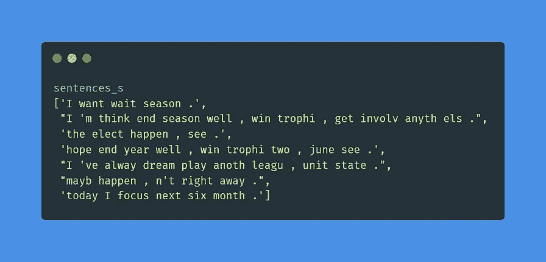
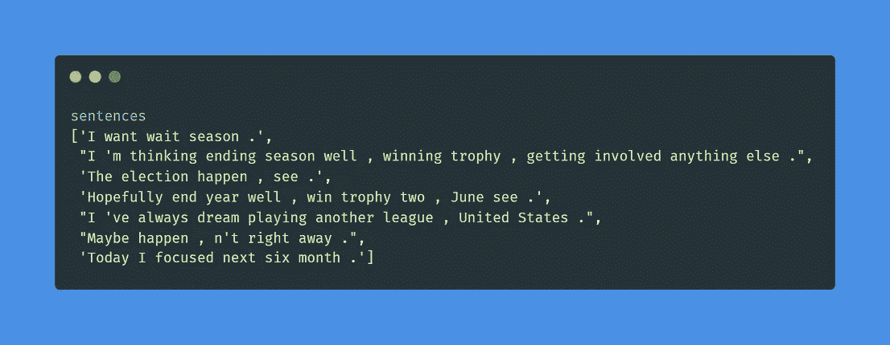

# 引理化| NLP 系列第 4 部分

> 原文：<https://medium.com/nerd-for-tech/lemmatization-nlp-series-part-4-33808b2f7027?source=collection_archive---------18----------------------->

自然语言处理(四)

词汇化适当地减少了屈折词，确保了词根属于该语言。在词汇化中，词根叫做词汇。一个引理是一组单词的规范形式、词典形式或引用形式。

词汇化考虑了单词的形态分析。有必要有详细的字典，算法可以通过这些字典将形式链接回它的引理。

词汇化示例

这篇博客是 NLP 系列的第 4 部分。如果你不知道词干，我建议你去读一读，因为我们会试着理解它们之间的区别。

首先，让我们看看如何实现引理化。

# 履行

1.  导入库。

导入库

2.为了执行词汇化，我将使用相同的段落。

段落

3.执行句子标记化，调用 WordNetLemmatizer()。

词汇符号化器

4.执行词汇化。

Lemmatizer

词汇化后的句子。

# 词汇化 v/s 词干

词汇化和词干化有相似之处，在文本挖掘中被广泛使用。文本挖掘是对用自然语言编写的文本进行分析，从文本中提取高质量的信息。它包括在文本中寻找感兴趣的模式或从文本中提取数据以插入数据库。它们都是屈折词的词根。词干可能不是一个真正的单词(因为它的算法)，而 Lemma 是一个基本的语言单词。

词汇化给单词带来了上下文，而词干化并没有给术语带来上下文。词汇化将意思相似的单词链接到一个单词，并对单词进行词法分析。

词汇化与词干化

如果我们查看段落并对其应用词干，我们可以看到词干和词汇化之间的区别。

左图:词干，右图:词汇化

# 什么时候用什么时候？

词干并不需要花费很多时间来执行一个特定的任务。尽管如此，词汇化仍然很耗时，因为它需要将单词链接到词典并做一些不同的处理，而词干化不需要做所有这些。

两者都产生屈折词的词根形式。区别在于词干可能不是一个真实的词，而 Lemma 是一个真实的语言词。

如果注重速度，应该使用词干，因为分类器扫描语料库会耗费时间和处理。这取决于您正在使用的应用程序，它决定了应该使用词干分析器还是词法分析器。如果您正在构建一个以语言为基础的语言应用程序，您应该使用词汇化来使用语料库匹配词根形式。

这些步骤展示了我们如何对文本数据执行词汇化。这个博客是关于 NLP 系列的第 4 部分。