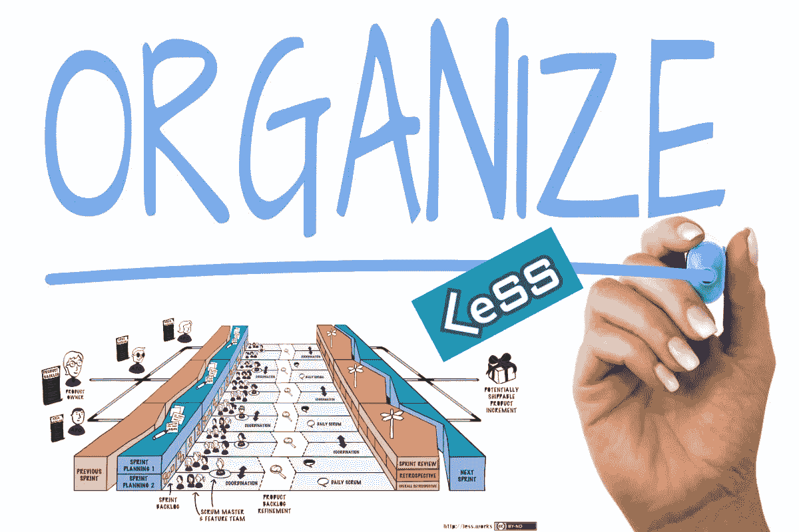
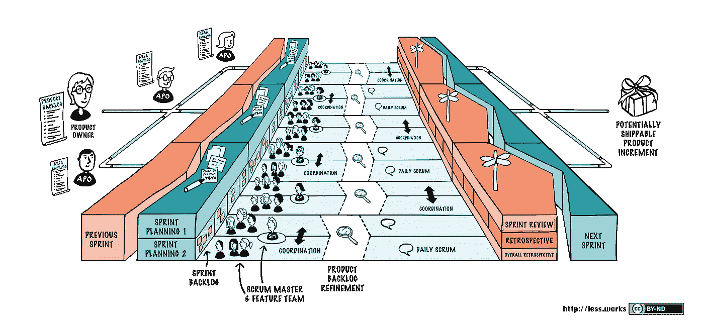

# 少走弯路:从领导者的角度——组织起来，第 2 部分

> 原文：<https://medium.com/nerd-for-tech/less-from-the-trenches-from-a-leaders-perspective-get-organized-part-2-88945e0a9b53?source=collection_archive---------1----------------------->

## 我们如何将我们的 20 个团队组织成一个更小的结构，以及我们面临的挑战

eSS 是一个基于 Craig Larman 和 Bas Vodde 在扩展 Scrum 的实践经验的框架。当你读他们的前两本书时，你可能会感到困惑。这些书没有给出如何少用的硬性规定。相反，它们包含了大量的例子，说明在扩展 Scrum 时什么可行，什么不可行。他们的书《扩展精益和敏捷开发》中的每一章都以“尝试…”或“避免…”开始。

这篇文章描述了我组织 LeSS 推荐方式的经验。我告诉你我们的起点，我们尝试了什么，以及学到了什么。我的角色是产品组主管(或开发经理)。如果你没有读过第 1 部分，概述了 LeSS 的基础知识，你可以在[第一部分](https://fredrik-carleson.medium.com/less-from-the-trenches-from-a-leaders-perspective-part-1-27a27915dad5)中阅读。如果你不知道少是什么，请只阅读第 1 部分。

# 少建议你怎么组织

少有两种口味；越来越小。如果你的团队少于一个产品负责人所能处理的，你就少用一些。如果你的团队多于一个产品负责人所能处理的，那么你就不用那么庞大。

下面的图片显示了不那么巨大的概述。在图中，您有大约 12 个团队，分布在三个区域。每个区域都有自己的(区域)产品负责人。

不太大

所有团队都以节奏工作，从一个产品待办事项中挑选故事，开始和结束他们的冲刺。在每个 sprint 阶段，您应该有一个潜在的可交付产品增量。在每个 sprint 的中间，您进行 backlog 精化。

> LeSS 的结构旨在减少孤岛和次优化。

也就是说，最大化合作，快速反馈循环，看看什么对整体最有利。该框架优先交付当前对客户最重要的功能。听起来很明显；谁不想这样呢？对于许多组织来说，上市时间和交付客户需求是一个具体的问题，因为你不是围绕价值来组织的。接下来的文章将展示这对我们的影响。

在克雷格的许多演讲中，他提出了一个简单但激进的想法，告诉你如何改变你的组织，使之符合 LeSS 的建议。首先，准备一份任何团队都需要的技能和知识的清单，以交付无依赖的特性。然后将组织中所有需要交付软件的人聚集在一个大房间里。要求所有参与者自行组成满足先决条件的团队。完成后，您将被组织成许多功能团队。就是这样。你已经重组了。

> 如果你的团队超过了一个产品负责人的能力，那么就把团队分成几个区域。

每个区域将有一个区域产品负责人和最多八个功能团队(大约)。区域既可以基于需求，也可以围绕以客户为中心的需求或产品架构进行开发。LeSS 建议您关注客户并创建需求领域，但认识到这有时会很难。

所有的团队将会有一个单一的需求来源，一个共同的待办事项，可以按区域过滤。需求是按优先级组织的。优先级最高的先做。任何团队都可以选择理想世界中的任何需求(特性),并开始着手工作。团队挑选功能。沟通是在团队之间进行的。

这种方法最大化了流程，缩短了上市时间，首先交付了最有价值的东西。不是围绕项目组织，将团队转移到一个项目，而是将工作转移到团队。

一个常见的误解是，LeSS 意味着所有的团队都应该能够处理所有的事情。这是一个愿景。我们的目标是创建 T 型团队，他们可以学习如何处理越来越多的产品部分。

# 我们是如何被组织起来的

我们在六个地方有大约 18 个 scrum 团队，包括在岸和离岸的。这些团队在一个有一千万行代码的大单块上工作。monolith 有一个 windows 客户端、一个 web 客户端和一些移动应用程序。

每个团队都是一个组件的专家。团队成员通常已经在同一个组件上工作了很多年。例如，一个团队可以专门从事时间管理。不同的组件是在不同的年代编写的，有不同的编码语言和架构。根据编写代码的人或时间，代码看起来会有所不同。

团队成员忠诚、熟练，并且对他们自己的组件有很好的领域知识。现有的程序众所周知，运行良好。每年可以发行十次。两个主要版本和八个次要版本。尽管如此，回归测试花费了数周时间。

# 我们的障碍

然而，我们可以看到问题。

*   关键人物即将退休。没有人能取代他们多年的经验和隐性知识。
*   开发部门已经和 Scrum 一起工作了两年，但是和以前相比，在交付方面并没有什么实质性的改进。
*   顾问部门使用传统的瀑布项目方法为客户处理产品的实际实现。这是固定的范围和成本，有最后期限。
*   销售部门已经销售了几年的项目。销售包括我们产品的变化。超出我们现有能力的变化。
*   现有客户也强烈要求变革。变革的需求只集中在少数几个组件上。这意味着只有少数几个团队知道如何处理 90%的客户强烈要求的积压项目。其他团队正在开发很少有人要求的低优先级特性。对我们的客户经理来说，让客户满意是一种微妙的平衡行为。
*   严重依赖关键人员造成的瓶颈(其中一些人很快就会退休)
*   能力的不平衡，只有几个团队能够处理高优先级的特性(导致排队和压力)
*   次优化
*   低质量和高技术债务代码的风险
*   对已经售出的功能设定不切实际的最后期限。
*   容量不足

我们的梦想场景是(当然)拥有可以开发我们产品任何特性的特性团队。这意味着，如果 90%的客户需要改变时间管理，所有团队都可以选择该领域的故事。然后，我们将对需求做出快速响应，并确保我们只在最优先的项目上工作。我们可以利用这些团队的能力处理低优先级的项目，让他们处理高优先级的项目。我们会有快乐的顾客和放松、满意的员工:)

# 较少的

已经决定减少尝试。我们会怎么做？

我们所有的团队都各自为政。每个团队都这样做了很多年。我们有紧迫的最后期限要满足。我们不能把团队转移到我们最需要发展的地方。我们发展壮大了，并增加了许多新团队，试图增加产能。他们仍然没有跟上速度。每增加一个新的团队或成员，就意味着需要一个有经验的人来指导新的团队或成员。有效地降低了我们的能力。基本上，我们没有预算或时间来雇佣新的团队。由于语言和低劣的通信设备，我们有分散的团队和通信问题。

> 我们意识到我们的情况必须改变。

我们如何从组件团队转移到功能团队？我们怎样才能更好地组织自己？我们如何利用现有资源增加产能？

# 你会怎么做？

如果这种情况下你在管理团队，你会怎么做？你会把所有团队都转移到一个地方吗？你会让团队重新安排吗？你会先解决技术债务吗？你会搞大爆炸还是逐步实施？你如何挑选合适的区域产品负责人？你会如何传达这些变化？你会自上而下还是自下而上还是两者结合？这些只是需要考虑的几个决定。

# 我们决定要做的

我们实际上讨论了把每个人放在同一个房间里，要求参与者自己组成团队。最后，我们决定不去尝试。

有一个公司决定，在岸和离岸团队都必须使用。我们认为(无论对错),由于地理位置和我们多样化的技术堆栈，我们无法将所有必要的能力融入同处一地的团队。

例如，一个核心组件是用 C 编写的，由一个团队处理。该团队中没有足够的成员将成员放入 20 个其他团队中，以确保所有团队都能处理该核心组件。即使我们把他们分成五个团队，他们也很可能仍然在新团队的筒仓中工作。

我们相信，在团队变得富有成效之前，如此剧烈的变化将需要比我们所允许的更多的时间。我们预计，随着所有形成、规范和风暴的发生，生产率在提高之前需要几个月才能恢复正常。

我们每个季度都有不可协商的最后期限和严格的利润率。我们要满足不切实际的最后期限，最好的办法是让现有的高绩效团队继续合作。

通常我们只有一个关键人物，他是某个领域的真正专家。

我们的架构具有多个技术栈，这使得团队很难在组件之间进行交换。特别是当团队已经在同一个代码上工作了几十年，并且对它了如指掌的时候…嗯，他们本可以做得更好。

我们曾试图向团队中添加新人，但通常需要 3-6 个月，他们才能很好地理解代码并做出贡献。我们还总是有人员流失到其他薪水更高的公司的风险。

我们选择一种更渐进的方法。我们决定为每个团队或团队小组定制许多小型解决方案。对于用 C 编写的组件工作的团队，我们决定增加更多的成员，以便稍后将团队一分为二。我们指派了一名团队成员作为新成员的全职导师，以确保知识转移。

# 区域

我们决定实施区域。理想情况下，区域应该基于以客户需求为中心的方法。这意味着一个团队或者一个区域将能够从头到尾地获取一个特性，不管产品中的哪个组件被调用。

例如，一个客户将一个商品从目录移动到购物车并创建了一个采购订单，他会期望一个类似的用户界面贯穿整个产品流程。

一个能够照顾到整个流程的团队会更好地提供令人愉快的用户体验。团队不必向其他团队进行任何移交，协调跨团队，拥有复杂的源代码控制策略，或者等待另一个团队完成他们的测试工作。理论上生活变得容易多了。

> 在现实中，当你拥有巨大的整体产品时，一个团队不会拥有整个产品的领域知识。我们很少从统一和谐的架构、持续集成或微服务开始。

因为有许多不同的技术栈，我们决定围绕产品的架构来组织区域。让同一个领域的团队使用相同的技术堆栈会使跨团队共享工作变得更容易，因为您不必了解许多不同的编程语言和技术。

我们还必须考虑组织中的领域专家。例如，在一个案例中，创建两个区域是有意义的，但是我们只有一个人知道这两个区域的细节。因为让那个人成为两个区域的区域产品负责人是不可行的，所以我们决定让一个区域负责两个区域。

我们决定每个团队有一个产品负责人，也就是一个支持产品负责人。我们称之为团队产品所有者。LeSS 真的不认为这是必要的，但我们决定我们需要它。团队产品所有者从一开始就是团队不可或缺的一部分，增加价值。

我们希望通过将团队放在公共区域，他们将开始交流并“负载平衡”工作。由于他们拥有相同的技术堆栈，他们可以开始挑选并分享他们共同领域的优先故事。想法是团队将他们的产品知识扩展到其他领域。

他们将是一个组件的专家，但如果需要的话，也能够在同一领域的其他组件上工作——这是一种缓慢且不那么革命性的方法。我们决定采用这种方法，因为我们认为它最适合满足我们的最后期限并保持预期的利润率。我们意识到这会给团队增加额外的负担。从长远来看，工作量会平衡，对关键人员的依赖也会降低。

当将团队部署到一个地区时，地理因素起着重要的作用。我们希望一个地区的团队尽可能高效地合作。我们坚信，做到这一点的最佳方式是让团队坐得彼此靠近。因此，我们决定将在同一地区工作的团队安排在同一地点。

在变更之前，我们的团队成员在同一个团队中，分为在岸和离岸、仅在岸、仅在离岸以及在岸地点之间。我们的经验是，一般来说，坐在一起的团队工作得更好。对于在岸团队和离岸团队来说，一些团队表现良好，而另一些则表现不佳——什么可行，什么不可行，为什么值得写一篇文章。我们试图尽可能地减少对团队的改变，以免造成太多的干扰。我们确实做了必要的改变。

# 未完成的

我们添加了一个“未完成”的区域，包括开发人员、架构师、开发支持和自动化测试。基本上，专家团队支持其他团队。LeSS 中未完成的部门是理想情况下不存在的。对于较大的组织来说，可能需要一段时间。这些团队中的许多成员(尤其是架构师)充当“自由代理”，在需要的地方提供帮助。他们帮助卸下那些负担过重的团队。这些免费代理可以处理经常发生的未计划的、高度关键的问题或任务——例如，安全问题、生产中的错误等等。对我们来说，自由球员的想法非常好。

团队的想法是减少一些团队花在修正错误上的时间。有些团队花了一半以上的时间在这上面。这个团队的想法也是重构现有代码，使其更易于维护。DevSupport 团队在某种程度上是某种类型的唯一真正的功能团队，因为它的成员来自所有组件团队，可以修复所有组件的 bugs)

**自动化测试团队的想法是快速工作，生产出临界质量的自动化测试，一旦达到临界质量，随后将移交给团队。当然，目的是减少花费在手工回归测试上的时间。**

**DevOps 团队的目的**是确保团队能够快速(自己)获得正确的环境，并在几分钟内(而不是几天)运行正确的配置。这对业务来说是至关重要的，无论是对帮助客户的支持，还是对顾问演示产品和开发团队测试、开发和修复问题来说。

试图划分区域似乎很简单。然而，当你深入细节时，你会遇到许多不得不处理的问题，比如对人的依赖、政治、苛刻的期限、技术限制，以及通常对变革的抵制。最后，我们大概有五个区域，每个区域有两到五个团队。

# 那么结果如何呢？

决定哪些区域应该存在，哪些团队应该在每个区域，分配产品负责人很容易，不会遇到太多阻力。我认为主要是因为我们内部讨论了很多。

每个人都同意我们必须做点什么。减少使用的决定已经传达，每个人都接受了这一点。给我们带来问题的部分是没有预料到的。

一个问题是，很少有人知道一个区域的产品负责人是什么或者应该做什么。团队产品负责人和区域产品负责人之间有什么区别？所以期望发生了冲突。

另一个问题是，我们有点天真地认为，通过建立适当的结构，事情会发生变化，团队将停止在筒仓中工作。这不会自动发生…

为了帮助事情朝着正确的方向发展，我们的产品负责人和区域产品负责人必须坐在一起进行多次长时间的会议，以达成对角色的共同理解，并讨论如何与同一区域的团队分享高优先级的故事。

我们得到的反馈是团队缺少大的图景和路线图。他们忽略了大局。很可能是因为我们还没有决定由谁来传达愿景；)我们机构有个教练之前和外管局合作过，所以我们决定借用一些思路。在 SAFe 中，有一个 PI(产品增量)计划，业务所有者和架构师每三个月(大约三个月)浏览一次愿景和路线图，并回答关于大图的问题。我们增加了定期的公路旅行，HPG、产品负责人、顾问、销售经理和区域产品负责人前往每个站点，解释每个区域一整天的路线图和愿景。这非常值得赞赏。

我们开始引入另一个动作，让 Scrum 大师处理多个团队，以避免孤岛。原因是为了在区域内进行交叉交流，并开始协调团队之间的关系。通过让一个 scrum 大师获得经验和对其他团队如何工作的洞察力，我们希望在团队之间带来好的实践和想法。我们的想法也是，Scrum masters 将开始看到组织层面的障碍，而不是团队层面的障碍。不太强调的东西。

当在一个 Scrum 团队中工作时，由于结构的原因，你很容易在诸如测试或者你作为 scrum master 的角色中独自工作。为了获得新的输入和想法，LeSS 推荐兴趣社区(CoI)。我们引入了其中的一些，但是在大多数情况下，它们从未真正成功过。要有一个成功的 CoI，你需要积极主动推动 CoI 的人。你还需要管理层的赞助。管理层需要告诉团队成员，花时间参与是可以的。在我们的案例中，我们很难按照不切实际的时间表交付，并且交付总是优先的。我相信这是他们没有起飞的另一个原因。人们觉得他们应该专注于交付，而不是讨论如何变得更好

LeSS 给出了很少关于如何处理多个团队的冲刺计划的信息。原则上，LeSS 在 sprint planning 第 1 部分中说:您可以通过向第一部分派遣代表来限制参与者，在第一部分中，产品负责人/区域产品负责人会介绍优先级最高的待办事项。然后，代表们挑选并在他们之间划分优先级最高的项目，并将它们带回他们的团队。第二部分是团队的常规团队冲刺计划会议。LeSS 说，如果需要，多个团队可以坐在一起解决依赖性，以方便沟通。当我离开的时候，我们真的从来没有满意地处理这件事。

# 经验教训

在向上扩展时，架构的重要性远远超出您的预期。如果你有一个包含多个技术栈的整体产品，那么划分需求区域或者创建功能团队将会更加困难。我就此写了另一篇文章。

将团队和人员分成不同的区域，并在纸上进行组织变革是很容易的。让人们改变行为是非常困难的，需要大量的时间、训练和讨论。

小费是从最少的开始。这很难实现。收集反馈，并根据反馈添加或更改不可行的内容。不要同时改变太多。让每个人都参与关于愿景、如何组织等等的研讨会。你会得到有价值的反馈和认同。

尝试最多同时驱动两个或三个变更(考虑 WIP 限制)。我的经验是，变化应该足够小，可以在几周内实现，并逐步进行。当一个变更发生时，在它的基础上构建，并基于前一个变更添加下一个小的修改。这确保你坚持旧的改变，并在改变的基础上增加新的东西。我非常怀疑科特勒和其他许多变化理论。它们非常适合项目和大爆炸的实现，但通常不适合敏捷组织(IMHO)。

要创建一个持续改进的学习型组织，需要管理层发起、设定优先时间来发现/测试如何将事情做得更好。我相信我们的 CoI 因为这个从来没有起飞过。如果你不集中精力，花时间变得更好，你的组织将永远是被动的，唯一的焦点是交付。我不知道有多少次我听说我们现在没有时间，下一个项目，下一个季度。从来没有一个好的时机开始这样做，如果你不这样做…一个缓慢的死亡，如果你问我。

> 值得吗？我相信是的！

在实施变革一年后，我们并没有达到一个完美甚至非常好的状态。但我们开始做的是不断改进我们的工作方式，我们如何组织自己，变得越来越灵活。

团队开始打破孤岛，这发现了必须解决的新问题。变革的车轮已经开始。

如果我们停留在我们拒绝改变的地方，我肯定它会工作一段时间。结果是最终我们根本没有竞争力。这种方法就像把你的头埋在沙子里。

如果你正在考虑减少，我真的推荐你阅读“扩展精益和敏捷开发的实践”和“扩展精益和敏捷开发”而不是“大规模 Scrum”前两本书描述了现实生活中可行和不可行的经验，而后者描述了结构和原则。你两者都需要。有点像犹太法典解释托拉。把它们放在手边，因为当你遇到情况时，你希望再读一遍那一章。你不必从头开始发明。你可以借鉴别人犯过的错误和经验，这些在 Bass 和 Craig 的书中都有很好的描述。

*最初发表于*[*【https://www.linkedin.com】*](https://www.linkedin.com/pulse/less-from-trenches-leaders-perspective-get-part-2-fredrik-carleson/)*。*