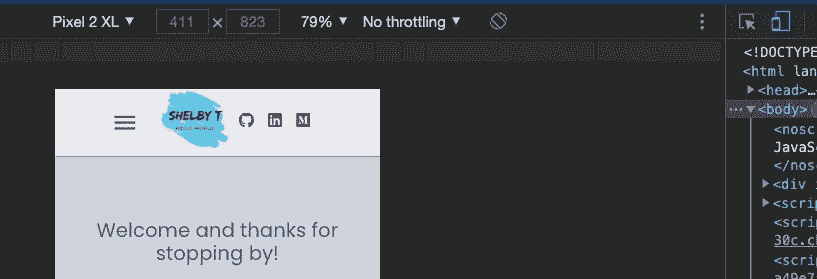

# 经验教训

> 原文：<https://medium.com/nerd-for-tech/lessons-learned-2932b01b3bad?source=collection_archive---------20----------------------->

我从建立我的投资组合网站中收集到的智慧结晶

我是来告诉你…

我想我会写一些和我以前的博客有点不同的东西。我从完成作品集网站的 350 号草稿中得到了很多收获。(它现在和将来都不会像我希望的那样完美。)以下内容将主要适用于最近的训练营和/或大学毕业生。如果你是一个经验丰富的开发人员，你可能已经有一个投资组合网站，或者你不需要一个！

1.  如果你还没有建立一个 React(或者在这里填写你的语言和/或框架)应用程序，你会感到生疏！别担心。检查你的笔记，看一些教程，读一些博客。这就像骑自行车，知识仍然在那里的某个地方。😉
2.  选项 A:你可以用你的项目组合来练习你已经学到的东西(完全有效)；或者选项 B:你可以通过学习/实现一些新的技巧来提高你的技能。我绝对推荐选项 b。这种体验既是令人生畏的，又是耐人寻味的，既令人沮丧，又令人着迷，而且非常非常有益。例如，我使用了几个新的 npm 包，为我的博客*创建了一个 RSS feed，学习了如何使用 EmailJS，并学习/使用了几乎所有样式的材料 UI。是的，我现在感觉很有成就感。😎
3.  如果你选择上面的选项 B，有许多优秀的博客可以帮助你。但是那里很可能有过时的信息。这就是你的批判性思维/谷歌技能发挥作用的地方。(当然，总会有文档作为最后的努力！)我正在关注一个博客，使用 npm [react-hook-form](https://www.npmjs.com/package/react-hook-form) 包来保存状态并为我的联系人表单提供验证，但是自从写了这个博客以来，其中一个道具名称已经改变了，所以遵循其中一部分说明会导致代码损坏(womp，womp！).幸运的是，react-hook-form 文档非常全面，他们相应的网站有一个有用的[视频教程](https://www.react-hook-form.com/get-started)来帮助你。另外，堆栈溢出。还需要我多说吗？
4.  有大量的资源说明如何在推送到远程 repo 之前隐藏 API 密钥，但我还没有找到很多关于如何在部署后访问和使用这些密钥的信息。毕竟，它们是有意隐藏在您的远程回购中的。谢天谢地，我发现利用我的 API 密匙和几个必需的 id 很容易，同时仍然通过 Netlify 自己的环境变量来保证它们的安全。如果您使用的是 Netlify，此功能位于应用的部署设置/环境中。
5.  你可能已经知道你希望你的投资组合的最终产品是什么样的，但如果你不知道，那也没关系。你会在某个时候弄清楚你的“愿景”。或者这种观点可能会随着时间的推移而改变。
6.  当你的项目开始实施时，向任何人寻求建议和反馈。不仅仅是来自其他开发者。问问你的妈妈/爸爸，你最好的朋友，你的遛狗者。UX/UI 是任何人都可以用真正有价值的反馈来回应的东西。
7.  有一件事对我来说已经变得相当清楚:无论我们谈论的是组件还是样式(哦，我喜欢样式)，开始时完全可以接受的东西，在短短的几天/几周内可能会变得对你来说根本不够好。换句话说，你的技能将成倍增长。我的主页有一个图像和一些文本，我很难把它们放在我想要的地方，所以我认为它“足够好了”。但是那个页面让我的大脑发痒，所以我不断尝试不同的策略，直到我发现我感觉更对称/更有吸引力的布局。现在我再也回不到“那就够好了”了。因为我是一个比两周前更好的开发人员！
8.  别忘了手机。你会变得非常擅长断点/媒体查询。即使你很熟练，这也会令人沮丧。一定要使用你的 Chrome 开发工具，打开小的移动/平板图标，尝试不同尺寸的设备。

移动/平板电脑图标位于此框的右上角，用蓝色标出

随着你技能的提高，或者你厌倦了现有的网站，想要尝试新的外观，你可能会一直更新/改变/刷新你的网站。我个人认为这是难以置信的，作为一个软件工程师，我想在设计世界里保持一只脚。你的投资组合反映了你的个性，随着我们的学习和成长，我们的投资组合也应该发展。

我很想知道你对建立投资组合网站的想法，你最大的挑战和最大的胜利是什么。我的站点是[这里](http://www.shelbytalbert.com)。一定要把你的发给我，我非常喜欢交换反馈。

多莉和我愿意帮忙！

*感谢[丽贝卡·罗宾斯](https://medium.com/u/92985413879e?source=post_page-----2932b01b3bad--------------------------------)提出 RSS 提要，感谢[詹姆斯·阿德瑞](https://medium.com/u/df20d0eb285d?source=post_page-----2932b01b3bad--------------------------------)给我们上了一堂关于 iframes 的精彩介绍课。💫

下面是我用来实现新功能、改进 UI 和保护我的站点上的 API 密钥的一些资源。

 [## 没有后端的简单反应接触形式

### 当我用 React 建立我的作品集网站时，我遇到的最具挑战性的问题之一是创建一个工作…

medium.com](/weekly-webtips/simple-react-contact-form-without-back-end-9fa06eff52d9)  [## 如何将中型博客流式传输到 React portfolio 应用程序

### 一步一步的指南。

javascript.plainenglish.io](https://javascript.plainenglish.io/how-to-stream-a-medium-blog-to-your-react-js-portfolio-9d62de41916e)  [## react-路由器在每次转换时滚动到顶部

### 对于 react-router v4，这里有一个实现滚动恢复的 create-react-app…

stackoverflow.com](https://stackoverflow.com/questions/36904185/react-router-scroll-to-top-on-every-transition)  [## 构建环境变量

### Netlify 环境变量在构建期间是可访问的。这允许您根据部署来更改行为…

docs.netlify.com](https://docs.netlify.com/configure-builds/environment-variables/)