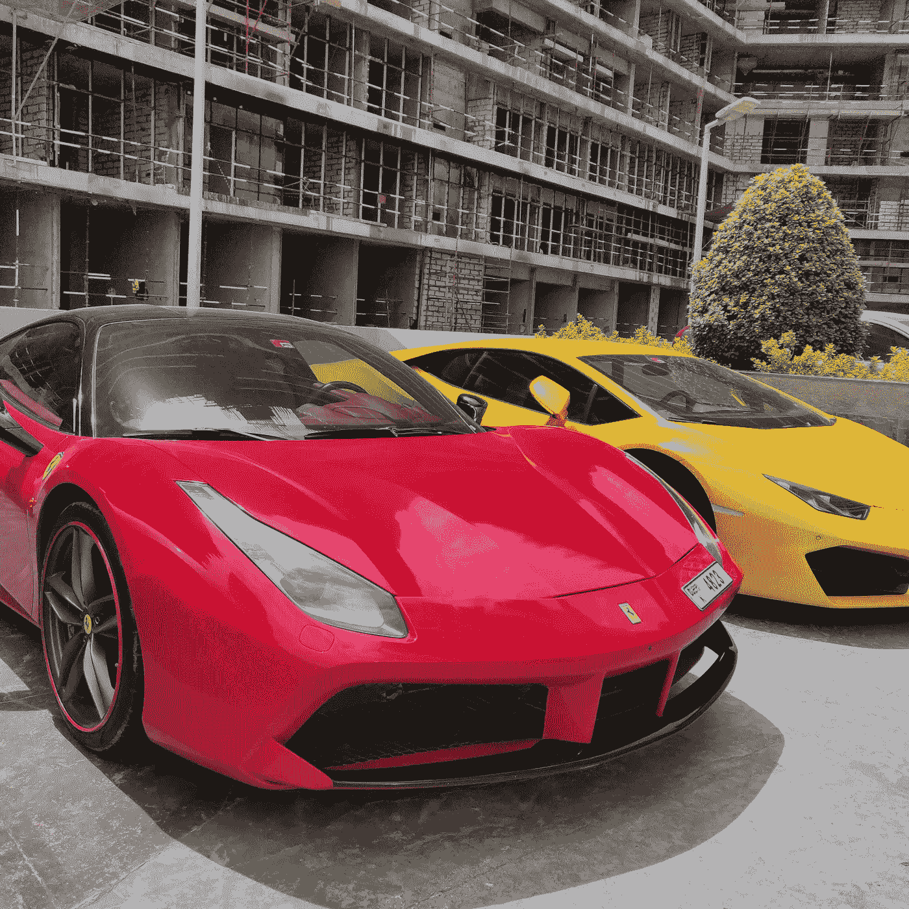

# 为奢侈品牌用户开发应用程序的经验教训

> 原文：<https://medium.com/nerd-for-tech/lessons-learned-from-developing-an-app-for-luxury-brand-users-7c94ee0b8200?source=collection_archive---------4----------------------->

## 奢侈品牌用户与典型用户群有何不同

图片作者。

奢侈品牌用户主要从兰博基尼、古驰、普拉达等奢侈高端品牌购买商品。奢侈品牌用户希望向他们周围的人散发出高购买力。