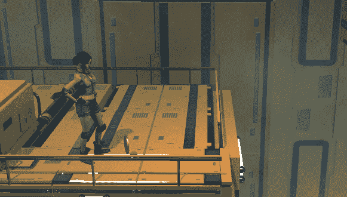
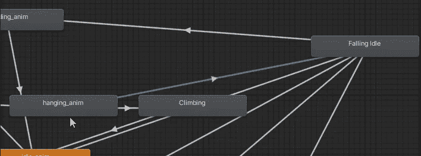

# 让它去吧——我是说窗台

> 原文：<https://medium.com/nerd-for-tech/let-it-go-the-ledge-i-mean-eb77200d6d85?source=collection_archive---------6----------------------->

**目标**:实现角色从抓壁架状态跌落的可能性

在这个教程中，我想给玩家一种可能性，让**放开窗台**并掉下去，而不是爬上去。这种改变应该几乎毫不费力，因为我们已经有了一个需要输入才能向上爬的逻辑。

我们只需要记住，由于**禁用角色控制器**的强力技巧，角色保持在悬挂位置，并且当角色保持在壁架(触发器)碰撞器盒内**时，它将保持禁用。**

所以，我们需要做的是**禁用碰撞器**(并在短时间后重新启用，以备将来抓取用)**启用角色控制器**，让玩家倒下。

R 是我们需要按下来让奇迹发生的键。我们关闭碰撞器，设置一个触发参数，启动从悬挂状态到坠落状态的转换。

碰撞器的停用和重新激活是在一个**协程**中使用一个延迟来执行的:足够长的时间让玩家摔倒，足够短的时间让壁架再次可用。

进入下降状态时，角色控制器将被安全启用。这个命令将在每次角色下落时执行，但这不是问题。

让我们看看结果。

