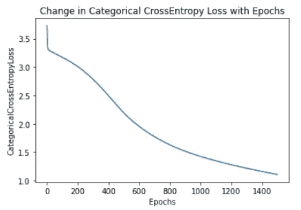

# 在开始批量梯度下降之前，我希望我完全理解

> 原文：<https://medium.com/nerd-for-tech/let-us-write-mini-batch-gradient-descent-using-numpy-51d67793f16f?source=collection_archive---------17----------------------->

利用爱因斯坦求和技术将整批梯度下降转化为小批梯度下降的方法。


凯利·西克玛在 [Unsplash](https://unsplash.com?utm_source=medium&utm_medium=referral) 上的照片

许多关于机器学习的博客解释了整批、小批和随机梯度下降方法的区别。但是它们要么不显示代码，要么为每种方法编写的代码差别很大。今天，我将向您展示如何轻松地将整批梯度下降转换为小批和随机梯度下降版本。随机梯度下降是批量等于 1 的小批量的特例。

让我们从批量梯度下降多类分类器神经网络开始。它将有一个具有泄漏 relu 激活的密集层，随后是另一个具有 softmax 激活功能的密集层，因为我们将为多类分类做它。如果你想从多类切换到二进制，那么在最后一层使用 sigmoid 激活函数。

整批梯度下降

```
class GradientDescent:
    def __init__(self, x:np.ndarray, y:np.ndarray, units_count:List, lr:float, epochs:int, bias:bool, seed:int) -> None:
        self.x = x
        self.y = y
        self.inp_units = self.x.shape[-1]
        self.batch_size = self.x.shape[-2]
        self.units_count = units_count
        self.lr = lr
        self.epochs = epochs
        self.bias = bias
        self.seed = seed
        self.rng =  np.random.default_rng(seed=seed)
        self.costs = np.zeros(epochs)
        # Hypothesis for each layer
        self.h0 = None
        self.h0a = None
        self.h1 = None
        self.h1a = None
        # Weight changes delta
        self.dJ_dW1 = None
        self.dJ_dW0 = None
        self.dJ_dB1 = None
        self.dJ_dB0 = None

    def init_weights(self):
        units_count_arr = np.array([self.inp_units] + self.units_count)
        L, = units_count_arr.shape
        S = units_count_arr.itemsize
        arr_view = as_strided(units_count_arr, shape=(L-1,2), strides=(S,S)).copy()
        self.wghts = [None]*(L-1)
        self.dWs = [None]*(L-1)
        self.biases = [None]*(L-1)
        self.dBs = [None]*(L-1) for i in range(L-1):
            w_cols, w_rows = arr_view[i,:]
            self.wghts[i] = self.rng.random((w_rows, w_cols))
            if self.bias:
                self.biases[i] = self.rng.random((w_rows,))

    def forward_prop(self, features):
        # Layer 1
        self.h0 = np.einsum('hi,Bi -> Bh', self.wghts[0], features)
        if self.bias:
            self.h0 = self.h0 + self.biases[0]
        self.h0a = lrelu(self.h0)

        # Layer 2
        self.h1 = np.einsum('ho,Bo -> Bh', self.wghts[1], self.h0a)
        if self.bias:
            self.h1 = self.h1 + self.biases[1]
        self.h1a = softmax(self.h1, _axis=1)
        return self.h1a, self.h1

    def cce_cost(self, hyp, target, batch_size):
        return -np.einsum('Bi,Bi', target, np.log(hyp))/batch_size

    def back_prop(self, features, hyp, target, batch_size):
        # Layer 2
        dJ_dH1a = hyp - target 
        self.dWs[1] = np.einsum('Bi,Bj -> ij',dJ_dH1a, self.h0a)/batch_size 
        dJ_dH1 = np.einsum('Bi,ij -> Bj', dJ_dH1a, self.wghts[1])

        # Layer 1
        dJ_dH0a = dJ_dH1*lrelu_prime(self.h0)
        self.dWs[0] = np.einsum('Bi,Bj -> ij',dJ_dH0a, features)/batch_size

        if self.bias:
            self.dBs[1] = np.einsum('Bi -> i', dJ_dH1a)/batch_size
            self.dBs[0] = np.einsum('Bi -> i', dJ_dH0a)/batch_size

    def update_weights(self):
        for i in range(len(self.wghts)):self.wghts[i] = self.wghts[i] - self.lr*self.dWs[i]
            if self.bias:
                self.biases[i] = self.biases[i] - self.lr*self.dBs[i]

    def optimize(self, features, target, batch_size):
        for epoch in range(self.epochs):
            hyp, logits = self.forward_prop(features)
            self.costs[epoch] = self.cce_cost(hyp, target, batch_size)
            self.back_prop(features, hyp, target, batch_size)
            self.update_weights()# MAIN BLOCK
iris = load_iris()
x = iris.data
y = iris.target
x_norm = normalize(x)
x_train, x_test, y_train, y_test = train_test_split(x_norm, y, test_size=0.33, shuffle=True, random_state=42)
y_train = binarize(y_train)_, out_units = y_train.shape
unit_per_layer_counts = [10, out_units]
gd = GradientDescent(x_train, y_train, unit_per_layer_counts, lr=0.01, epochs=100, bias=True, seed= 42)
gd.init_weights()
gd.optimize(gd.x, gd.y, gd.batch_size)
plt.plot(gd.costs)
```

现在，我们应该对上面的代码做什么修改才能使它成为 mini batch？我们将需要一种方法来获得我们的现有数据在一个批量大小。让我们先做那件事。在下面的方法中，您可以给出一个批量大小，数据集被分成多个批次，每个批次包含多个样本。如果分割不完美，则丢弃剩余的样本。可以通过用整个数据集中的随机样本填充最后一批中剩余的空白空间来进一步改进。

```
def batch_data(test, batch_size):
    m,n = test.shape
    S = test.itemsize
    if not batch_size:
        batch_size = m
    count_batches = m//batch_size
    test_batches = as_strided(test, shape=(count_batches, batch_size, n), strides=(batch_size*n*S,n*S,S)).copy()
    return test_batches
```

> 现在让我们以这样一种方式修改主算法，即在每个时期整个数据仅被覆盖一次，并且来自每个批处理的所有误差仅被累积一次 [](https://stats.stackexchange.com/a/189251/183128) 。！！

这似乎比上一个任务难了一点不是吗。这很容易做到。

```
class BatchGradientDescent:
    def __init__(self, x:np.ndarray, y:np.ndarray, units_count:List, batch_size:int, lr:float, epochs:int, bias:bool, seed:int) -> None:
        self.x = x
        self.y = y
        self.inp_units = self.x.shape[-1]
        self.batch_size = batch_size
        self.units_count = units_count
        self.lr = lr
        self.epochs = epochs
        self.bias = bias
        self.seed = seed
        self.rng =  np.random.default_rng(seed=seed)
        self.costs = np.zeros(epochs)
        # Hypothesis for each layer
        self.h0 = None
        self.h0a = None
        self.h1 = None
        self.h1a = None
        # Weight changes delta
        self.dJ_dW1 = None
        self.dJ_dW0 = None
        self.dJ_dB1 = None
        self.dJ_dB0 = None

    def init_weights(self):
        units_count_arr = np.array([self.inp_units] + self.units_count)
        L, = units_count_arr.shape
        S = units_count_arr.itemsize
        arr_view = as_strided(units_count_arr, shape=(L-1,2), strides=(S,S)).copy()
        self.wghts = [None]*(L-1)
        self.dWs = [None]*(L-1)
        self.biases = [None]*(L-1)
        self.dBs = [None]*(L-1) for i in range(L-1):
            w_cols, w_rows = arr_view[i,:]
            self.wghts[i] = self.rng.random((w_rows, w_cols))
            if self.bias:
                self.biases[i] = self.rng.random((w_rows,))

    def batch_data(self, data, batch_size):
        m,n = data.shape
        S = data.itemsize
        if not batch_size:
            batch_size = m
        count_batches = m//batch_size
        data_batches = as_strided(data, shape=(count_batches, batch_size, n), strides=(batch_size*n*S,n*S,S)).copy()
        return data_batches, count_batches

    def forward_prop(self, features):
        # Layer 1
        self.h0 = np.einsum('hi, Bi -> Bh', self.wghts[0], features)
        if self.bias:
            self.h0 = self.h0 + self.biases[0]
        self.h0a = lrelu(self.h0)

        # Layer 2
        self.h1 = np.einsum('ho,Bo -> Bh', self.wghts[1], self.h0a)
        if self.bias:
            self.h1 = self.h1 + self.biases[1]
        self.h1a = softmax(self.h1, _axis=1)
        return self.h1a, self.h1

    def cce_cost(self, hyp, target, batch_size):
        return -np.einsum('Bi,Bi', target, np.log(hyp))/batch_size

    def back_prop(self, features, hyp, target, batch_size):
        # Layer 2
        dJ_dH1a = hyp - target 
        self.dWs[1] = np.einsum('Bi,Bj -> ij',dJ_dH1a, self.h0a)/batch_size 
        dJ_dH1 = np.einsum('Bi,ij -> Bj', dJ_dH1a, self.wghts[1])

        # Layer 1
        dJ_dH0a = dJ_dH1*lrelu_prime(self.h0)
        self.dWs[0] = np.einsum('Bi,Bj -> ij',dJ_dH0a, features)/batch_size

        if self.bias:
            self.dBs[1] = np.einsum('Bi -> i', dJ_dH1a)/batch_size
            self.dBs[0] = np.einsum('Bi -> i', dJ_dH0a)/batch_size

    def update_weights(self):
        for i in range(len(self.wghts)):
            self.wghts[i] = self.wghts[i] - self.lr*self.dWs[i]
            if self.bias:
                self.biases[i] = self.biases[i] - self.lr*self.dBs[i]

    def optimize(self, features, target, batch_size):
        batched_features, no_of_batches = self.batch_data(features, batch_size)
        batched_target,_ = self.batch_data(target, batch_size)
        for epoch in range(self.epochs):
            batch_costs = np.zeros(no_of_batches)
            for index in np.ndindex(batched_features.shape[:1]):
                hyp, logits = self.forward_prop(batched_features[index,:].squeeze(axis=0))
                _cost = self.cce_cost(hyp, batched_target[index,:].squeeze(axis=0), batch_size)
                batch_costs[index] = _cost
                self.back_prop(batched_features[index,:].squeeze(axis=0), hyp, batched_target[index,:].squeeze(axis=0), batch_size)
                self.update_weights()
            self.costs[epoch] = batch_costs.sum()# MAIN block
_, out_units = y_train.shape
unit_per_layer_counts = [10, out_units]
bgd = BatchGradientDescent(x_train, y_train, unit_per_layer_counts, batch_size=32, lr=0.01, epochs=1500, bias=True, seed= 42)
bgd.init_weights()
bgd.optimize(bgd.x, bgd.y, bgd.batch_size)
plt.plot(bgd.costs)
plt.xlabel('Epochs')
plt.ylabel('CategoricalCrossEntropyLoss')
plt.title('Change in Categorical CrossEntropy Loss with Epochs')
plt.savefig('CategoricalCrossEntropyLoss.png')
```

不用担心任何转置或任何一对多矩阵乘法，我们出来干净。这就是爱因斯坦求和技术的力量。



使用小批量梯度下降的成本与时期的收敛性。-图片归作者所有

如果你不明白为什么 softmax 的反向传播是以我所做的方式实现的，请点击这个[链接](https://stats.stackexchange.com/a/235541/183128)获得一个严格的数学解释。对于玩具示例的解释，请遵循此[链接](https://stats.stackexchange.com/a/306710/183128)。

还想了解更多？查看博客末尾的参考资料。

我是 TCS 的机器学习工程师，我的(数字软件和解决方案)团队正在开发令人惊叹的产品。点击下面的链接，了解更多关于我们产品的信息:

[](https://www.tcs.com/dss) [## 数字软件和解决方案:提供高度个性化的体验

### Digital Software & Solutions 的互联智能解决方案将帮助您转变产品和服务…

www.tcs.com](https://www.tcs.com/dss) 

参考资料:

1.  [https://stats.stackexchange.com/a/189251/183128](https://stats.stackexchange.com/a/189251/183128)
2.  https://ajcr.net/Basic-guide-to-einsum/
3.  【https://rockt.github.io/2018/04/30/einsum 
4.  [https://obi laniu 6266 h16 . WordPress . com/2016/02/04/Einstein-summation-in-numpy/](https://obilaniu6266h16.wordpress.com/2016/02/04/einstein-summation-in-numpy/)
5.  [https://stats . stack exchange . com/questions/235528/back propagation-with-soft max-cross-entropy](https://stats.stackexchange.com/questions/235528/backpropagation-with-softmax-cross-entropy)
6.  [https://www.ics.uci.edu/~pjsadows/notes.pdf](https://www.ics.uci.edu/~pjsadows/notes.pdf)