# 让我们给推进器的使用增加一个限制

> 原文：<https://medium.com/nerd-for-tech/lets-add-a-limit-to-our-usage-of-thrusters-db761c41b6e2?source=collection_archive---------38----------------------->

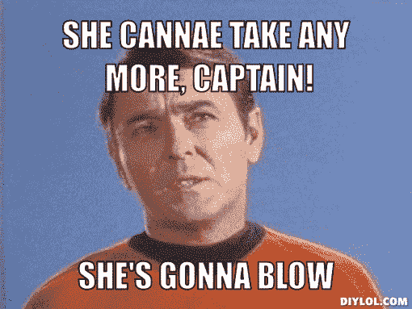

今天我们将研究如何限制推进器的使用，这样玩家就不能无限地停留在加速状态。至于推进器的实现是如何完成的，我们在这里做了[。
首先，我们需要创造一个让推进器工作的物体:](/nerd-for-tech/lets-add-some-player-thrusters-357403aeab91)

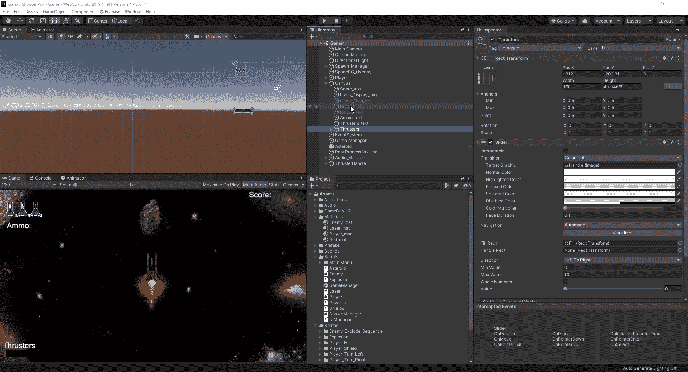

从这里，我们可以移动我们的酒吧到任何角落，我们想看到的酒吧，这将是我们的最后一个在左下角。在我们到达那个状态之前，我们需要先调整几个设置:

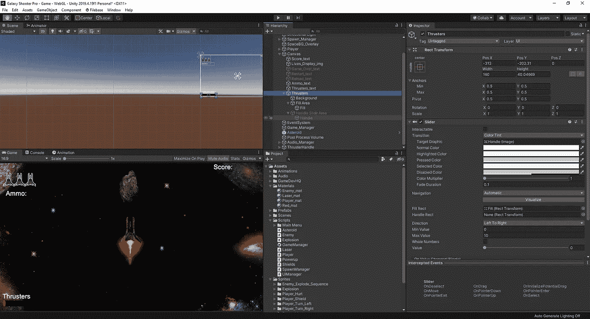

我们首先要在层次结构中打开新的滑块对象，并关闭我们的幻灯片区域。在父对象中，我们将把我们的值调整到所需的数量。从那里，我们可以去我们的填充和背景选项，并改变它:

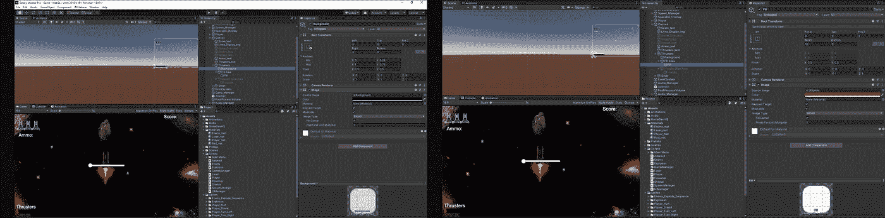

现在我们已经设置好了我们的推力器栏，我们可以进入 UIManager 脚本并开始创建代码来使我们的推力器栏开始工作。首先，我们将自己制作一个滑块变量和一个 bool 来使用:

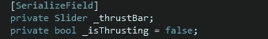

我们的滑块变量，我们将在 Unity 编辑器中添加新制作的滑块。从这里，我们将进入我们的空开始，并设置我们的推力杆的值为 10。由于我们使用的是滑块，我们需要添加。值添加到代码行，然后输入我们需要的值:

从这里，我们将快速进入我们的玩家脚本，并调整我们的船的速度是如何确定的。由于我们将使用脚本连接，我们将简化我们如何决定何时激活我们的推进器助推或不。首先，我们将创建几个新的浮点数，然后在 Void start 中设置它们的值:

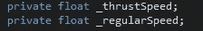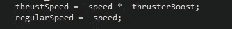

从这里开始，我们将在玩家脚本上创建一个新的公共 void 来确定我们的 _speed 值。为了使工作更容易，我们将创建一个简单的开关语句来确定推进器是否处于活动状态:

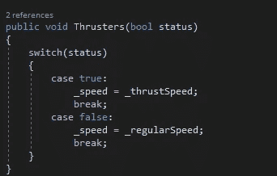

从这里，我们将快速返回到 UIManager 脚本，并添加几个新的空白来处理:

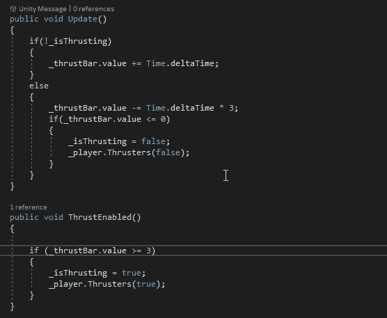

首先，我们告诉 unity，如果我们不使用推进器，我们希望它以每秒 1 点的速度充电。否则，只要我们的值为 0 或以上，我们希望以每秒 3 的速率使用它。只要剩余值为 3 或更高，推力启动部分将允许我们使用我们的推进器。如果我们在它下降到 30%以下时按住 shift 键，我们仍然可以使用推进器，但如果我们在它下降到 30%以下或达到 0 后放开它，推进器将不会再次工作，直到我们达到 30%。

我们需要调整的最后一部分是速度变量，以及我们如何调整脚本以使其正常工作:

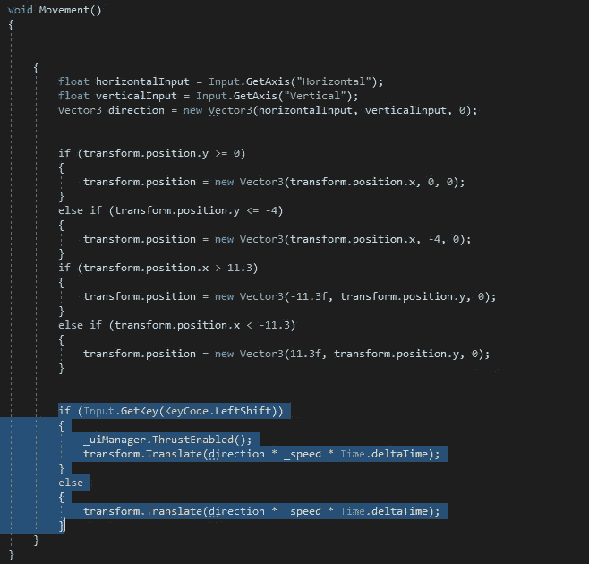

我们所做的是将我们的两个移动方法移到一个 if else 语句中。我们告诉 Unity 的是，如果我们持有 LShift，我们希望在 UIManager 上启用我们的 ThrustEnabled 以及 _speed 变量，在这种情况下，它将具有推进器乘数。否则，我们的速度将只是一个固定的速率。现在我们已经完成了所有的设置，我们可以回到我们的 Unity 编辑器，检查推进器是否如预期的那样工作:

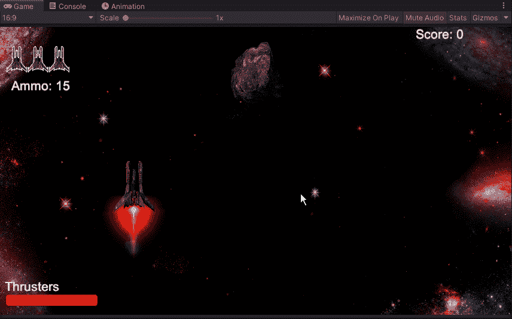

我们已经做到了，我们已经设法改变了它，所以我们现在增加的推进器有一个有限的使用期，这样我们就不能在整个游戏中一直高速飞行。