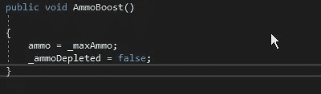
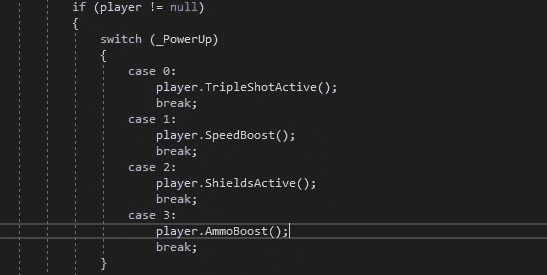
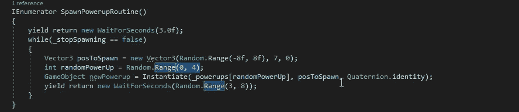
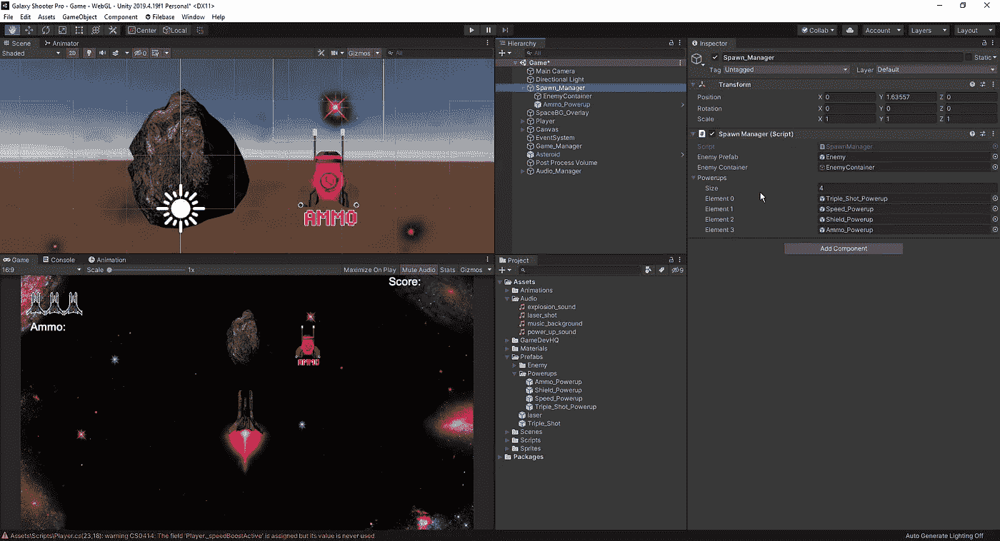
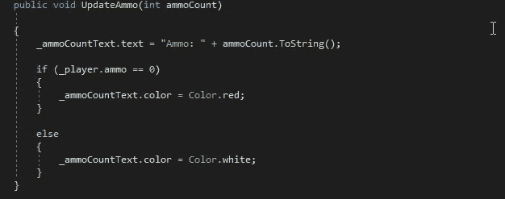
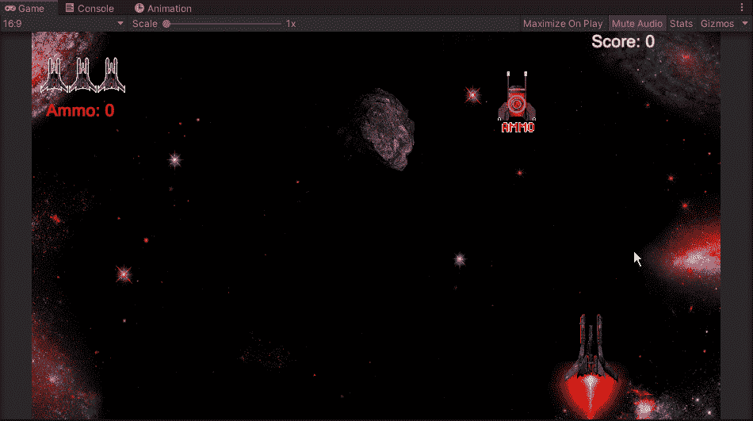
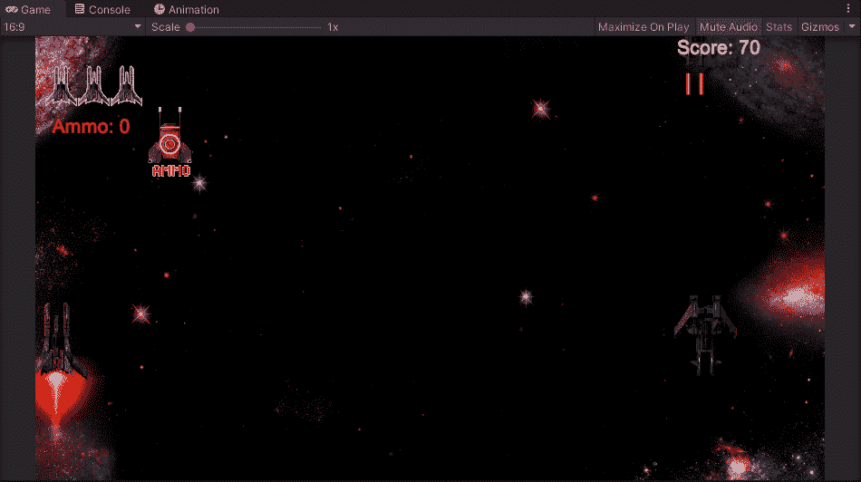

# 让我们增加一个弹药能量

> 原文：<https://medium.com/nerd-for-tech/lets-add-ammo-powerup-a7e1f488475f?source=collection_archive---------26----------------------->

现在我们已经增加了弹药特性，让我们给玩家一个重新装填弹药的方法，否则如果我们只能射出 15 发子弹，这个游戏就会很快结束。首先，让我们为弹药制作一个精灵:

和我们的其他精灵一样，我们需要添加一个刚体，盒子碰撞器，动画和我们的启动脚本。从那里，我们可以进入我们的播放器脚本，并为我们收集新的加电创建一行代码:

有了这个空白，我们现在可以转移到我们的 powerups 脚本，并期待在我们的新加电。首先，我们需要为 switch 语句添加一个新的 case:

现在我们有了一个新的案例，我们还需要切换到我们的产卵管理器脚本，并为我们的弹药启动预设创建一个新的行:

我们必须把我们的射程增加到 4，这样我们就可以把我们的预置拖到种子管理器中，否则我们就没有弹药补给种子了。从这里，我们可以返回到我们的 Unity 编辑器，并将我们新制作的预置拖到新的插槽中:

最后，我们需要进入我们第一次实现弹药时创建的更新弹药空洞，并改变一些东西。当弹药为 0 时，我们希望文本变为红色，否则文本将为白色:

现在我们已经把这些都准备好了，我们可以在我们的游戏中测试一下，看看弹药补充是否有效:

我们的最后一步是确保我们通过管理器获得弹药能量:

现在我们有了，我们有了一个有效的弹药系统，同时有了一个能量种子来补充我们的弹药数量。