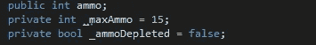
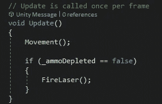
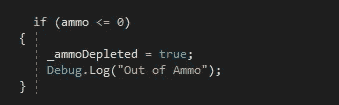
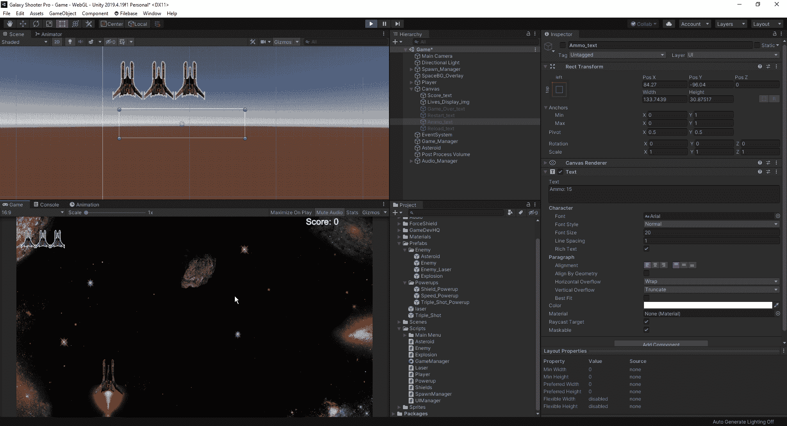
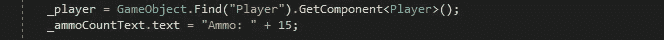
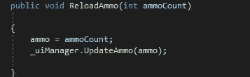
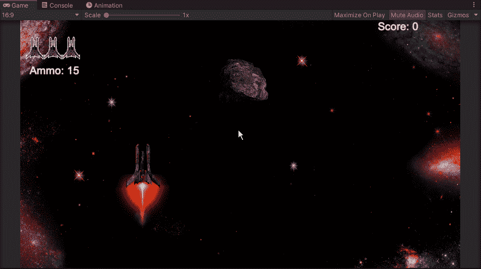

# 让我们添加一些玩家弹药

> 原文：<https://medium.com/nerd-for-tech/lets-add-some-player-ammo-ba7812e0baa2?source=collection_archive---------30----------------------->

现在我们的玩家已经有了一些推进器，我们在这里谈到了，我们今天将会考虑增加一个弹药系统。首先，我们将研究如何设置我们的脚本，以便当我们的玩家射击设定的射击次数时，在本例中是 15 次，我们停止射击。在未来的文章中，我们将会创造一个新的能量补充来补充弹药。
首先，我们需要在我们的播放器上创建几个变量，这样我们的脚本就有东西可以调用了:

我们将把这 3 个变量放到我们的玩家脚本中。在我们的无效开始中，我们将在 ammo = _maxAmmo 中编码，这样当我们开始游戏时，我们有 15 次机会。接下来，我们将转到我们的 FireLaser 方法，并声明 if _ammoDepleted = false，FireLaser:

有了这个代码，一旦我们的弹药耗尽，我们就不能再开火了，但是为了让它工作，我们需要创建一个 if 语句，这样我们就知道我们的弹药何时耗尽:

现在我们已经创建了所有这些，我们可以测试我们的游戏，看看我们是否在 15 次射击后停止射击，并显示 debug.log:

现在，我们必须创建一个 UI 指示器，这样我们就知道我们还有多少弹药，并且让我们看到没有弹药的指示。首先，我们将转到 UiManager 脚本并创建两个新的变量:

从这里，我们将创建一个到我们的玩家脚本的链接，就像我们之前在游戏管理器中做的那样，这样我们就可以从中提取信息，以及我们游戏的初始脚本，以显示我们的弹药数量:

现在我们已经创建了我们的初始脚本，我们可以为我们的脚本创建一个新的公共 void 来运行我们的文本并更新我们当前的弹药数量:

就像我们对分数文本所做的一样，我们将我们的 void 文本附加到我们的 player 方法，我们还必须在 player 脚本上创建它:

现在我们已经将所有东西都编写到 UIManager 和播放器脚本中，我们可以回到 Unity 编辑器，看看它是否像我们希望的那样运行:

现在我们有了。我们已经成功地实现了一个弹药系统，这样我们就可以限制玩家的射击次数，这样他就不会没完没了地射击了。然而，现在的问题是我们如何给我们的玩家弹药来补充他们的补给。至于我们将如何解决这个问题，我们将在以后的文章中讨论。